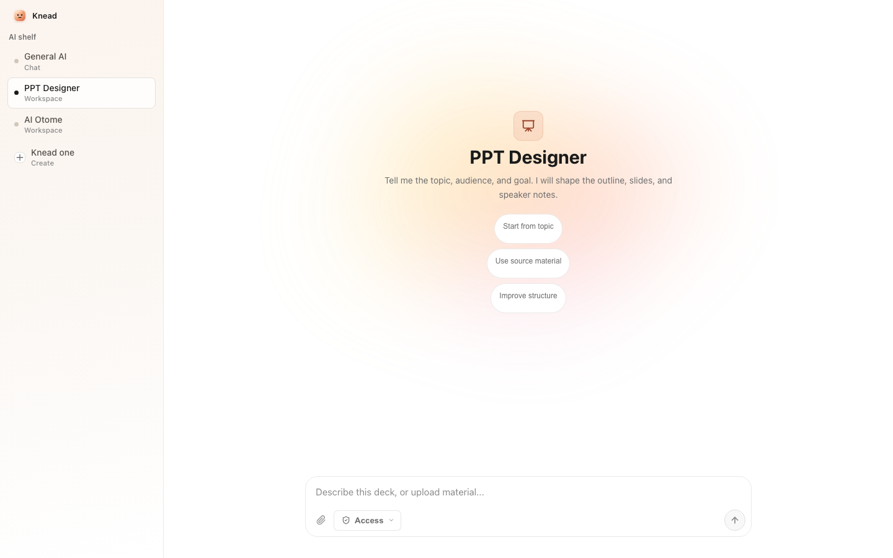
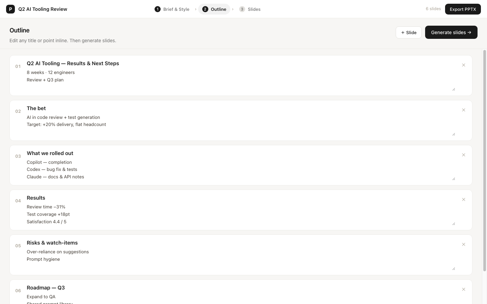
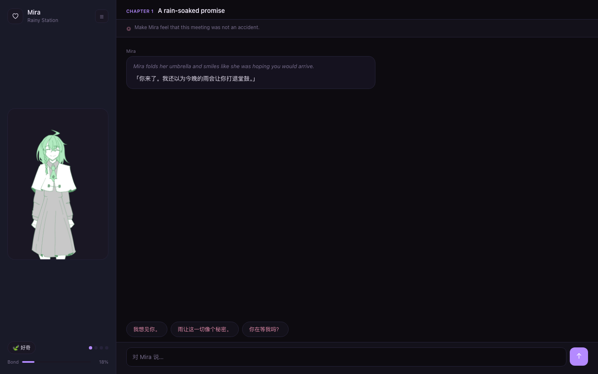

<p align="center">
  
</p>

<h1 align="center">Hermes Knead WebUI</h1>

<p align="center">
  <strong>One sentence. Shape an AI product you can actually use.</strong>
</p>

<p align="center">
  A Hermes WebUI-based product shell for creating, using, and shaping AI products.
</p>

<p align="center">
  <a href="#why-hermes-knead-webui">Why</a> ·
  <a href="#how-it-works">How it works</a> ·
  <a href="#screenshots">Screenshots</a> ·
  <a href="#quick-start">Quick start</a> ·
  <a href="#built-on-hermes-webui-and-hermes-agent">Hermes runtime</a>
</p>

<p align="center">
  <a href="LICENSE"></a>
  
  
  
  
</p>

## Why Hermes Knead WebUI

Most AI tools stop at chat. Most app builders make you leave the work and start building an app.

Hermes Knead WebUI is the middle path: pick an AI, say what you need, and let that AI become a small product when the task needs more structure.

The public project name is **Hermes Knead WebUI**. The app keeps **Knead** as its short in-product name because it is friendlier in the shelf, title bar, and product UI. The source package is named `hermes-knead-webui` because this repository is specifically the Knead product layer on top of Hermes WebUI and Hermes Agent.

An AI product in Hermes Knead WebUI owns its role, prompt, avatar, skills, tools, task history, files, and optional workspace. It can stay as a normal chat product, or it can grow a focused surface for work like slides, research, data, writing, games, or repeatable personal workflows.

The current MVP is intentionally small:

| Product | Shape | What it proves |
| --- | --- | --- |
| `General AI` | Chat only | The default chat surface is itself a product UI. |
| `PPT Designer` | Chat plus workspace | A task can grow outline, slide, note, style, and export surfaces. |
| `AI Otome` | Full product workspace | An AI-first interactive product can own its own interface, memory, choices, and character state. |

## How It Works

Hermes Knead WebUI has one user model:

1. **Choose or create an AI.** Start from the shelf. Use `General AI`, a built-in product, or knead a new one.
2. **Use it through chat.** The first interaction is natural language. The AI decides whether the base chat is enough.
3. **Shape it when useful.** If the task needs structure, the AI can open or improve its product workspace without changing the global shell.

The important boundary: product changes belong to the selected AI product. If `PPT Designer` improves its workspace, that does not mutate `General AI` or the rest of the app.

## Screenshots

### AI shelf



Choose an AI product, start a task, or knead a new AI from the shelf.

### PPT workspace



`PPT Designer` can turn a chat request into a working surface for outlines, slide planning, generation steps, and export.

### AI Otome workspace



`AI Otome` shows the same product model applied to a game-like AI companion with its own state and interaction loop.

## Built On Hermes WebUI And Hermes Agent

Knead does not replace Hermes WebUI or Hermes Agent. It starts from the inherited Hermes WebUI browser foundation under `apps/webui`, then adds the Knead product shelf, product manifests, product workspaces, and product-shaping behavior.

The native agent loop, model routing, tool execution, skills, checkpoints, files, and runtime events come from the official [Hermes Agent](https://github.com/NousResearch/hermes-agent) runtime vendored under `runtimes/hermes-agent`.

In short:

```text
Hermes WebUI  = browser shell foundation
Hermes Agent  = native agent runtime
Knead         = AI product shelf and workspace layer
```

The vendoring policy, upstream baseline, and patch rules live in [docs/architecture/HERMES_VENDORING.md](docs/architecture/HERMES_VENDORING.md).

## Quick Start

Requirements:

- Node.js 22+
- pnpm 10.33+
- Python 3.11+ or 3.12

```bash
pnpm install
pnpm setup:local

# Add at least one provider key to .env, for example OPENROUTER_API_KEY.
# Then configure the project-local Hermes model/provider state.
pnpm hermes:model

pnpm dev
```

The app starts at `http://localhost:8788`.

`pnpm dev` uses:

- the vendored Hermes runtime in `runtimes/hermes-agent`
- project-local Hermes state in `.hermes-home/`
- built-in products from `products/`
- runtime-created products from `.hermes-home/webui/products/`

Useful overrides:

```bash
HERMES_WEBUI_PORT=8789 pnpm dev
KNEAD_PROJECT_ROOT=/path/to/knead pnpm dev
KNEAD_BUILTIN_PRODUCTS_DIR=/path/to/builtin-products pnpm dev
KNEAD_PRODUCTS_DIR=/path/to/runtime-products pnpm dev
```

If the app says no LLM provider is configured, run `pnpm hermes:model` again.

## PPT Image Generation

`PPT Designer` can use the bundled PPT skill workflow. Add a FAL key before using image generation:

```bash
cp products/ppt-designer/ppt-skill/.env.example products/ppt-designer/ppt-skill/.env
# Edit products/ppt-designer/ppt-skill/.env and set FAL_KEY.
```

## Repository Shape

```text
apps/webui/        Knead WebUI, inherited from Hermes WebUI and extended for products
products/          Curated built-in AI products
packages/          Shared TypeScript packages
runtimes/          First-class runtime dependencies, including Hermes Agent
scripts/           Development, verification, and release scripts
docs/              Current product, architecture, brand, and reference docs
experiments/       Public boundary note for excluded historical prototypes
vendor/            Local reference checkouts, ignored by Git
```

The tracked root is intentionally small and mostly standard for an open-source project:

| Root entry | Why it stays at the root |
| --- | --- |
| `README.md`, `LICENSE`, `NOTICE.md` | GitHub-facing project identity, license, and attribution. |
| `CONTRIBUTING.md`, `CODE_OF_CONDUCT.md`, `SECURITY.md` | Standard open-source collaboration and security files. |
| `CHANGELOG.md`, `RELEASE.md` | Release notes and release checklist. |
| `PRODUCT.md`, `PRODUCT_UIUX.md`, `DESIGN.md` | Product context used by maintainers and local design tooling. |
| `package.json`, `pnpm-lock.yaml`, `pnpm-workspace.yaml` | Workspace scripts, package metadata, and locked dependencies. |

Generated or user-created products are runtime state, not source code. When launched through `pnpm dev`, they are written under `.hermes-home/webui/products/` so using Knead does not dirty the repository.

Local directories like `.hermes-home/`, `node_modules/`, `tmp/`, and `vendor/` can make the checkout look busy, but they are ignored runtime or reference state, not published source.

The root `package.json` is marked `private: true` on purpose. Knead is released as a source repository today, not as a publishable npm package; the flag prevents accidental registry publishes while keeping the repository public and reusable.

## Verify

Use the smallest check that matches the change:

| Command | Use when |
| --- | --- |
| `pnpm docs:check` | Editing README or current docs. |
| `pnpm product:check -- <product-dir>` | Reviewing or promoting one AI product. |
| `pnpm verify` | Touching WebUI, product runtime, products, scripts, or docs. |
| `pnpm check` | Opening a normal PR. |
| `pnpm release:check` | Preparing release-facing files. |
| `pnpm release:check:clean` | Final pre-tag check with a clean Git worktree. |

Optional live model smoke:

```bash
KNEAD_RELEASE_AGENT_SMOKE=1 pnpm release:check
```

Use this only after a configured Hermes Gateway is running.

## References

Knead was shaped by several public projects:

- [Hermes Agent](https://github.com/NousResearch/hermes-agent): native agent runtime, tool execution, skills, checkpoints, and WebUI foundation.
- Hermes WebUI: inherited browser UI foundation under `apps/webui`, used as the starting point for Knead's product shell.
- [PilotDeck](https://github.com/OpenBMB/PilotDeck): focused chat-plus-workspace interaction model.
- [LobeHub / Lobe Chat](https://github.com/lobehub/lobe-chat): approachable assistant creation, selection, and management.
- [PinMe](https://github.com/glitternetwork/pinme): lightweight object organization and durable workspace ideas.

These are references, not mixed production source. The only first-class vendored runtime is the official Hermes Agent checkout described in [docs/architecture/HERMES_VENDORING.md](docs/architecture/HERMES_VENDORING.md).

More notes live in [docs/references/REFERENCE_PROJECTS.md](docs/references/REFERENCE_PROJECTS.md).

## Docs

- [PRODUCT.md](PRODUCT.md): product definition and design principles
- [PRODUCT_UIUX.md](PRODUCT_UIUX.md): current UI/UX model
- [DESIGN.md](DESIGN.md): visual system and brand tone
- [CHANGELOG.md](CHANGELOG.md): release-facing change log
- [RELEASE.md](RELEASE.md): release checklist
- [docs/PRODUCT_MODEL_CONTRACT.md](docs/PRODUCT_MODEL_CONTRACT.md): product runtime model and invariants
- [docs/architecture/PRODUCTION_REPOSITORY_PLAN.md](docs/architecture/PRODUCTION_REPOSITORY_PLAN.md): production repository plan
- [docs/brand/screenshots/README.md](docs/brand/screenshots/README.md): release-facing screenshot policy

## Release Bar

The MVP is healthy when:

1. A user can select an AI product and start from chat.
2. `General AI` behaves as a complete chat product, not an empty workspace.
3. `PPT Designer` can open a PPT task surface when structure becomes useful.
4. A product can update its own identity, skills, tools, and runtime product workspace without mutating the global shell.
5. Product interface evolution is previewable, applicable, and recoverable.

## Contributing

See [CONTRIBUTING.md](CONTRIBUTING.md) for setup, source boundaries, and PR checks. See [CODE_OF_CONDUCT.md](CODE_OF_CONDUCT.md) for collaboration norms, [SECURITY.md](SECURITY.md) for private vulnerability reporting and local secret handling, and [NOTICE.md](NOTICE.md) for bundled runtime attribution.

## License

Knead is released under the [MIT License](LICENSE).
