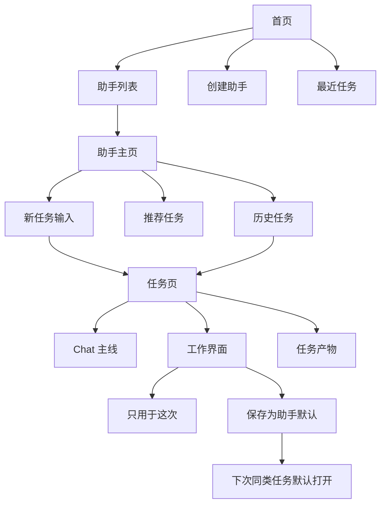

# Next AI 改版计划：从助手到可进化工作界面

更新日期：2026-06-03

> 当前准则以 `docs/PRODUCT_DIRECTION_CURRENT.md`、`docs/NEXT_AI_PRODUCT_MOTHER_CURRENT.md`、`docs/ASSISTANT_WORK_INTERFACE_UX_SPEC.md` 为准。本文后半部分保留大量历史推演记录，若出现“助手优先”“默认界面”“Chat 主线”“左右侧”等旧口径，只作为讨论背景，不作为当前实现依据。

## 最新认知

2026-06-03 当前主路径定为 `AI 产品`：

```text
AI 产品库 -> AI 产品 -> 任务 -> 对话入口 + 按需长出的工作界面
```

原因是“助手”容易让用户理解成普通聊天人格，而我们的对象范围更大：

```text
它有 Chat。
它有长期职责。
它有自己的任务列表。
它可以在任务中打开或沉淀专属工作界面。
它可以被用户和 AI 一起持续改造。
```

下面较早的“不要在主路径出现 AI 产品”等判断保留为历史讨论记录；当前实现以三份当前准则文档为准。

2026-06-03 继续收敛首屏语言：

```text
内置 AI 产品 = 起点模板。
用户一句话要求“以后这样做” = 先预览，再创建个人版 AI 产品。
个人版 AI 产品 = 用户自己的长期工作对象，可以继续调整工作方式、任务入口和任务界面。
```

第一屏不要解释架构。选中一个 AI 产品后，主区应该像清爽的新任务入口，而不是产品说明页。用户只需要看到：

```text
选择一个 AI 产品。
说一句任务，或上传资料。
任务需要时长出合适的工作界面。
用得顺手后让这个 AI 产品的同类任务沿用。
```

因此主界面可见文案优先使用“新任务 / 任务里会使用 / 下次同类任务沿用 / 调整工作方式 / 回滚”。日常使用态不展示三张关系说明卡；只有“新建 AI 产品”这种需要确认流程的页面，才展示“想法 -> 预览 -> 加入 AI 产品库”。

自进化相关入口也优先使用“工作方式”：

```text
调整工作方式
工作方式预览
后续任务会使用新的任务入口和任务界面
回滚上一版工作方式
```

避免在用户主路径里使用“编辑职责 / AI 产品职责 / 配置流程”这类后台感更强的说法。

## 这次先收敛什么

当前版本最大的问题不是功能少，而是用户一眼看不懂：

```text
AI 产品 / 工作台 / 专属工作区 / 会话 / Agent / Skills / Automation
```

这些词同时出现在第一屏，会让用户不知道自己到底是在：

```text
选择助手？
新建对话？
打开一个工作台？
配置一个产品？
管理一个空间？
```

第一版必须先变简单。用户第一眼只需要理解：

```text
我选择一个 AI 产品。
我给它一个任务。
任务需要时，它会长出自己的工作界面。
如果这套界面好用，可以让这个 AI 产品以后的同类任务沿用。
```

这就是我们从 LobeHub 式 AI 助手往前走一步的地方：不是“多一个人格”，而是“每个 AI 产品都可以拥有自己的工作方式和界面”。

## 产品心智

### 用户看到的心智

```text
AI 产品 -> 任务 -> 对话入口 + 工作界面
```

用户不需要先理解“自进化”。他只需要觉得：

```text
这个 AI 产品越来越懂我的工作方式。
它不是只有聊天，它会在需要时长出合适的操作页面。
```

### 系统内部的心智

```text
AI 产品 = 长期工作对象
任务 = 一次具体工作
对话入口 = 任务里的自然输入和反馈主线
工作界面 = 任务中的可操作 UI
保存默认 = 把这套 UI / prompt / 流程沉淀回 AI 产品
```

内部可以继续叫 AI Product、Workbench、Generated UI，但第一版主路径不要把这些词同时暴露给用户。

## 信息结构



### 三个页面

```text
首页
  负责选择助手、创建助手、查看最近任务。

助手页
  负责告诉用户“你正在使用哪个助手”，并让用户发起一个任务。

任务页
  负责真正工作：Chat 始终在场，工作界面按需出现。
```

第一版可以不做真实 URL 路由，先用前端 state 模拟这三层页面。因为 Hermes 当前已经用 `/session/:id` 承载会话路由，马上硬改路由会牵扯更多。

## 首屏应该长什么样

### 首页

首页不是 Chat，也不是工作台管理器。

```text
┌──────────────────────┬────────────────────────────────────────┐
│ Next AI              │                                        │
│                      │              选择一个助手开始           │
│ + 创建助手           │                                        │
│                      │   [通用助手] [PPT 设计师] [研究分析师]   │
│ 助手                 │   [数据分析师]                          │
│ - 通用助手           │                                        │
│ - PPT 设计师         │   最近任务                              │
│ - 研究分析师         │   - Codex 介绍 PPT                      │
│                      │   - PilotDeck 竞品分析                  │
└──────────────────────┴────────────────────────────────────────┘
```

### 助手页

点击 `PPT 设计师` 后，不是在左侧切换一个 active 状态，而是进入这个助手自己的开工页。

```text
┌──────────────────────┬────────────────────────────────────────┐
│ Next AI              │                                        │
│ ← 首页               │              PPT 设计师                 │
│ + 新任务             │     把想法、资料和要求变成演示文稿。       │
│                      │                                        │
│ 任务                 │   ┌────────────────────────────────┐   │
│ - Codex 介绍 PPT     │   │ 描述你想做的 PPT，或上传资料...    │   │
│ - 融资路演           │   └────────────────────────────────┘   │
│                      │                                        │
│                      │   推荐任务                             │
│                      │   [做产品介绍 PPT] [文档转 PPT] [优化结构]│
└──────────────────────┴────────────────────────────────────────┘
```

这里仍然不出现工作界面复杂工作界面。因为用户还没有给任务。

### 任务页

用户发起任务后进入任务页。

```text
┌──────────────┬──────────────────────────────┬──────────────────────────────┐
│ PPT 设计师    │ Codex 介绍 PPT                 │ 工作界面                       │
│ ← 助手主页    │                              │                              │
│              │ 用户：做一个介绍 Codex 的 PPT   │ 初始隐藏 / 空状态               │
│ 任务          │                              │                              │
│ - 当前任务    │ 助手：我先确认主题、受众、页数。 │ 当任务需要时由助手建议打开。      │
│ - 历史任务    │                              │                              │
│              │ [输入框]                       │                              │
└──────────────┴──────────────────────────────┴──────────────────────────────┘
```

当助手判断需要 PPT 结构化界面时，Chat 里出现建议：

```text
我可以在工作界面打开 PPT 工作界面，把主题、受众、大纲、页面和讲稿放在一起。

[打开工作界面] [先看看] [继续纯聊天]
```

打开后：

```text
┌──────────────┬──────────────────────────────┬──────────────────────────────┐
│ PPT 设计师    │ Codex 介绍 PPT                 │ PPT 工作界面                   │
│              │                              │                              │
│ 任务          │ 助手：我整理了第一版大纲。       │ 基本信息                       │
│ - 当前任务    │                              │ 主题 / 受众 / 页数 / 风格        │
│              │ 工具调用卡片                    │                              │
│              │ 思考过程卡片                    │ 大纲                           │
│              │                              │ 页面列表                       │
│              │ [输入框]                       │ 讲稿                           │
└──────────────┴──────────────────────────────┴──────────────────────────────┘
```

这里的工作界面不是独立产品，不是 Lovable 式生成应用，而是这个任务里的操作层。Chat 仍然是核心。

## 新建流程

### 新建任务

`新任务` 不是新建工作台，也不是马上产生一条空会话。更自然的流程是：

```text
点击新任务
  -> 回到当前助手主页的输入状态
  -> 用户输入第一句话
  -> 系统创建任务
  -> 进入任务页
```

这样不会产生一堆空任务。

### 创建助手

创建助手也不要先给配置表单。第一版可以是一个对话式创建弹窗：

```text
你想创建一个什么助手？

例：
- 帮我做融资路演 PPT 的助手
- 帮我分析运营数据的助手
- 帮我整理论文资料的助手
```

MVP 里先生成一个本地静态助手卡片即可，不急着接完整后端。

### 保存工作界面

只有当用户明确表达“以后都这样”或任务做完后助手建议时，才出现保存。

```text
这套 PPT 工作界面以后还要默认使用吗？

[保存到 PPT 设计师] [只用于这次] [取消]
```

保存的对象不是“另一个工作台”，而是：

```text
PPT 设计师的默认工作方式更新了。
```

## 和当前代码的对应关系

### 当前已有能力

当前 Hermes WebUI 里已经有三块可以复用：

```text
1. Chat 主体：消息流、输入框、模型调用、工具调用卡片。
2. PPT 工作界面 iframe：activeWorkbenchSurface / activeWorkbenchFrame。
3. PPT 任务触发卡片：_maybeAppendWorkbenchProposal。
```

这些方向是对的。

### 当前需要修正的地方

1. 左侧一级入口太复杂。

当前可见入口包含：

```text
AI 产品 / 新对话 / 会话 / 专属工作区 / 工作台 / Skills / Automation
```

第一版应收敛为：

```text
助手
任务
设置
```

`Skills`、`Automation`、`工作台管理页` 可以先隐藏到高级入口。

2. `AI 产品` 这个词不应该出现在主路径。

当前位置包括：

```text
panelChat 标题
breadcrumb
active workbench note
workbench detail empty
```

第一版改为：

```text
助手
工作界面
```

3. 点击助手不应该只是切换空状态文案。

当前 `selectAiObject(kind)` 只是改标题、描述、输入框 placeholder 和推荐问题。

目标行为：

```text
selectAssistant(kind)
  -> 进入助手主页
  -> 展示该助手任务列表和开工输入
```

第一版可以继续使用单页面状态，不必马上改真实路由。

4. 工作界面不应该是左侧一级“专属工作区”。

`panelWorkbenches` 第一版可以保留代码，但从主导航隐藏。用户只在任务里看到“打开工作界面”。

5. PPT 工作界面文案要从“产品 UI”改成“工作界面”。

例如：

```text
当前产品 UI -> 当前工作界面
Chat 还在左边，右边是这个 AI 产品长出的界面
  -> Chat 还在左边，右边是这个助手为当前任务打开的工作界面
```

## MVP 实施顺序

### P0：概念收口，不改 Agent 能力

目标：用户第一眼能看懂。

- 隐藏 rail 里多余入口。
- 左侧改成助手列表 + 最近任务。
- 主区域做助手主页空状态。
- 文案统一：助手 / 任务 / 工作界面。
- 保留当前 Chat 和发送逻辑。

验收：

```text
打开首页，用户能知道自己要选一个助手开始。
点击 PPT 设计师，用户能知道自己正在使用 PPT 设计师。
```

### P1：任务页跑通

目标：用户发起 PPT 任务后，不再停留在模糊首页，而是进入任务状态。

- 用户在助手页输入第一句话后，创建当前任务标题。
- 左侧显示当前助手的任务列表。
- 中间显示 Chat。
- 当前任务标题出现在顶部。

验收：

```text
输入“帮我做一个介绍 Codex 的 PPT”
页面显示当前任务：Codex 介绍 PPT
Chat 可以正常继续。
```

### P2：PPT 工作界面自然出现

目标：复用现有 `activeWorkbenchSurface`，但改成“任务里的工作界面”。

- 保留 `_maybeAppendWorkbenchProposal`。
- 把卡片文案改成“打开 PPT 工作界面”。
- 点击后工作界面 iframe 打开 `ppt-studio`。
- 工作界面按钮继续通过 `postMessage` 给 Chat 发任务。

验收：

```text
PPT 任务后出现建议卡片。
点击打开，工作界面出现 PPT 工作界面。
Chat 输入框仍然可用。
```

### P3：保存为助手默认工作方式

目标：跑通自进化的最小心智。

- 在工作界面顶部增加“保存为默认”。
- 保存后在当前助手对象上记录 `defaultWorkbenchId = ppt-studio`。
- 下次进入 PPT 设计师或发起 PPT 任务时，自动提示或默认打开。
- 增加“只用于这次 / 保存默认”的区别。

验收：

```text
用户点击保存默认。
提示：PPT 设计师以后会默认使用这套工作界面。
刷新后仍能看到这个默认状态。
```

### P4：创建助手

目标：让用户感到“我也能创建一个新的 AI 产品”，但表层仍叫助手。

- 创建助手弹窗。
- 输入一句自然语言。
- 生成助手卡片、开场文案、推荐任务。
- 第一版 UI 模板可以复用通用助手。
- 后续再允许生成专属工作界面。

验收：

```text
用户输入“创建一个帮我做融资路演 PPT 的助手”
左侧出现新助手。
点击后进入这个助手主页。
```

## 暂时不做什么

第一版不要做：

```text
工作台市场
复杂版本 diff
多工作界面并排
让 AI 直接改母体核心代码
所有任务类型全覆盖
复杂技能和自动化入口
```

这些以后都可以做，但现在会伤害第一版清晰度。

## 下一步代码改造清单

```text
1. index.html
   - 改左侧结构和主路径文案。
   - 隐藏工作台 / Skills / Automation 等高级入口。
   - 把“AI 产品”改为“助手”。
   - 把“产品 UI”改为“工作界面”。

2. workbench-runtime.js
   - AI_OBJECTS 改名为 ASSISTANTS。
   - selectAiObject 改成 selectAssistant。
   - 新增 app state：home / assistant / task。
   - 保留 activateWorkbenchInChat，但文案改成 activateWorkInterfaceInTask 的语义。

3. messages.js / ui.js
   - 保留 PPT 触发逻辑。
   - 调整建议卡片文案。
   - 让打开工作界面发生在任务页。

4. style.css
   - 收敛侧边栏样式。
   - 任务页三栏布局保持稳定。
   - 工作界面不要像独立 SaaS 页面，而像任务辅助区。

5. docs
   - 以本文和 `ASSISTANT_WORK_INTERFACE_UX_SPEC.md` 为准。
   - 旧的“工作台 / 母体 / AI 产品”文档保留为研究记录，不再作为第一版 UI 实施依据。
```

## 当前实施进度

## 2026-06-01 复盘：为什么现在仍然觉得怪

当前怪感不是来自某个组件样式，而是来自产品对象没有真正分层。

我们想表达的是：

```text
用户选择一个助手。
助手承接一次任务。
任务过程中，Chat 是主线。
当任务需要更高效的操作方式时，助手打开或改造自己的工作界面。
好用的工作界面沉淀回这个助手。
```

但当前实现仍然更像：

```text
用户停留在一个 Hermes 会话页。
左侧看起来像会话列表。
中间是 Chat。
工作界面突然打开一个 iframe 工作界面。
然后我们用文案解释它是“助手的工作界面”。
```

所以用户会困惑：

```text
我现在是在一个助手里？
还是一个任务里？
工作界面是这个助手自己的能力？
还是临时贴上来的工具？
保存为默认到底保存到哪里？
```

第一版必须承认一个事实：如果页面结构还没有把 `助手 -> 任务 -> 工作界面` 这三层做出来，只靠改名不会自然。

### 更清楚的第一版形态

先不要做“可自进化平台”的大叙事。第一版就做一个清楚的 AI 助手产品，但比普通助手多一层能力：

```text
每个助手可以有自己的工作界面。
工作界面可以在任务中出现。
工作界面可以保存成这个助手以后的默认工作方式。
```

对应页面应该是：

```text
首页：选择助手 / 创建助手
助手页：这个助手的开工页
任务页：Chat + 当前任务工作界面
```

对应用户感知应该是：

```text
我进入了 PPT 设计师。
我开始了一个 PPT 任务。
PPT 设计师帮我打开了 PPT 工作界面。
我觉得这套界面好用，于是保存给 PPT 设计师以后默认使用。
```

这比“我在一个聊天产品里看到一个可自进化工作台”自然很多。

### 下一步真正该补的不是更多功能

下一步不应该继续加复杂按钮，而是补清楚三个状态：

```text
assistant-home
  没有具体任务，只是进入某个助手。

task-chat
  已经有任务，主要在 Chat 中推进。

task-with-interface
  任务需要结构化操作，工作界面出现。
```

代码上可以仍然复用 Hermes session，但 UI 上要让用户看见这三种状态的差异。

最小改造标准：

```text
点击 PPT 设计师 -> 看到 PPT 设计师主页，而不是普通会话页。
输入第一句话 -> 创建任务，顶部和左侧都显示这是一个任务。
任务需要 PPT UI -> Chat 提示后工作界面出现 PPT 工作界面。
保存默认 -> 明确提示“已保存到 PPT 设计师”，下次 PPT 任务能自动打开或主动提示。
```

如果这个闭环没跑通，继续讨论“AI 产品自进化”都会显得虚。

### 2026-06-01 P0 已完成

- 主路径文案从 `AI 产品 / 产品 UI / 工作台` 收敛为 `助手 / 任务 / 工作界面`。
- 第一屏隐藏 `工作台 / Skills / Automation` 等高级入口。
- 保留 Chat、PPT 工作界面 iframe、PPT 任务建议卡片。
- PPT 建议卡片改为“打开 PPT 工作界面”。

### 2026-06-01 P1 骨架已完成

- 暂时把 Hermes `session` 映射为 Next AI 的一次 `任务`。
- 没有消息时，页面视为助手主页：

```text
助手 / PPT 设计师
```

- 有消息时，页面视为任务页：

```text
PPT 设计师 / 当前任务标题
```

- 当前任务标题优先使用 session title；如果还没有稳定标题，就用第一条用户消息生成。
- 消息里的助手名优先显示当前助手名，例如 `PPT 设计师`。

这个阶段仍然没有做完整的“助手 -> 任务”后端归属关系。任务列表现在继续复用 Hermes session list。下一步才需要把任务真正绑定到助手。

### 2026-06-01 P2 工作界面闭环已完成

- PPT 工作界面继续复用现有 `ppt-studio` iframe。
- 打开后页面保持任务页语义：

```text
PPT 设计师 / 当前任务标题
```

- 工作界面工具栏新增 `保存为默认`。
- 保存后先写入浏览器本地偏好：

```text
next-ai-assistant-default-work-interfaces
```

- 当前 MVP 中保存的是：

```text
PPT 设计师 -> ppt-studio
```

- 保存后按钮变成 `已设为默认`，用于验证“这套工作界面沉淀回助手”的产品感觉。
- 修复了工作界面打开后底部输入框横跨到工作界面面板的问题。

这个阶段仍然只是前端偏好，不是最终的后端助手配置。下一步可以把这个默认工作界面写入正式助手模型，并让下次 PPT 任务自动打开或主动提示。

### 2026-06-02 助手主页 / 任务页状态已拆开

这次补齐了第一版最关键的产品语义：没有任务时不再把用户直接塞进一个空聊天记录页，而是显示独立的助手主页。

现在页面有三个前端状态：

```text
assistant
  显示助手主页，例如 PPT 设计师主页。
  中间是助手介绍、推荐任务和底部输入框。
  消息流隐藏。

task
  发送第一句话后进入任务。
  breadcrumb 变成：PPT 设计师 / 当前任务标题。
  消息流显示，助手主页隐藏。

task + active work interface
  任务中打开工作界面。
  Chat 仍是任务主线，工作界面显示 ppt-studio。
```

代码落点：

```text
index.html
  新增 assistantHome 独立主页层。

workbench-runtime.js
  新增 openAssistantHome。
  syncAssistantTaskUi 负责切 assistant / task 状态。
  选助手会同步主页标题、描述、推荐任务和默认工作界面提示。
```

### 2026-06-02 自定义助手开始携带默认工作界面

这一步把“创建助手”从普通助手列表，往“可自进化 AI 产品”推进了一小步。

现在用户创建 PPT 类助手时，例如：

```text
我想创建一个帮我做融资路演 PPT 的助手
```

系统会生成：

```text
融资路演 PPT 设计师
```

并自动为它绑定：

```text
默认工作界面：PPT 工作界面
defaultWorkbenchId: ppt-studio
```

用户在助手主页能看到：

```text
已保存默认工作界面：PPT 工作界面
```

进入这个助手的任务后，系统会自动打开工作界面 PPT 工作界面。这个交互表达的是：

```text
这个助手不只是一个 prompt。
它还带着一套适合自己职责的工作页面。
```

这比“用户先聊天，然后突然建议打开一个工具”更接近我们的核心产品感。

当前仍然是 MVP 绑定规则：

```text
PPT / 幻灯 / 演示 / 路演 / BP / 汇报 -> ppt-studio
研究 / 数据等助手 -> 暂不自动绑定工作界面
```

后续演进方向：

```text
1. 让 AI 为新助手推荐工作界面类型。
2. 没有合适模板时，生成一个新的工作界面草稿。
3. 用户预览、应用、回滚。
4. 应用后沉淀为该助手的默认工作方式。
```

这时“自进化”就不再是抽象概念，而是：

```text
助手的 prompt / 流程 / UI 都可以随着任务经验被保存和更新。
```

### 2026-06-02 入口关系继续收敛

这次补的是第一屏真实点击路径，不是新增能力。

现在助手主页会明确告诉用户当前页面要做什么：

```text
当前助手：
在下面输入第一句话，开始「PPT 设计师」的新任务。

创建助手：
在下面描述它的职责、输入和产出，发送后会创建到左侧助手列表。
```

这让用户更容易理解：

```text
创建助手 = 创建一个长期工作对象
新任务 = 使用某个助手开始一次具体工作
```

同时修正了一个容易混淆的入口：

```text
如果用户停在“创建助手”页，点击左侧“新任务”
  -> 回到最近使用的真实助手主页
  -> 不会原地停留在创建助手页
```

这个细节很重要，因为“创建助手”不是一个普通任务助手，它是创建长期对象的入口。第一版必须先把这条关系做清楚，否则用户会分不清自己是在“造一个助手”，还是“让助手干活”。

### 2026-06-02 默认工作界面的来源收敛

这次补清楚了一个关键产品关系：

```text
助手可以天然自带一个推荐工作界面。
用户保存的默认工作界面可以覆盖这个推荐。
```

当前实现：

```text
PPT 设计师
  recommendedWorkbenchId = ppt-studio
  recommendedWorkbenchName = PPT 工作界面

自定义 PPT 助手
  创建时写入 defaultWorkbenchId = ppt-studio

研究分析师 / 数据分析师 / 通用助手
  暂不自带默认工作界面
```

这让内置 `PPT 设计师` 也更像一个真正的 AI 工作对象：

```text
进入 PPT 设计师主页
  -> 看到“新任务会自动打开：PPT 工作界面”

开始 PPT 任务
  -> Chat 进入任务页
  -> 工作界面自动打开 PPT 工作界面
```

这个关系比“所有工作界面都必须用户手动保存出来”更自然。因为第一批内置助手本来就应该有自己的产品形态。

后续 AI 生成 UI 也可以落在这个模型上：

```text
助手推荐界面 = 系统/AI 认为最适合这个助手的初始 UI
用户默认界面 = 用户确认好用后沉淀下来的版本
```

这样不会把“推荐”“默认”“自进化结果”混在一起。

### 2026-06-02 推荐界面和保存默认继续拆开

这次修正了一个容易误导用户的细节：

```text
助手推荐的工作界面 ≠ 用户已经保存的默认工作界面
```

之前内置 `PPT 设计师` 虽然只是系统推荐 `ppt-studio`，但工作界面按钮会显示：

```text
已设为默认
```

这会让用户误以为自己已经做过一次保存。现在状态拆开：

```text
推荐态：
  主页提示：推荐工作界面：PPT 工作界面，新任务会自动打开
  工作界面按钮：保存为默认
  按钮可点击

保存态：
  主页提示：已保存默认工作界面：PPT 工作界面
  工作界面按钮：已设为默认
  按钮不可点击
```

这样产品心智更自然：

```text
系统可以先给助手一个适合它的推荐界面。
用户觉得好用后，再把它保存成自己的默认工作方式。
```

这也为后面的“预览 / 应用 / 回滚”留出了清楚状态：

```text
recommended -> applied once -> saved default -> evolved version
```

### 2026-06-02 默认工作界面增加退出口

这次补的是用户控制权。

如果一个助手有推荐工作界面，用户不一定想每次都自动打开。现在工作界面工具栏会按状态给出不同动作：

```text
推荐态：
  保存为默认
  关闭自动打开

保存态：
  已设为默认
  取消默认
```

状态变化：

```text
推荐自动打开
  -> 用户点击“关闭自动打开”
  -> 以后新任务不再自动打开这套推荐界面
  -> 但 Chat 里仍然可以在需要时建议打开

用户保存默认
  -> 用户点击“取消默认”
  -> 删除用户保存的默认设置
  -> 如果这套界面也是系统推荐，则同时关闭推荐自动打开
```

这样“自进化”不是单向锁死的：

```text
推荐 -> 保存默认 -> 取消默认 / 关闭自动打开 -> 重新保存
```

用户可以接受 AI 给的界面，也可以把它退回到更轻的纯 Chat 工作方式。

### 2026-06-02 工作界面建议卡片去重

这次补的是任务页里的“提示时机”。

规则变成：

```text
只有当任务内容像 PPT，
并且当前助手没有 PPT 工作界面作为推荐/默认，
并且工作界面还没有打开 PPT 工作界面时，
才在 Chat 里出现“要不要打开 PPT 工作界面？”建议卡片。
```

对应用户感受：

```text
PPT 设计师：
  自带推荐 PPT 工作界面
  新任务会自动打开
  Chat 里不再重复问“要不要打开”

通用助手：
  默认纯聊天
  用户提到 PPT 时，可以出现打开工作界面的建议

任何助手：
  如果工作界面已经打开了 PPT 工作界面
  Chat 里不再重复出现打开建议
```

这让交互更自然：

```text
自动打开 = 直接进入工作
没有默认 = 提议打开
已经打开 = 不重复打扰
```

### 2026-06-02 任务列表变成助手私有视图

这次补的是左侧任务列表的用户心智。

现在选择不同助手时，左侧任务列表只显示这个助手处理过的任务：

```text
PPT 设计师
  只显示 PPT 设计师的任务

研究分析师
  只显示研究分析师的任务

通用助手
  显示未绑定到专门助手的普通任务
```

没有任务时，左侧不再只是空白，而是显示：

```text
「数据分析师」还没有任务
这里会只显示这个助手处理过的任务。
[开始新任务]
```

点击 `开始新任务` 只会回到当前助手主页，不会创建空 session。

这个细节让产品更像：

```text
每个助手都是一个长期工作对象。
任务列表是这个对象自己的工作记录。
```

而不是一个全局聊天历史列表。

### 2026-06-02 打开任务时恢复所属助手

这次补的是任务恢复路径。

如果用户直接打开一个已有任务 URL，或者从历史状态恢复任务，页面会根据任务归属切回对应助手：

```text
PPT 任务
  -> 自动切到 PPT 设计师
  -> breadcrumb 显示：PPT 设计师 / 当前任务标题

研究任务
  -> 自动切到研究分析师

未归属任务
  -> 归到通用助手
```

这个规则避免了错位：

```text
当前页面看起来是通用助手，
但内容其实是一条 PPT 设计师任务。
```

任务归属现在不只影响左侧列表过滤，也影响任务打开后的页面状态。

### 2026-06-02 自定义助手任务恢复

这次补的是用户自己创建的助手。

如果任务归属到一个自定义助手，例如：

```text
融资路演 PPT 设计师
```

直接打开这个任务时，页面会恢复到这个自定义助手：

```text
breadcrumb:
  融资路演 PPT 设计师 / 融资路演任务
```

如果任务指向的自定义助手已经不存在，比如本地记录被清理了：

```text
assignment:
  missing-task -> custom-deleted-helper
```

系统会：

```text
1. 回退到通用助手
2. 清理无效 assignment
3. 让这条任务出现在通用助手任务列表里
```

这保证了：

```text
用户创建的 AI 工作对象可以恢复。
坏掉或丢失的自定义助手不会让任务消失。
```

### 2026-06-02 创建助手增加同名去重

这次补的是创建流程的稳定性。

如果用户重复输入类似请求：

```text
我想创建一个帮我做融资路演 PPT 的助手
创建一个融资路演 PPT 助手
```

系统不会再生成两个重复助手，而是：

```text
1. 识别到同名自定义助手已经存在
2. 打开已有助手
3. 提示：已打开已有助手
```

当前去重规则很保守：

```text
只按自定义助手标题去重
不会合并不同名称的助手
```

这样更符合长期对象心智：

```text
创建助手不是每次生成一个新会话。
如果这个工作对象已经存在，就继续使用它。
```

```text
style.css
  新增 assistant-home 样式。
  assistant 状态隐藏 messages-shell。
  task 状态隐藏 assistant-home。
```

当前验证结果：

```text
助手主页：
  body[data-next-ai-view] = assistant
  breadcrumb = 助手 / PPT 设计师
  messages-shell hidden = true

任务页：
  body[data-next-ai-view] = task
  breadcrumb = PPT 设计师 / Codex 介绍 PPT
  assistantHome hidden = true
  messages-shell hidden = false

工作界面：
  activeWorkbenchFrame = /api/workbenches/ppt-studio/preview
  activeWorkbenchName = PPT 工作界面
```

这一步之后，产品终于更像：

```text
进入一个助手 -> 发起一个任务 -> 任务中长出工作界面
```

而不是：

```text
聊天页旁边贴一个工作台。
```

### 2026-06-02 P3 默认工作界面行为已接上

这次把 `保存为默认` 从“只是保存一个偏好”推进到“下次任务真的会使用”。

当前行为：

```text
助手主页
  如果当前助手保存过默认工作界面，显示：
  已保存：PPT 工作界面

进入任务页
  如果当前助手有 defaultWorkbenchId，且当前任务还没有打开工作界面，
  系统会自动打开一次默认工作界面。

用户手动收起
  同一个任务内不会反复自动打开。

下一个任务
  仍会再次按默认工作方式打开。
```

代码落点：

```text
workbench-runtime.js
  _assistantDefaultWorkbenchId / _assistantDefaultWorkbenchName 读取默认配置。
  _maybeAutoOpenAssistantDefaultWorkbench 在任务态自动打开默认工作界面。
  _assistantDefaultDismissedKey 记录用户在当前任务中手动收起，避免反复重开。
```

验证结果：

```text
助手主页：
  defaultHint = 已保存：PPT 工作界面
  activeWorkbenchSurface hidden = true

任务页：
  activeWorkbenchSurface hidden = false
  activeWorkbenchFrame = /api/workbenches/ppt-studio/preview
  activeWorkbenchName = PPT 工作界面
  saveWorkbenchDefaultBtn = 已保存到 AI 产品

手动收起后：
  activeWorkbenchSurface hidden = true
  同一任务没有自动重开
```

这个阶段仍然是前端 localStorage 偏好，不是最终的后端助手配置。但用户心智已经能跑通：

```text
这个助手的工作界面可以被保存。
保存以后，同类任务会自动用上。
```

### 2026-06-02 助手任务归属已接上

这次处理左侧任务列表的怪感：它不再只是 Hermes 的全局会话列表，而是按当前助手显示任务。

当前行为：

```text
用户在 PPT 设计师里发起任务
  当前 session_id 会记录为 ppt 助手的任务。

用户在研究分析师里发起任务
  当前 session_id 会记录为 research 助手的任务。

切换助手
  左侧任务列表只显示当前助手的任务。

未归属的旧 Hermes 会话
  暂时只在通用助手下显示，避免污染 PPT / 研究 / 数据等专属助手。
```

代码落点：

```text
workbench-runtime.js
  新增 next-ai-session-assistant-assignments localStorage。
  markSessionForCurrentAssistant 记录 session -> assistantKind。
  filterSessionsForCurrentAssistant 按当前助手过滤任务。

messages.js
  发送消息时，如果创建/使用了当前 session，给它打上当前助手归属。

sessions.js
  renderSessionListFromCache 在项目/归档过滤前先按当前助手过滤。
  当前助手没有任务时，显示空状态。

index.html
  左侧点击助手改为 openAssistantHome(kind)，而不是只切换文案。

style.css
  增加 assistant-task-empty 侧栏空状态样式。
```

验证结果：

```text
PPT 设计师：
  rows = [Codex 介绍 PPT]

研究分析师：
  rows = [PilotDeck 调研]

数据分析师：
  rows = [运营数据分析]

通用助手：
  rows = [未归属旧任务]

新任务打标：
  new_ppt_task -> ppt
  new_research_task -> research
```

这个阶段仍然是前端归属，不是最终后端任务模型。但产品感已经更接近：

```text
我进入了某个助手。
我看到的是这个助手自己的任务。
我在这个助手里发起的新任务，也会回到这个助手下面。
```

### 2026-06-02 P4 创建助手草案流已接上

这次把 `创建助手` 从一个静态入口推进成可用的第一版流程。

当前行为：

```text
点击左侧 创建助手
  进入创建助手主页。

在底部输入：
  我想创建一个帮我做融资路演 PPT 的助手。

系统不会创建 Hermes 会话，也不会把这句话发给模型。
而是在前端生成一个本地助手草案：
  名称
  描述
  输入框 placeholder
  推荐任务

生成后：
  左侧出现新助手卡片。
  自动进入这个新助手主页。
  刷新后仍能恢复这个助手。
  在这个助手里发起任务，会归属到这个助手下面。
```

代码落点：

```text
workbench-runtime.js
  新增 next-ai-custom-assistants localStorage。
  createAssistantFromPrompt 根据一句话生成本地助手草案。
  renderAssistantList 把自定义助手插入左侧助手列表。
  initNextAiAssistants 刷新后恢复自定义助手。

messages.js
  当前助手为 create 时，send() 会拦截输入并创建助手，
  不进入普通 Agent 对话流。
```

验证结果：

```text
输入：
  我想创建一个帮我做融资路演 PPT 的助手。

生成：
  title = 融资路演 PPT 设计师
  placeholder = 描述这次要做的 PPT 或上传资料...
  左侧出现自定义助手
  当前主页切到 融资路演 PPT 设计师

刷新后：
  自定义助手仍存在

任务归属：
  custom_task_1 -> custom-融资路演-ppt-设计师-...

真实 send 路径：
  在创建助手主页输入创建需求后
  hasSession = false
  messagesLength = 0
  说明没有创建普通任务会话
```

这个阶段仍然不是最终的“AI 自己设计完整产品界面”。它只是 P4 的最小闭环：

```text
普通用户可以创建一个长期 AI 工作对象。
这个对象能出现在左侧。
它有自己的主页和推荐任务。
它发起的任务能归属回它。
```

## 一句话判断标准

每次改 UI 都问一句：

```text
用户会不会更清楚：我正在用哪个助手，正在做哪个任务，工作界面为什么出现？
```

如果答案是否，就先不做。

### 2026-06-02 助手主页增加关系区

这一步不是新增能力，而是把已经做出来的产品关系放到首屏里。

之前的问题：

```text
用户选中了一个助手，但页面主要只显示标题、描述和推荐任务。
如果用户没有参与我们的讨论，很难理解：
  这个助手是长期对象，
  新任务会归属到它，
  工作界面为什么会在任务中出现，
  保存默认到底保存到哪里。
```

当前助手主页新增一条轻量关系区：

```text
任务归属
  新任务属于当前助手。
  左侧只显示它处理过的任务。

工作界面
  有推荐界面的助手会显示可使用的界面。
  没有推荐界面的助手先保持纯 Chat。

沉淀
  好用的方式可以保存回这个助手。
```

创建助手页使用同一个区域，但文案切换为：

```text
第一步：描述一个长期对象
第二步：生成助手主页
第三步：开始任务再进化
```

这解决的是“用户到底进入了什么东西”的首屏理解问题。它暂时不引入新的配置入口，也不把产品做成复杂后台。

### 2026-06-02 自定义助手增加对象身份

这一步继续解决“创建出来的助手不像长期对象”的问题。

当前行为：

```text
创建助手页
  显示：创建后，它会成为左侧列表里的长期助手，而不是一次普通对话。

用户创建助手后
  主页眉标从「当前助手」变成「你创建的助手」。
  主页显示一行历史来源：
    最初创建：我想创建一个帮我做融资路演 PPT 的助手...

刷新后
  自定义助手仍能恢复最初创建信息。
  如果它是 PPT 类助手，仍保留默认 PPT 工作界面关系。
```

这条信息很小，但产品上很重要：

```text
用户能看到：这个东西是我造出来的。
它不是一段聊天记录。
它是一个可以继续使用、继续沉淀工作方式的 AI 工作对象。
```

第一版暂时不做复杂的编辑页。后续可以在这个对象身份基础上继续加：

```text
编辑职责
编辑推荐任务
切换默认工作界面
删除 / 归档助手
```

### 2026-06-02 自定义助手增加轻管理

这一步补齐长期对象的最基础生命周期，但仍然保持第一版简单。

当前行为：

```text
内置助手
  不显示管理按钮。
  它们是系统提供的稳定入口。

创建助手页
  不显示管理按钮。
  它只是创建长期对象的入口。

自定义助手主页
  显示两个轻操作：
    编辑职责
    重命名
    删除
```

编辑职责：

```text
使用产品内 showPromptDialog。
更新这个助手的 desc。
主页描述立即变化。
刷新后从 next-ai-custom-assistants 恢复。
```

这不是完整配置系统，而是最小的“自进化沉淀入口”：

```text
用户觉得这个助手应该更专注某个场景。
他先把职责改掉。
后续任务、推荐任务、默认工作界面再围绕这个职责继续沉淀。
```

重命名：

```text
使用产品内 showPromptDialog。
保持 kind 不变，只更新 title。
左侧列表、主页标题、localStorage 同步更新。
禁止和其他自定义助手、内置助手重名。
```

删除：

```text
使用产品内 showConfirmDialog。
只删除助手对象，不删除历史任务。
清理这个助手的默认工作界面偏好。
清理这个助手的任务归属，让历史任务回到最匹配的内置 AI 产品；无法识别时回到通用 AI。
删除后回到通用 AI 主页。
```

这一步的产品含义：

```text
用户不是只能创建一张列表项。
他可以整理自己创建的 AI 工作对象。
但第一版仍然避免做复杂后台和完整配置系统。
```

### 2026-06-02 职责驱动任务入口

上一版里，`编辑职责` 只改了助手主页描述。这样还不够自然：

```text
如果用户把“融资路演 PPT 设计师”的职责改成“销售提案 PPT”，
主页描述会变，
但输入框和三张推荐任务仍然停留在“融资路演”。
```

这会削弱“沉淀”的感觉。因为用户改的是这个助手以后怎么工作，入口也应该跟着变。

当前行为：

```text
编辑职责后
  更新 desc
  同时根据新职责重新生成：
    placeholder
    三张推荐任务

刷新后
  desc / placeholder / suggestions 都从 next-ai-custom-assistants 恢复。
```

例子：

```text
原始助手：
  融资路演 PPT 设计师

新职责：
  专门帮我为企业客户制作销售提案 PPT，突出客户痛点、解决方案和成交下一步。

更新后入口：
  placeholder = 描述这次销售提案 PPT 的客户、目标或上传资料...
  推荐任务 = 做销售提案 PPT / 资料转提案大纲 / 优化方案结构
```

这一步让“职责沉淀”不只是文字变化，而是影响用户下一次怎么开始任务。

### 2026-06-02 职责同步工作界面

只让推荐任务跟着职责变还不够。工作界面也必须跟着职责走，否则会出现：

```text
用户把一个 PPT 助手改成“运营数据分析”。
输入框和推荐任务已经变成数据分析。
但助手仍然默认打开 PPT 工作界面。
```

这会让“工作界面是助手职责的一部分”这个产品逻辑崩掉。

当前行为：

```text
编辑职责后：
  如果新职责包含 PPT / 幻灯 / 演示 / 路演 / BP / 汇报
    保存 PPT 工作界面推荐
    同步写入默认工作界面偏好

  如果新职责不再是 PPT 类
    清空这个助手的 recommendedWorkbench*
    清空这个助手的默认工作界面偏好
    关系区显示：先保持纯 Chat
```

验证例子：

```text
原始：
  融资路演 PPT 设计师
  默认工作界面：PPT 工作界面

新职责：
  专门帮我分析运营数据、指标变化和表格，输出经营结论和看板建议。

更新后：
  placeholder = 描述要分析的数据或上传表格...
  推荐任务 = 分析关键指标 / 整理看板结构 / 解释数据变化
  工作界面 = 先保持纯 Chat
  默认工作界面偏好 = {}
```

反向也成立：

```text
数据助手职责改成经营汇报 PPT
  -> 恢复 PPT 工作界面推荐
  -> 默认工作界面偏好写入 ppt-studio
```

这一步让职责、任务入口、工作界面三者第一次形成同一套自进化语义。

### 2026-06-02 职责同步名称，但尊重手动命名

如果助手名称一直停在旧职责上，用户会感觉这个对象“人格”和能力范围不一致。

比如：

```text
名称：融资路演 PPT 设计师
新职责：专门帮我分析运营数据、指标变化和表格，输出经营结论和看板建议。
```

这时继续显示“融资路演 PPT 设计师”是不自然的。当前规则：

```text
如果名称来自系统生成
  编辑职责后，根据新职责重新推断名称

如果用户手动重命名过
  编辑职责只更新职责、任务入口和工作界面
  不覆盖用户起的名字
```

验证例子：

```text
自动生成名：
  融资路演 PPT 设计师
职责改为数据分析后：
  名称 -> 运营数据分析师
  titleSource -> generated-from-duty

手动命名：
  我的固定助手
职责改为数据分析后：
  名称仍然是 我的固定助手
  titleSource 仍然是 manual
```

这一步把“AI 产品会自己变好用”从界面层继续推进到对象身份层：
对象会根据职责自我调整，但不会抢走用户明确做过的命名决定。

### 2026-06-02 编辑职责改成预览后应用

直接保存职责会太像普通配置后台，不像“AI 产品在提出进化”。

现在流程改成：

```text
编辑职责
  -> 输入新职责
  -> 打开专属“AI 产品进化预览”卡
  -> 用户点击应用变化
  -> 写入助手对象
```

预览内容包括：

```text
名称：
  如果系统生成名会跟随职责更新，显示 old -> new。
  如果用户手动命名过，只显示当前名称。

职责：
  新职责文本。

输入框：
  下一次开始任务时的 placeholder。

推荐任务：
  下一次主页显示的三张任务入口。

工作界面：
  PPT 类职责会显示 PPT 工作界面。
  非 PPT 类职责显示先保持纯 Chat。
```

取消预览时不写入任何变化。

界面形态不再复用通用确认弹窗，而是单独展示：

```text
现在的名称 -> 之后的名称
职责 / 任务入口 / 推荐任务 / 工作界面
取消 / 应用变化
```

这一步把“编辑职责”从一次静默配置改成了一个最小的自进化确认：

```text
AI/系统提出：我会把自己变成这样。
用户确认：应用到这个长期 AI 产品。
```

### 2026-06-02 应用进化后支持回滚

只有预览和应用还不够。自进化如果没有撤回能力，用户会害怕把一个好用的助手改坏。

当前行为：

```text
应用职责变化前
  保存一份旧版助手快照

快照包含
  名称
  titleSource
  职责
  输入框 placeholder
  推荐任务
  recommendedWorkbench*
  这个助手的默认工作界面偏好

应用变化后
  自定义助手主页显示：回滚上次变化

点击回滚
  恢复上一版助手对象
  恢复默认工作界面偏好
  不删除历史任务
```

验证例子：

```text
原始：
  融资路演 PPT 设计师
  默认工作界面：PPT 工作界面

应用变化：
  变成运营数据分析师
  工作界面变成先保持纯 Chat
  出现回滚入口

回滚后：
  名称回到融资路演 PPT 设计师
  职责和任务入口回到路演 PPT
  默认工作界面恢复 PPT 工作界面
  回滚入口隐藏
```

这一步让“自进化”更像一个可控过程：

```text
提出变化 -> 预览 -> 应用 -> 可回滚
```

### 2026-06-02 自然语言触发助手进化

只靠 `编辑职责` 按钮仍然偏配置。更自然的方式是用户直接对这个长期 AI 产品说：

```text
以后你专门帮我分析运营数据、指标变化和表格，输出经营结论和看板建议。
```

当前行为：

```text
在自定义助手主页
  用户输入一句明显是在改变长期职责的话
  系统不会创建普通任务会话
  也不会把这句话发给模型
  而是打开 AI 产品进化预览卡

用户点击应用变化
  更新助手名称 / 职责 / 任务入口 / 工作界面关系
  保存旧版快照，可回滚
  清空输入框

用户取消
  不写入变化
  输入内容保留，方便改写或继续作为普通任务发送
```

触发条件保持保守：

```text
必须是自定义助手主页
必须没有附件
必须同时包含：
  长期改变意图：以后 / 默认 / 改成 / 专门 / 主要负责 / 沉淀...
  任务领域信号：PPT / 研究 / 数据 / 表格 / 销售 / 提案...
```

普通任务不会被拦截：

```text
帮我做一份路演 PPT
  -> 不触发进化
  -> 继续走普通任务/聊天
```

这一步让“自进化”从管理入口进入聊天入口：

```text
用户不是去配置助手。
用户是跟助手说：以后你这样工作。
系统把这句话转成可预览、可应用、可回滚的产品变化。
```

### 2026-06-02 助手主页显示最近进化

应用变化后，如果主页只突然变成新状态，用户会缺少上下文：

```text
这个助手为什么变成这样了？
我刚刚应用的变化在哪里？
如果想退回去，应该从哪里操作？
```

当前行为：

```text
自定义助手应用一次进化后
  主页显示一条轻量状态：
    最近进化
    从「旧名称」调整为「当前名称」
    已在 今天 15:13 应用，可回滚到上一版。

同时显示：
  回滚上次变化

回滚后
  最近进化状态隐藏
  回滚入口隐藏
```

这不是完整版本管理，只是第一版的可理解痕迹：

```text
用户看得到刚刚发生过一次产品变化。
用户知道这次变化还能撤回。
```

### 2026-06-02 新建 AI 产品增加预览

之前 `创建助手` 太像普通角色配置，用户很难感受到：

```text
我不是在新建一个聊天人格。
我是在新建一个长期 AI 产品对象。
它默认先聊天，但任务中可以长出自己的界面。
```

当前入口调整为：

```text
左侧：新建 AI 产品
主页：用一句话描述你想要的长期 AI 产品
发送后：先出现新建 AI 产品预览
```

预览会展示四个关系：

```text
名称
职责
任务入口
推荐任务
推荐界面
```

如果用户输入：

```text
我想创建一个帮我做融资路演 PPT 的 AI 产品。
```

系统会预览：

```text
名称：融资路演 PPT 设计师
默认交互：Chat 始终在场
职责：把资料、想法和目标受众整理成清晰的演示文稿...
推荐界面：PPT 工作界面
```

用户点击创建后：

```text
左侧出现这个 AI 产品
进入它自己的主页
PPT 工作界面保存为默认工作方式
输入框清空
```

用户取消时：

```text
不创建
不清空输入
焦点回到输入框，方便继续改写
```

这一步不是完整的生成应用系统，但把“新建长期对象”的第一步讲清楚了：

```text
AI 产品先作为一个可聊天的长期对象出现。
它的专属界面关系可以从创建时的意图里先长出第一层。
后续再通过任务和进化继续变得更像一个真正的产品。
```

### 2026-06-02 PPT 任务页增加归属提示

创建或选择一个 AI 产品后，用户真正发起第一条任务时，页面必须马上解释清楚：

```text
这不是普通新会话。
这是某个长期 AI 产品下面的一次任务。
Chat 还在。
如果这个产品有默认工作界面，工作界面会自动打开。
```

当前任务页新增一条轻量提示：

```text
当前任务
属于「PPT 设计师」
Chat 始终在场，工作界面已打开「PPT 工作界面」。
```

这条提示只出现在任务页，不出现在 AI 产品主页。

对于 PPT 类 AI 产品：

```text
进入产品主页
  -> 输入第一句话
  -> 创建任务
  -> 面包屑变成：PPT 设计师 / 当前任务
  -> Chat 区显示任务归属
  -> 工作界面自动打开 PPT 工作界面
```

这样“界面长出来”的关系变得更自然：

```text
AI 产品不是一个配置项。
任务也不是孤立会话。
任务是在这个 AI 产品里发生的，工作界面是这个 AI 产品为任务打开的操作层。
```

### 2026-06-02 第一条任务发送的启动保护

真实走查时发现一个关键边界：

```text
用户停在 AI 产品主页
输入第一条任务
前端创建新的 Hermes session
页面 boot 仍在异步恢复旧的 0 消息临时会话
旧逻辑会把当前 session 清空
```

这会导致用户点击发送后看到：

```text
Error: could not create a task session
```

修正原则：

```text
恢复旧空会话可以回到空态。
但如果用户已经开始发送第一条消息，启动收尾逻辑不能清当前 session。
```

这一步让 MVP 的真实链路成立：

```text
AI 产品主页
  -> 输入 PPT 任务
  -> 创建任务 session
  -> Chat 显示用户消息
  -> 工作界面打开 PPT 工作界面
  -> 任务归属显示为「属于 PPT 设计师」
```

### 2026-06-02 首屏概念统一为 AI 产品

当前版本继续收敛首屏信息结构：

```text
左侧主层级：AI 产品
选中对象：PPT 设计师 / 研究分析师 / 数据分析师 / 通用 AI
对象主页：当前 AI 产品
任务列表：只显示这个 AI 产品处理过的任务
任务页：Chat + 必要时打开的工作界面
```

首屏不再把核心对象叫成“助手”，避免用户误以为这里只是一个普通 persona。

主页三张关系卡改成更直接的理解路径：

```text
AI 产品：先选中一个长期对象，它有自己的职责、任务列表和工作方式。
任务：每次开工仍然从 Chat 开始。
界面：需要时长出工作界面，好用的界面可以保存回这个 AI 产品。
```

这一步的目标不是做更多功能，而是让用户第一次打开时能看懂：

```text
我不是在新建一次对话。
我是选中一个 AI 产品。
然后在它下面开始一次任务。
任务过程中，界面会根据任务需要出现。
```

### 2026-06-02 新建 AI 产品预览增加创建后路径

新建 AI 产品不能只展示配置字段，否则用户仍然会觉得它像“新建一个助手配置”。

预览弹窗现在必须同时回答三件事：

```text
我刚才说了什么？
系统准备创建成什么 AI 产品？
创建后我会怎么使用它？
```

预览结构：

```text
你的描述：用户原始输入
名称：生成的 AI 产品名称
默认交互：Chat 始终在场
职责：这个 AI 产品长期负责什么
任务入口：之后输入框如何提示用户开始任务
推荐任务：它主页上的建议任务
推荐界面：是否会自动打开专属工作界面
```

新增“创建后路径”：

```text
1. 进入 AI 产品主页
   左侧会出现这个长期对象

2. 从 Chat 开始任务
   第一句话会变成它下面的一次任务

3. 需要时打开界面
   例如 PPT 产品会自动打开「PPT 工作界面」
```

当前验证案例：

```text
用户输入：
  我想创建一个帮我做销售提案 PPT 的 AI 产品

预览：
  名称 = 销售提案 PPT 设计师
  推荐界面 = PPT 工作界面
  创建后路径 = 新任务会自动打开「PPT 工作界面」

创建后左侧：
  销售提案 PPT 设计师
  推荐：PPT 工作界面

首个任务：
  Chat 始终在场，工作界面自动打开「PPT 工作界面」
  工作界面按钮仍显示“保存给这个 AI 产品”
```

这说明：

```text
系统推荐了一套适合这个 AI 产品的工作界面。
用户还没有把它保存成自己的长期默认。
只有点击“保存给这个 AI 产品”，才算真正沉淀。
```

这让新建动作更像：

```text
我描述一个长期 AI 产品
系统生成一个产品对象
我确认后进入这个产品主页
之后每次任务仍然从 Chat 开始
界面在任务中自然出现
```

### 2026-06-02 创建后增加第一次任务提示

创建成功后，用户最容易困惑的是：

```text
我已经创建了一个 AI 产品。
那我现在该做什么？
第一句话是在修改产品，还是开始任务？
```

因此，用户创建的 AI 产品主页会出现一条轻量提示：

```text
下一步：在下方发第一句话，创建它的第一次任务。
之后好用的界面和流程可以继续保存回来。
```

如果这个 AI 产品有推荐工作界面，则提示会更具体：

```text
下一步：在下方发第一句话，创建它的第一次任务；
任务开始后会自动打开「PPT 工作界面」。
```

这条提示只出现在用户创建的 AI 产品上，不干扰内置产品首屏。

同时修正了通用自定义产品的自动命名：

```text
输入：我想创建一个帮我整理每日灵感 abc12 的 AI 产品。
旧名称：创建一个帮我整理每日灵感 aAI 产品
新名称：整理每日灵感 abc12 AI 产品
```

它会清理常见口语壳：

```text
我想 / 请 / 帮我 / 创建一个 / 做一个 / 的 AI 产品 / 的助手
```

保留真正描述职责的部分，让新对象出现在左侧时更像一个产品，而不是一句原始 prompt。

### 2026-06-02 任务页增加进行中状态

任务页只有“属于某个 AI 产品”的归属提示还不够。

用户真正发出第一句话后，需要马上知道：

```text
这个 AI 产品已经开始处理这次任务。
Chat 仍然可以继续补充要求。
如果有工作界面，工作界面会打开。
如果没有工作界面，任务也仍然成立。
```

任务页新增轻量状态条：

```text
AI 产品正在处理这次任务
你可以继续在 Chat 里补充要求；思考过程和工具调用会在消息流里展示。
```

工作界面状态根据产品类型变化：

```text
PPT 设计师：
已打开界面 / PPT 工作界面

通用 AI：
工作界面 / 按需打开
```

这一步的意义是把任务页从“普通聊天 + 一句说明”推进到更自然的工作流：

```text
我在某个 AI 产品下面开了一次任务。
这个任务正在运行。
Chat 是主控制台。
工作界面是任务需要时长出来的操作面板。
```

### 2026-06-02 任务状态增加空闲态

任务不能只有“运行中”，完成后也需要告诉用户：

```text
这次任务还在。
我可以继续补充。
下一句话仍然进入当前任务，而不是新建 AI 产品。
```

空闲态文案：

```text
任务已创建，可以继续补充
下一句话会继续进入当前任务，不会新建另一个 AI 产品。
```

状态点也从运行中的黑点变成完成感更明确的绿色点。

PPT 任务空闲后仍保留工作界面状态：

```text
已打开界面 / PPT 工作界面
```

通用 AI 任务空闲后显示：

```text
工作界面 / 按需打开
```

这让任务生命周期变成：

```text
创建任务
  -> AI 产品正在处理这次任务
  -> 任务已创建，可以继续补充
  -> 后续消息继续进入当前任务
```

### 2026-06-02 左侧任务列表收敛

左侧不是全局会话列表，也不是工作台列表。

选中一个 AI 产品后，左侧任务区只表达一件事：

```text
这里是当前 AI 产品处理过的任务。
```

因此左侧任务列表新增一个很轻的上下文条：

```text
PPT 设计师
3 个任务 · Chat 是主线，工作界面按需打开
```

空态也改为任务关系，而不是泛泛地说没有会话：

```text
「PPT 设计师」还没有任务
从工作界面发第一句话后，这里会出现这个 AI 产品处理过的任务。
```

搜索无结果时单独显示：

```text
没有匹配的任务
换个关键词搜索「PPT 设计师」的任务。
```

这一步的目的不是增加功能，而是把信息层级压平：

```text
AI 产品
  -> 它的任务列表
  -> 当前任务的 Chat
  -> 当前任务按需打开的工作界面
```

同时，AI 产品视图里不再让旧 Hermes 的 Project 过滤器参与任务列表。

原因是第一版左侧只保留一个主轴：

```text
当前 AI 产品的任务
```

如果旧 Project 状态继续偷偷过滤，会出现用户看不懂的情况：

```text
明明选中了 PPT 设计师，却看不到它的任务。
```

Project 仍可作为未来的二级组织方式，但不能在当前主路径里隐式改变结果。

### 2026-06-02 新任务与新建 AI 产品分开

第一版入口必须非常明确：

```text
新建 AI 产品 = 创造一个长期对象
新任务 = 在当前 AI 产品下面开始一次具体工作
```

因此左侧 `新建 AI 产品` 进入创建页：

```text
描述它的职责
发送后预览
确认后进入 AI 产品列表
```

顶部主按钮 `新任务` 只做当前 AI 产品下的任务入口：

```text
清空当前任务态
回到当前 AI 产品主页
等待用户输入第一句话
第一句话发出后才创建任务
```

如果用户已经在 `新建 AI 产品` 页面，顶部主按钮不再显示 `新任务`，而是显示：

```text
返回当前产品
```

并使用返回箭头。

左上角品牌入口也遵守同一条规则：

```text
普通 AI 产品页：回到当前 AI 产品主页
新建 AI 产品页：退出创建页，回到上一个 AI 产品主页
```

这样避免用户误以为：

```text
我在创建 AI 产品时，又点了一个新任务，是不是会新建任务？新建产品？新建会话？
```

主路径保持为：

```text
选择 AI 产品
  -> 新任务
  -> Chat 开工
  -> 需要时工作界面打开工作界面
```

### 2026-06-02 第一句话后的任务过渡

用户从 AI 产品主页发出第一句话后，页面会从产品主页进入任务页。

这个瞬间不能让用户感觉成：

```text
我只是进入了一段普通聊天。
```

而应该明确表达：

```text
这个 AI 产品开始处理一次任务。
```

因此任务页状态文案使用当前 AI 产品名：

```text
「PPT 设计师」正在处理这次任务
```

任务结束后的空闲态也继续绑定当前 AI 产品：

```text
下一句话会继续进入「PPT 设计师」的当前任务，不会新建另一个 AI 产品。
```

输入框在任务页不再沿用产品主页的启动占位，而是变成：

```text
继续补充「Codex 介绍 PPT」这次任务...
```

这样用户会更自然地理解：

```text
主页输入第一句话 = 创建任务
任务页继续输入 = 补充当前任务
```

### 2026-06-02 工作界面的归属说明

PPT 等任务会自动打开工作界面，但这个界面不能让用户误解成：

```text
突然多了一个独立工具。
```

它应该被理解成：

```text
当前 AI 产品为当前任务打开的操作层。
```

因此工作界面 toolbar 使用三层信息：

```text
「PPT 设计师」的工作界面
PPT 工作界面
为「Codex 介绍 PPT」打开；Chat 仍是任务主线控制这次任务。
```

这进一步固定产品关系：

```text
AI 产品负责一类工作
任务是一次具体工作
Chat 控制任务
工作界面服务任务
好用的界面可以保存回 AI 产品
```

### 2026-06-02 保存工作界面就是轻量进化

工作界面 `保存为默认` 不能只像一个设置项。

它应该让用户感觉到：

```text
我把这次任务里好用的工作界面保存回这个 AI 产品了。
这个 AI 产品以后会用这套方式开始同类任务。
```

因此按钮文案改为：

```text
保存给这个 AI 产品
已保存到 AI 产品
从产品移除
```

主页提示也改为：

```text
已保存到这个 AI 产品：PPT 工作界面，新任务会自动打开
```

这不是完整的“AI 自己改代码”，但它是第一版最稳的自进化入口：

```text
任务里出现界面
  -> 用户确认好用
  -> 保存回 AI 产品
  -> 下次任务默认打开
```

### 2026-06-02 保存后的新任务自动沿用

保存工作界面之后，真正证明“AI 产品变得更好用”的不是按钮变成已保存，而是下一次任务会自动沿用。

因此自动打开时不再使用偏设置的提示：

```text
已按默认设置打开工作界面
```

而改为：

```text
「PPT 设计师」已沿用保存的「PPT 工作界面」
```

任务状态里，打开前也表达为：

```text
正在沿用已保存的「PPT 工作界面」
沿用 PPT 工作界面
```

这让用户更容易理解：

```text
上次保存
  -> AI 产品记住了
  -> 这次任务自动用上了
```

### 2026-06-02 反向路径：本次收起 vs 从产品移除

工作界面有两种退出，必须区分：

```text
本次收起 = 只影响当前任务
从产品移除 / 关闭自动打开 = 改变这个 AI 产品以后的默认行为
```

`本次收起` 不会清掉保存到 AI 产品里的默认工作界面。

它只记录：

```text
当前任务不要反复自动打开这个界面。
```

因此提示为：

```text
本次任务已收起「PPT 工作界面」，「PPT 设计师」以后的新任务仍会自动打开
```

而 `从产品移除` 才表示：

```text
已从「PPT 设计师」移除：以后新任务不会默认打开这套工作界面
```

这能避免用户把“我现在不想看工作界面面板”和“我不想这个 AI 产品以后再用这套界面”混在一起。

### 2026-06-02 关闭推荐后的恢复入口

如果用户从产品里移除了默认工作界面，或关闭了内置推荐的自动打开，主页不能只留下一个不可操作的状态。

关闭后主页显示：

```text
已关闭推荐自动打开：PPT 工作界面
[恢复自动打开]
```

点击恢复后会清掉 `disabledRecommendedWorkbenchId`，回到推荐自动打开状态。

恢复按钮需要同时有明确的可访问标签：

```text
button text = 恢复自动打开
title / aria-label = 恢复自动打开：已关闭推荐自动打开：PPT 工作界面
```

这样“进化”不是单向的：

```text
推荐自动打开
  -> 用户关闭
  -> 主页可恢复
  -> 新任务重新自动打开
```

当前验证结果：

```text
关闭态：
  左侧 = 已关闭：PPT 工作界面
  主页提示 = 已关闭推荐自动打开：PPT 工作界面

点击恢复：
  左侧 = 推荐：PPT 工作界面
  主页提示 = 推荐工作界面：PPT 工作界面，新任务会自动打开

恢复后的新任务：
  工作界面自动打开 PPT 工作界面
  toast = 「PPT 设计师」已打开推荐的「PPT 工作界面」
```

### 2026-06-02 左侧 AI 产品列表反映进化状态

左侧 AI 产品列表不只是导航，也应该轻量显示这个产品当前沉淀了什么。

因此每个 AI 产品的小字从静态描述升级为动态状态：

```text
推荐：PPT 工作界面
已保存：PPT 工作界面
已关闭：PPT 工作界面
默认纯聊天
```

这样用户不用点进产品主页，也能看到：

```text
这个 AI 产品是否已经有默认工作界面。
这个 AI 产品是否关闭了推荐自动打开。
这个 AI 产品是否仍然只是纯 Chat。
```

这是“产品会变化”的低成本外显。

### 2026-06-02 自定义 AI 产品的推荐界面状态

用户新建一个 PPT 类 AI 产品时，系统会根据职责推断出 `PPT 工作界面`。

这个初始状态应该被理解为：

```text
这个 AI 产品推荐使用这套界面。
```

而不是：

```text
用户已经确认保存过这套界面。
```

因此：

```text
创建后：推荐：PPT 工作界面
用户手动点击保存后：已保存：PPT 工作界面
```

这样“推荐”和“用户确认沉淀”不会混在一起。

反向路径也要按这个区分：

```text
推荐状态点击关闭 = 关闭推荐自动打开
已保存状态点击移除 = 从产品移除用户保存的默认界面
```

### 2026-06-02 职责进化与默认界面的状态规则

`AI 产品` 的职责变化会重新计算它适合什么工作界面，但不能把系统推荐和用户保存混成一件事。

当前规则：

```text
AI 产品职责产生推荐界面
  -> 如果用户没有手动保存默认界面，使用推荐界面
  -> 如果用户已经手动保存默认界面，保留用户保存

用户关闭推荐自动打开
  -> 主页和左侧显示已关闭
  -> 新任务先保持纯 Chat
  -> 可以从主页恢复推荐

用户手动保存工作界面
  -> 状态变为已保存
  -> 之后新任务默认打开

职责改成不需要结构化界面
  -> 清掉默认工作界面
  -> 左侧状态显示“默认纯 Chat”
  -> 新任务回到纯 Chat

回滚职责变化
  -> 恢复上一版职责
  -> 同时恢复上一版的推荐/保存/关闭状态
```

这条规则背后的产品判断是：

```text
系统可以建议 AI 产品怎么长。
用户确认保存后，才算真正沉淀。
职责被明确改掉时，界面关系也要跟着变。
回滚不是只回滚文案，也要回滚工作方式。
```

当前验证结果：

```text
行业研究产品 -> 销售提案 PPT 设计师
  进化预览：推荐界面 = PPT 工作界面
  应用后左侧：推荐：PPT 工作界面
  新任务：工作界面自动打开 PPT 工作界面
  工作界面按钮：保存给这个 AI 产品

销售提案 PPT 设计师 -> 行业研究产品
  进化预览：工作界面 = 先保持纯 Chat
  应用后左侧：默认纯 Chat
  新任务：不自动打开工作界面

回滚
  左侧恢复：推荐：PPT 工作界面
  主页恢复：推荐工作界面：PPT 工作界面，新任务会自动打开
```

### 2026-06-02 从输入框触发 AI 产品进化

用户在自定义 AI 产品主页里输入类似：

```text
以后你专门做销售提案 PPT，默认围绕客户、痛点和方案亮点推进
```

这句话不应该被当成普通任务消息直接发送，而应该先进入进化预览。

当前验证规则：

```text
触发预览：
  不创建 session
  不写入 S.messages
  输入框内容保留
  预览显示推荐界面 = PPT 工作界面

取消预览：
  不修改 AI 产品
  不创建 session
  不写入 S.messages
  输入框内容仍保留，用户可以继续改

应用预览：
  清空输入框
  不创建普通聊天消息
  更新 AI 产品职责、任务入口、推荐任务和推荐界面关系
  左侧显示：推荐：PPT 工作界面
```

这个边界让用户能理解：

```text
我在 AI 产品主页说“以后你……”，是在改这个 AI 产品。
我在任务页说“帮我……”，是在让它做一次任务。
```

### 2026-06-02 首屏降噪原则

第一版首屏不要把 `AI 产品 / 任务 / 工作界面 / 自进化` 当作概念课来解释。

用户真正需要看到的是路径：

```text
选中一个 AI 产品
  -> 在 Chat 里说这次要做什么
  -> 任务需要时工作界面打开工作界面
  -> 好用后保存回这个 AI 产品
```

因此主页上的三段说明从抽象层级改成操作路径：

```text
Chat：先说这次要做什么
工作界面：需要时再打开工作界面
沉淀：好用再保存回来
```

新建 AI 产品页也按流程表达：

```text
描述一个长期 AI 产品
  -> 预览后再创建
  -> 开任务后再进化
```

这能减少用户一进来就被“工作台”“空间”“界面”“产品”多个词同时砸中的感觉。

### 2026-06-02 任务中的工作界面建议卡

如果当前 AI 产品没有默认工作界面，但用户在任务里提出了明显需要结构化操作的需求，例如 PPT，系统可以在 Chat 里给出一张轻量建议卡。

这张卡的心智不是：

```text
我要生成一个独立应用。
我要跳去另一个工作台。
```

而是：

```text
这次任务是否需要工作界面操作界面？
```

因此建议卡文案应表达：

```text
Chat 继续留在这里。
工作界面服务于当前任务。
用户可以打开，也可以先保持纯 Chat。
```

按钮语义：

```text
打开工作界面 = 把工作界面放到当前任务中
先看看 = 预览这套界面
继续纯聊天 = 只关闭这张建议卡，不回滚、不删除、不改变 AI 产品长期配置
```

如果 AI 产品本身已有推荐或保存的默认界面，则第一句话创建任务后直接打开工作界面，不再额外弹建议卡。

当前实现边界：

```text
打开工作界面：
  -> 工作界面打开 PPT 工作界面
  -> 建议卡静默移除
  -> 不写入 AI 产品默认偏好

先看看：
  -> 在当前任务中预览 PPT 工作界面
  -> 建议卡静默移除
  -> 不写入 AI 产品默认偏好

继续纯聊天：
  -> 建议卡移除
  -> toast = 这次任务先保持纯 Chat
  -> 不写入 AI 产品默认偏好
```

这条边界很关键：

```text
打开 / 预览 = 只影响当前任务
保存给这个 AI 产品 = 才影响以后新任务
```

因此点开建议卡后，工作界面工具栏仍然显示：

```text
保存给这个 AI 产品
```

用户确认好用之后，才算把这套界面沉淀回 AI 产品。

### 2026-06-02 工作界面的边界

工作界面不是一个被 Chat 调出来的独立 SaaS，也不是 Lovable 式新应用预览。

它应该被用户理解为：

```text
当前任务的操作界面
```

以 PPT 为例，工作界面不应该再出现一套独立产品导航、独立项目列表、独立工作台壳。它只负责把当前 PPT 任务需要反复看的东西摆出来：

```text
关键信息
大纲
页面
讲稿
```

Chat 的地位不变：

```text
Chat = 任务主线、意图入口、Agent 执行入口
工作界面 = 当前任务的结构化操作层
保存 = 把这套好用的操作层沉淀回 AI 产品
```

工作界面按钮也不应该绕开 Chat 自己执行一套独立流程。它应该把上下文带回 Chat，例如：

```text
请基于当前工作界面 PPT 工作界面继续优化：主题、受众、风格……
```

这样用户能自然理解：

```text
我仍在和这个 AI 产品聊天。
只是这次任务多了一个更好用的工作界面。
好用以后，它会变成这个 AI 产品的一部分。
```

如果工作界面已经打开，但Chat 仍处在 AI 产品主页状态，左侧需要自动降噪：

```text
隐藏大头像
压缩标题
关系说明改成单列
推荐任务按钮改成紧凑列表
```

原因是工作界面出现后，左侧不再是完整首屏，而是 Chat 主线的上下文区。它应该解释“我是谁、这次任务怎么开始、工作界面为什么在这里”，不能再占用大面积做产品介绍。

自动打开工作界面时，必须区分“推荐”和“用户保存”：

```text
推荐工作界面自动打开：
  「PPT 设计师」已打开推荐的「PPT 工作界面」

用户保存的默认界面自动打开：
  「PPT 设计师」已沿用已保存的「PPT 工作界面」
```

不能把推荐说成已保存。否则用户会误以为自己已经确认沉淀过这套界面，破坏“系统建议 / 用户保存”的核心边界。

### 2026-06-02 工作界面要吃到当前任务上下文

工作界面不能只是静态 demo。它一出现，就要带入当前任务的基本信息。

以 PPT 为例：

```text
用户：帮我做一个产品介绍 PPT，先确认主题、受众和大纲。
任务标题：产品介绍 PPT
工作界面主题：产品介绍 PPT
```

如果工作界面仍显示默认案例，例如“融资路演 Deck”，用户会觉得这套界面只是摆出来的样板，没有真的和 Chat 任务发生关系。

当前实现规则：

```text
打开工作界面时，iframe URL 带入：
  assistant = 当前 AI 产品名
  task = 当前任务标题
  message = 第一条用户消息

PPT 工作界面启动后：
  优先使用 task 作为主题
  如果 task 不明确，再从 message 里清洗出主题
  没有上下文时，只显示中性默认值“当前 PPT 主题”
```

这条规则以后也适用于研究、数据等工作界面：

```text
工作界面必须从当前 Chat 任务长出来。
不能先给用户一个无关的模板案例。
```

### 2026-06-02 保存 / 关闭 / 复用的真实闭环

这次验证后，保存逻辑要固定成三种状态，而不是一个含糊的“默认”：

```text
推荐：PPT 工作界面
  系统认为这个 AI 产品适合自动打开这套界面。
  用户还没有确认沉淀。

已保存：PPT 工作界面
  用户点过“保存给这个 AI 产品”。
  新任务会提示“已沿用已保存的 PPT 工作界面”。

已关闭：PPT 工作界面
  用户点过“从产品移除”或“关闭自动打开”。
  新任务保持纯 Chat，不再自动打开工作界面。
```

工作界面工具栏对应关系：

```text
推荐态：
  主按钮 = 保存给这个 AI 产品
  次按钮 = 关闭自动打开

已保存态：
  主按钮 = 已保存到 AI 产品
  次按钮 = 从产品移除

已关闭态：
  工作界面默认不打开
  左侧 AI 产品列表显示“已关闭：PPT 工作界面”
```

命名修正规则：

```text
当工作界面真实加载后，以 workbench.name 为准同步默认记录。
```

原因是本地偏好里可能残留旧名字，例如早期的“PPT 设计师 UI”。如果继续用旧名字展示，用户会误以为打开的是另一套界面。

当前验证结果：

```text
旧本地记录：PPT 设计师 UI
打开任务后自动修正为：PPT 工作界面

toast：
  「PPT 设计师」已沿用已保存的「PPT 工作界面」

iframe URL：
  /api/workbenches/ppt-studio/preview?assistant=...&task=融资路演 PPT&message=...

PPT 工作界面内主题：
  融资路演 PPT
```

这个闭环表达的是：

```text
AI 产品可以先推荐一个更适合当前职责的工作界面。
用户觉得好用后，再保存成这个 AI 产品以后的默认工作方式。
用户不喜欢，也能关闭自动打开，回到纯 Chat。
```

### 2026-06-02 任务归属恢复验证

这次把一个容易让产品“散掉”的关系重新确认了一遍：

```text
AI 产品
  -> 拥有自己的任务列表
  -> 任务打开时会恢复到所属 AI 产品
  -> 任务中的推荐/默认工作界面会继续生效
```

当前实现链路：

```text
用户在某个 AI 产品里发送第一句话
  -> markSessionForCurrentAssistant 写入：
     session_id -> assistantKind

用户切换 AI 产品
  -> filterSessionsForCurrentAssistant 只显示当前 AI 产品的任务

用户刷新或直接打开历史任务 URL
  -> syncAssistantForLoadedSession 读取任务归属
  -> 页面切回该 AI 产品
  -> 如果它有推荐/默认工作界面，任务页自动打开工作界面
```

验证结果：

```text
真实任务：
  session_id = 12ea2c0fff7e
  message_count = 20

临时归属到自定义 PPT AI 产品后，直接打开任务 URL：
  current AI product = 自定义 PPT AI 产品
  body[data-next-ai-view] = task
  breadcrumb root = 自定义 PPT AI 产品
  title = 任务标题

如果该 AI 产品推荐 ppt-studio：
  activeWorkbench = ppt-studio
  activeWorkbenchFrame = /api/workbenches/ppt-studio/preview?assistant=...&task=...&message=...
  save button = 保存给这个 AI 产品
  clear button = 关闭自动打开
```

这个结论很重要，因为它说明第一版不只是“聊天旁边贴一个 iframe”。它已经有了最小的对象关系：

```text
长期 AI 产品
  保存自己的默认/推荐工作界面
  拥有自己的任务记录
  任务恢复时找回自己的产品上下文
```

暂时仍然没有做到：

```text
1. 把任务归属写入后端正式 schema。
2. 让 AI 直接生成全新的 React 工作界面。
3. 对工作界面做版本 diff / 回滚。
```

但当前 MVP 的核心闭环已经可以继续往下推进：

```text
选 AI 产品 -> 发起任务 -> Chat 工作 -> 工作界面出现 -> 保存/关闭 -> 下次任务复用
```

### 2026-06-02 旧任务归属增加轻量推断

这次修的是一个很影响体感的历史任务问题。

之前规则很保守：

```text
没有明确 assignment 的旧 Hermes 会话
  -> 全部归到通用 AI
```

这会导致一种明显错位：

```text
标题是“融资PPT三页Slide大纲设计”
页面却显示：
  通用 AI / 融资PPT三页Slide大纲设计
```

用户会觉得：

```text
为什么这是 PPT 任务，但不属于 PPT 设计师？
为什么工作界面 PPT 工作界面没有自然出现？
```

现在增加了只针对未归属旧任务的轻量推断：

```text
已有明确归属：
  永远尊重 session_id -> assistantKind

没有明确归属：
  标题 / 待发送消息 / 摘要里包含 PPT、PowerPoint、幻灯、演示、路演、独立英文 deck/slide
    -> 归到 PPT 设计师

  包含数据、表格、指标、运营、Excel、CSV、图表、看板
    -> 归到数据分析师

  包含研究、调研、竞品、资料、文献、论文、引用、市场分析、行业分析
    -> 归到研究分析师

  都不匹配
    -> 归到通用 AI
```

注意这里故意不把任意 `Deck` 子串都当成 PPT，因为 `PilotDeck` 是产品名，不应该被误判为演示文稿任务。

验证结果：

```text
打开旧任务：
  /session/12ea2c0fff7e

页面恢复为：
  PPT 设计师 / 融资PPT三页Slide大纲设计

工作界面：
  自动打开 PPT 工作界面

PPT 设计师任务列表：
  包含旧 PPT 任务
  不再混入 PilotDeck 调研报告
```

这一步让旧数据也更符合新的产品模型：

```text
不是所有历史聊天都属于通用 AI。
能被识别出职责场景的旧任务，应该自然回到对应 AI 产品。
```

### 2026-06-02 顶部从工具页签改为任务状态

这次修的是任务页顶部的层级表达。

之前顶部工作界面看起来像一组工具页签：

```text
Chat / Files / Workspaces / Memory
```

即使后面几个暂时禁用，这个形态仍然会把用户带回普通工具壳心智：

```text
我是不是在切功能模块？
Files、Workspaces、Memory 是不是还没做完？
工作界面和 Chat 到底是什么关系？
```

现在改成任务状态胶囊：

```text
任务页：
  Chat 主线
  已打开：PPT 工作界面

AI 产品主页：
  「研究分析师」新任务入口
  先从纯 Chat 开始
```

这个改动表达的是：

```text
Chat 不是一个 tab，而是任务的主控制线。
工作界面不是另一个页面模块，而是当前任务旁边打开的操作层。
```

验证结果：

```text
旧 PPT 任务页：
  breadcrumb = PPT 设计师 / 融资PPT三页Slide大纲设计
  topStatus = Chat 主线 / 已打开：PPT 工作界面
  workbenchVisible = true

研究分析师主页：
  breadcrumb = AI 产品 / 研究分析师
  topStatus = 「研究分析师」新任务入口 / 先从纯 Chat 开始
  assistantHome hidden = false
  messagesShell hidden = true
  workbenchVisible = false
```

这一步让第一版更接近我们想要的结构：

```text
AI 产品主页
  -> 开始一次任务

任务页
  -> Chat 主线
  -> 需要时打开工作界面
```

而不是：

```text
一个聊天工具壳
  -> 上面挂了一排还没启用的功能 tab
```

### 2026-06-02 工作界面操作回到 Chat 主线

这次走查的是 `PPT 工作界面` 里的按钮是否真的接回Chat。

当前规则固定为：

```text
工作界面
  负责把任务信息、结构、页面、讲稿摆出来

Chat
  仍然是任务主控制线

工作界面按钮
  不直接伪造一个独立产物
  而是把结构化请求送回 Chat 主线
  再由当前 AI 产品继续处理
```

交互文案从：

```text
让 Agent 继续优化
```

改为：

```text
交给 Chat 继续优化
```

原因是“Agent”容易让用户感觉工作界面里又有一个新的执行主体；“交给 Chat”更清楚地表达：

```text
工作界面是操作层。
Chat 才是任务主线。
```

父页面收到工作界面请求后也会提示：

```text
已从「PPT 工作界面」送回 Chat 主线
```

验证结果：

```text
点击「交给 Chat 继续优化」
  -> iframe 内状态：已把这条优化请求送回 Chat 主线。
  -> 父页面 composer 收到：
     工作界面发回的结构化任务请求
  -> 父页面 toast：
     已从「PPT 工作界面」送回 Chat 主线
```

测试时 mock 了 `send()`，只验证交互链路，没有触发真实模型调用。

### 2026-06-02 Chat 顶部状态卡收敛

这次修的是任务页 Chat 区顶部的信息密度。

之前空闲任务页会同时显示：

```text
顶部状态：
  Chat 主线 / 已打开：PPT 工作界面

任务归属卡：
  当前任务属于「PPT 设计师」
  Chat 始终在场，工作界面已打开「PPT 工作界面」

任务进度卡：
  任务已创建，可以继续补充
  下一句话会继续进入「PPT 设计师」的当前任务
  已打开界面：PPT 工作界面
```

这三层都在讲“当前任务属于谁、工作界面是否打开”，会让 Chat 区显得像被状态说明占据，而不是自然开始工作。

现在规则改为：

```text
空闲任务页：
  保留任务归属卡
  隐藏任务进度卡

任务运行中：
  显示任务进度卡
  告诉用户 AI 产品正在处理这次任务
  思考过程和工具调用仍然在消息流里展示
```

验证结果：

```text
空闲 PPT 任务：
  topStatus = Chat 主线 / 已打开：PPT 工作界面
  contextHidden = false
  progressHidden = true
  workbenchVisible = true

模拟运行中：
  progressHidden = false
  progressText = 「PPT 设计师」正在处理这次任务...
  className = assistant-task-progress is-running
```

这一步的原则是：

```text
状态说明只在需要时出现。
空闲时让 Chat 区尽快回到内容本身。
```

### 2026-06-02 创建预览区分自动打开和按需打开

这次修的是 `新建 AI 产品预览` 里的第三步文案。

之前第三步标题固定是：

```text
需要时打开界面
```

但 PPT 类 AI 产品下面又会写：

```text
新任务会自动打开「PPT 工作界面」
```

这两个说法放在一起会让用户疑惑：

```text
到底是需要时再打开？
还是这个 AI 产品的新任务会默认自动打开？
```

现在改成动态规则：

```text
有推荐工作界面：
  第三步标题 = 自动打开工作界面
  说明 = 新任务会自动打开「PPT 工作界面」

没有推荐工作界面：
  第三步标题 = 需要时打开界面
  说明 = 没有合适界面时先保持纯 Chat
```

验证结果：

```text
创建融资路演 PPT AI 产品：
  推荐界面 = PPT 工作界面
  第三步 = 自动打开工作界面
  说明 = 新任务会自动打开「PPT 工作界面」

创建读书笔记和学习计划 AI 产品：
  工作界面 = 先保持纯 Chat
  第三步 = 需要时打开界面
  说明 = 没有合适界面时先保持纯 Chat
```

这个细节让创建流程更像在解释真实产品行为，而不是展示一套泛化模板。

### 2026-06-02 创建后第一次任务闭环验证

这次验证的是“新建 AI 产品”确认后的真实落地路径，不只是预览弹窗文案。

创建确认后必须连起来：

```text
创建 AI 产品
  -> 左侧出现长期对象
  -> 进入这个 AI 产品主页
  -> 主页说明推荐/默认工作界面
  -> 第一句话创建它下面的一次任务
  -> 任务归属写入 session -> assistantKind
  -> 如果有推荐工作界面，自动打开工作界面
```

发现并修正的小问题：

```text
创建后主页顶部状态原来写：
  新任务会推荐：PPT 工作界面

但实际行为是：
  推荐界面也会自动打开，只是来源不是用户保存。

现在改为：
  新任务会自动打开：PPT 工作界面
```

验证结果：

```text
创建：
  prompt = 我想创建一个帮我做融资路演 PPT 的 AI 产品
  current = 融资路演 PPT 设计师
  topStatus = 「融资路演 PPT 设计师」新任务入口 / 新任务会自动打开：PPT 工作界面
  defaultHint = 推荐工作界面：PPT 工作界面，新任务会自动打开

第一次任务：
  prompt = 帮我做一个融资路演 PPT 第一版
  breadcrumb = 融资路演 PPT 设计师 / 融资路演 PPT 第一版
  topStatus = Chat 主线 / 已打开：PPT 工作界面
  workbenchVisible = true
  activeWorkbenchName = PPT 工作界面
  assignment = session_id -> custom-融资路演-ppt-设计师-...
  iframe = /api/workbenches/ppt-studio/preview?assistant=...&task=...&message=...
```

这一步说明：

```text
新建 AI 产品不是只生成一张左侧卡片。
它已经能带着自己的推荐工作界面进入第一次任务。
```

### 2026-06-02 删除自定义 AI 产品后的任务回退

这次验证的是删除自定义 AI 产品后的历史任务去向。

第一版原则：

```text
删除自定义 AI 产品
  -> 只删除长期对象本身
  -> 不删除它处理过的历史任务
  -> 清理默认/推荐工作界面偏好
  -> 清理 session -> assistantKind assignment
```

清理 assignment 后，历史任务会重新走旧任务轻量推断：

```text
PPT 历史任务
  -> 回到内置 PPT 设计师

数据历史任务
  -> 回到数据分析师

研究历史任务
  -> 回到研究分析师

无法识别
  -> 回到通用 AI
```

因此删除确认文案从旧的：

```text
历史任务会回到通用 AI 列表。
```

改为：

```text
历史任务会回到最匹配的内置 AI 产品；无法识别时回到通用 AI。
```

验证结果：

```text
删除前：
  assignment = custom-delete-ppt-...
  loadedKind = custom-delete-ppt-...
  belongsCustom = true

删除后：
  assignment = null
  inferred = ppt
  activeTitle = PPT 设计师
  generalWouldShow = false
  pptWouldShow = true
```

这个行为比“全部回通用 AI”更符合产品模型：

```text
自定义 AI 产品删除了，但任务本身仍然应该回到最接近的长期工作对象。
```

### 2026-06-02 Chat + 工作界面的响应式走查

这次走查的是已经进入任务后的核心页面：

```text
左侧：AI 产品 / 任务列表
中间：Chat 主线
工作界面或下方：当前任务的工作界面
```

多视口验证结果：

```text
1600px：
  Chat 和 PPT 工作界面左右并排
  工作界面宽度 760px

1100px：
  Chat 在上
  PPT 工作界面在下

900px：
  Chat 在上
  PPT 工作界面在下
  左侧 AI 产品列表仍保留
```

发现的问题：

```text
工作界面标题栏的说明文字在 900px 宽度下会横向溢出。
```

修正方式：

```text
不改产品结构。
只把工作界面标题区改成可换行：
  - 标题区域占用剩余空间
  - 说明文字允许自然换行
  - 操作按钮保持独立收缩
```

验证结果：

```text
activeWorkbenchNote:
  900px 下从横向溢出变成两行显示
  scrollWidth == offsetWidth

顶部状态：
  Chat 主线
  已打开：PPT 工作界面

核心关系仍然成立：
  Chat 是任务主线
  工作界面是当前 AI 产品为当前任务打开的操作层
```

### 2026-06-02 AI 产品首页流程带收敛

这次修的是 AI 产品首页的第一眼理解。

原来的首页关系区虽然表达了正确模型：

```text
Chat
工作界面
沉淀
```

但视觉上更像在解释概念，和顶部状态重复。

调整后首页关系区改成更接近“启动流程”的三段：

```text
发消息
  开一个任务

任务界面
  Chat + PPT 工作界面

沉淀
  好用再保存
```

这让用户更容易把 AI 产品理解为：

```text
一个长期工作对象
  -> 下方发消息开启一次任务
  -> 任务中出现专属界面
  -> 好用的界面和流程再保存回这个 AI 产品
```

窄屏走查还发现：

```text
900px / 700px 宽度下，首页内容高度会被底部输入框遮住。
```

修正方式：

```text
AI 产品首页本身允许纵向滚动。
900px 以下流程带只保留标题，不显示说明句。
```

验证结果：

```text
900px:
  assistantHome canScroll = true
  relationHiddenByComposer = false
  actionsHiddenByComposer = false
  overflow = []

700px:
  assistantHome canScroll = true
  relationHiddenByComposer = false
  actionsHiddenByComposer = false
  overflow = []
```

这一版仍然保持核心原则：

```text
首页不是工作界面本身。
首页是选择一个 AI 产品后，开始新任务的入口。
真正的工作界面必须从任务里长出来。
```

### 2026-06-02 新建 AI 产品页状态语义修正

这次走查的是：

```text
点击左侧「新建 AI 产品」
  -> 进入创建页
  -> 发送描述
  -> 先预览
  -> 确认后加入左侧 AI 产品列表
```

发现的问题：

```text
创建页顶部状态仍显示：
  「新建 AI 产品」新任务入口
  先从纯 Chat 开始

左侧任务空态仍显示：
  「新建 AI 产品」还没有任务
  开始新任务
```

这会让用户误解为：

```text
新建 AI 产品 = 开一个普通任务
```

而正确关系应该是：

```text
新建 AI 产品 = 创建一个长期工作对象
普通任务 = 这个对象创建成功后才会出现
```

修正后：

```text
顶部状态：
  创建向导
  发送后先预览

左侧任务区：
  创建后任务
  创建完成后再搜索任务...

左侧空态：
  正在新建 AI 产品
  描述职责后会先生成预览；确认后才会加入左侧 AI 产品列表。
  返回当前产品
```

创建推荐卡验证：

```text
点击「新建融资路演产品」
  -> 直接打开创建预览
  -> 不进入普通聊天任务

预览内容：
  名称 = 融资路演 PPT 设计师
  职责 = 把资料、想法和目标受众整理成清晰的演示文稿...
  任务入口 = 描述这次路演 PPT 的目标、受众或上传资料...
  推荐界面 = PPT 工作界面
  新任务会自动打开「PPT 工作界面」
```

确认创建后验证：

```text
activeObject = custom-融资路演-ppt-设计师-...
view = assistant
title = 融资路演 PPT 设计师
topStatus = 「融资路演 PPT 设计师」新任务入口 / 新任务会自动打开：PPT 工作界面
defaultHint = 推荐工作界面：PPT 工作界面，新任务会自动打开
suggestions = 做一份路演 PPT / 资料转路演大纲 / 优化结构和讲稿
inputPlaceholder = 描述这次路演 PPT 的目标、受众或上传资料...
```

这一步把“创建”和“开任务”重新拆开：

```text
创建页负责造出 AI 产品。
AI 产品主页负责开始第一次任务。
任务页负责 Chat + 工作界面。
```

### 2026-06-02 第一次任务页的分工文案修正

这次走查的是：

```text
创建「融资路演 PPT 设计师」
  -> 进入 AI 产品主页
  -> 开始第一次任务
  -> 自动打开 PPT 工作界面
```

用页面状态模拟第一次任务后，核心链路已经成立：

```text
view = task
breadcrumb = 融资路演 PPT 设计师 / 融资路演 PPT 第一版
topStatus = Chat 主线 / 已打开：PPT 工作界面
assistantHomeHidden = true
messagesShellHidden = false
activeWorkbench = PPT 工作界面
frameSrc 包含：
  assistant = 融资路演 PPT 设计师
  task = 融资路演 PPT 第一版
  message = 帮我做一份融资路演 PPT...
```

发现的小问题：

```text
任务页上下文条原文：
  当前任务 属于「融资路演 PPT 设计师」
  Chat 始终在场，工作界面已打开「PPT 工作界面」。

问题：
  “属于”太抽象。
  用户需要看到的是：
    谁在处理这次任务
    Chat 和工作界面怎么分工
```

修正后：

```text
当前任务 由「融资路演 PPT 设计师」处理
Chat 控制需求和反馈，工作界面「PPT 工作界面」处理具体操作。
```

无工作界面时也统一成同一套关系：

```text
Chat 控制需求和反馈，需要结构化操作时再打开专属工作界面。
```

验证结果：

```text
contextHidden = false
contextTitle = 由「融资路演 PPT 设计师」处理
contextDesc = Chat 控制需求和反馈，工作界面「PPT 工作界面」处理具体操作。
contextOverflow = false
activeWorkbenchHidden = false
noteOverflow = false
composerPlaceholder = 继续补充「融资路演 PPT 第一版」这次任务...
```

这一步继续强化任务页的基本关系：

```text
AI 产品处理任务。
Chat 是主控制线。
工作界面是当前任务的操作层。
```

### 2026-06-02 第一次真实发送链路的左侧摘要修正

这次用 mock 接口走查真实点击发送：

```text
创建「融资路演 PPT 设计师」
  -> 在 AI 产品主页输入第一次任务
  -> mock /api/session/new
  -> mock /api/chat/start
  -> 页面进入 task 状态
```

验证到真实发送后的第一秒体验：

```text
currentSession.session_id = mock-first-task-...
currentSession.title = 融资路演 PPT 第一版
currentSession.message_count = 1
currentSession.next_ai_assistant_kind = custom-融资路演-ppt-设计师-...
currentSession.active_stream_id = stream-mock-first-task-...

leftRowExists = true
leftRowText = 融资路演 PPT 第一版
topStatus = Chat 主线 / 已打开：PPT 工作界面
workbenchHidden = false
workbenchName = PPT 工作界面
contextDesc = Chat 控制需求和反馈，工作界面「PPT 工作界面」处理具体操作。
```

发现的小问题：

```text
左侧任务摘要仍然写：
  1 个任务 · Chat 是主线，工作界面按需打开

但当前 AI 产品已经有默认推荐工作界面：
  PPT 工作界面

并且第一次任务已经自动打开了它。
```

修正后：

```text
有默认/推荐工作界面的 AI 产品：
  1 个任务 · Chat 是主线，PPT 工作界面会随任务打开

没有默认工作界面的 AI 产品：
  1 个任务 · Chat 是主线，工作界面按需打开
```

这一步让左侧列表也服从同一个产品关系：

```text
AI 产品不是只有 Chat。
如果它已经沉淀出默认工作界面，任务列表也应该承认这件事。
```

### 2026-06-02 任务页状态语义收敛

这次继续走查“任务运行中 / 任务结束后”的表达，发现最容易让用户困惑的不是功能坏，而是页面在反复解释内部结构：

```text
顶部：Chat 主线 / 已打开：PPT 工作界面
中部：Chat 控制需求和反馈，工作界面处理具体操作
工作界面：Chat 仍是任务主线控制这次任务
```

这些话都对，但放在一起会让页面像产品说明书，不像自然可用的 AI 产品。

修正后：

```text
顶部状态：
  当前任务 / PPT 工作界面

任务归属卡：
  由「PPT 设计师」负责
  工作界面是「PPT 工作界面」，继续发消息即可调整这次任务。

工作界面说明：
  为「融资路演 PPT 第一版」打开；Chat 仍是任务主线收集需求和反馈。
```

关键原则：

```text
运行中状态由进度卡表达。
结束态不能再写“正在处理”。
顶部只表达当前所处状态，不解释产品架构。
中间卡只告诉用户：谁负责、工作界面是什么、继续怎么做。
```

已验证构造任务态：

```text
view = task
topStatus = 当前任务 / PPT 工作界面
contextTitle = 由「PPT 设计师」负责
contextDesc = 工作界面是「PPT 工作界面」，继续发消息即可调整这次任务。
progressHidden = true
composerPlaceholder = 继续补充「融资路演 PPT 第一版」这次任务...
```

下一步要继续处理：

```text
工作界面的首屏内容仍然偏空。
它需要更像“这个 AI 产品的专属操作界面”，而不是只露出一个工作界面标题。
```

### 2026-06-03 PPT 工作界面首屏产品化

这轮继续处理“工作界面像空壳”的问题。之前虽然已经能自动打开 `PPT 工作界面`，但首屏更像一个说明页/配置页：

```text
先看到任务简报和表单。
真正代表 PPT 产品的页面预览在下面。
用户第一眼仍然不容易理解：这个 AI 产品已经长出了一个 PPT 操作区。
```

这次把 `spaces/generated/ppt-studio/versions/v1/` 改成更像 PPT 产品的当前任务界面：

```text
顶部：当前 AI 产品 + 当前 PPT 任务
摘要条：主题 / 受众 / 页数 / 状态
核心区：页面预览优先出现
下方：页面列表
后续：任务简报和下一步操作
按钮：仍然能把优化请求送回Chat
```

在 host 工作界面 iframe 的 720px 宽度下，响应式顺序调整为：

```text
页面预览
任务简报
下一步操作
```

这样第一眼看到的是 PPT 的产物形态，而不是一组配置字段。

验证结果：

```text
host view = task
topStatus = 当前任务 / PPT 工作界面
right iframe width = 720
iframe overflowX = false
iframe title = 融资路演 PPT 第一版
iframe assistant = PPT 设计师
slideCount = 5
deckTop = 172
briefTop = 648
firstVisible = deck-panel
```

工作界面按钮回填 Chat 也已验证：

```text
点击“投资人审阅”
捕获到Chat 输入：
请站在投资人视角审阅这份 PPT，指出最弱的 3 个地方。
当前信息：主题「融资路演 PPT 第一版」，受众「投资人」，风格「清晰克制」。
```

当前产品判断：

```text
Chat 仍是主线。
工作界面不是另一个聊天窗口，而是当前 AI 产品面对这类任务时长出来的操作界面。
PPT 产品第一眼应该看到页面预览，而不是配置表单。
```

下一步可以继续推进：

```text
让Chat 的消息/工具结果能更新工作界面 PPT 工作界面状态。
例如：Agent 生成大纲后，工作界面页面列表和大纲自动变化。
这一步才会更接近“AI 改自己的产品界面”的 MVP 感。
```

### 2026-06-03 Chat 输出同步到 PPT 工作界面

这轮开始补“Agent 产物影响工作界面”的最小链路。目标不是做完整状态管理，而是先证明产品关系：

```text
Chat / Agent 产出
  -> Host 从消息中提取 PPT 状态
  -> 工作界面 PPT 工作界面更新页面列表、页数、当前页预览
```

新增了一个轻量同步协议：

```text
Host -> iframe
source: next-ai-host
type: ppt.state
state:
  taskTitle
  assistantTitle
  status
  slides[]
  lastAssistant
```

Host 侧逻辑：

```text
从最近一条 assistant 消息中提取 PPT 大纲。
识别 1. / 2. / 3. 这种编号行。
提取冒号前作为页面标题。
提取冒号后作为当前页面正文。
在 iframe load 后推送一次。
在 syncAssistantTaskUi() 时继续推送最新状态。
```

PPT 工作界面侧逻辑：

```text
监听 next-ai-host / ppt.state。
更新摘要状态：已生成大纲。
更新页数：N 页。
更新 slide list。
更新 outline。
更新当前页面标题和正文。
保留工作界面按钮 -> Chat 的回传能力。
```

验证 1：6 页大纲同步。

```text
assistant 输出：
1. 封面：一句话说明产品愿景
2. 市场痛点：为什么现在必须解决
3. 产品方案：核心体验和差异化
4. 商业模式：客户、收入和增长路径
5. 竞争壁垒：数据、技术和渠道优势
6. 融资计划：里程碑、资金用途和下一步

iframe 结果：
status = 已生成大纲
pages = 6 页
slideTitles = 封面 / 市场痛点 / 产品方案 / 商业模式 / 竞争壁垒 / 融资计划
outline 同步为同样 6 项
overflowX = false
```

验证 2：页面正文同步。

```text
assistant 输出：
1. 封面：一句话说明产品愿景

iframe 结果：
canvasTitle = 封面
canvasBody = 一句话说明产品愿景
```

这一步的产品意义：

```text
工作界面不再只是打开后的静态壳。
它开始响应Agent 的产物。
用户会更容易感到：这个 AI 产品正在把 Chat 变成一个 PPT 产品界面。
```

下一步可以继续补：

```text
把同步从“解析自然语言大纲”升级为“Agent 明确输出结构化工作界面事件”。
例如工具调用或隐藏 JSON：
  ppt.update_outline
  ppt.update_slide
  ppt.update_notes
这样工作界面就不依赖文本猜测了。
```

### 2026-06-03 结构化工作台状态协议

这轮把上一节的下一步做成了最小闭环。

之前工作界面 PPT 工作界面的更新主要靠前端从 assistant 自然语言里猜：

```text
1. 封面：一句话说明产品愿景
2. 市场痛点：为什么现在必须解决
```

这能展示方向，但不够稳定。现在的产品逻辑改成：

```text
Chat 里正常和用户说话
  -> assistant 额外附带一个隐藏的工作台状态事件
  -> 宿主页面解析事件
  -> 工作界面 PPT 工作界面更新
  -> 用户只看到自然对话，不看到机器协议
```

支持的事件形态：

````text
```next-ai-workbench
{
  "workbench": "ppt-studio",
  "type": "ppt.state",
  "state": {
    "status": "已生成页面",
    "taskTitle": "融资路演 PPT 第一版",
    "audience": "投资人",
    "style": "增长叙事",
    "slides": [
      {
        "title": "封面",
        "body": "一句话说明产品愿景",
        "notes": "先建立可信度，再给出清晰目标。",
        "visual": "大标题 + 产品核心画面"
      }
    ]
  }
}
```
````

也兼容：

```text
<next-ai-workbench>...</next-ai-workbench>
<nextai-workbench>...</nextai-workbench>
<ppt-state>...</ppt-state>
```

当前实现边界：

```text
宿主：
  优先解析结构化状态事件。
  如果没有事件，再回退到自然语言大纲解析。
  把解析后的状态通过 postMessage 发给工作界面 iframe。

Chat 渲染：
  隐藏 next-ai-workbench / ppt-state 事件块。
  仍然保留 assistant 的自然语言回复。

PPT 工作界面：
  接收 taskTitle / audience / style / status。
  接收 slides，每页支持 title / body / notes / visual。
  更新页数、页面列表、当前页、讲述重点、视觉方向。
```

这一步的产品意义：

```text
工作界面开始像“这个 AI 产品的任务状态”，而不是一个被打开的静态网页。
用户感觉到的是：
  我继续和 AI 聊。
  工作界面 PPT 产品界面自己跟着变。
```

这比单纯把 UI 写死更接近我们说的“Chat 逐渐长成 AI PPT 产品”。

已验证：

```text
node --check vendor/hermes-webui/static/workbench-runtime.js
node --check vendor/hermes-webui/static/ui.js
node --check spaces/generated/ppt-studio/versions/v1/app.js
python3 -m py_compile vendor/hermes-webui/api/streaming.py vendor/hermes-webui/api/routes.py
```

浏览器走查：

```text
直接预览：
  给 PPT iframe 发送 ppt.state 后，页面更新为 4 页。

宿主嵌入：
  assistant 消息里带 next-ai-workbench 事件。
  Chat 不显示 JSON。
  工作界面 PPT 工作界面更新为：
    title = 融资路演 PPT 第一版
    audience = 投资人
    status = 已生成页面
    pages = 4 页
    canvasTitle = 封面
    notes = 先建立可信度，再给出清晰目标。
    visual = 大标题 + 产品核心画面
  横向溢出 = false
```

下一步不应该立刻扩很多新工作界面，而应该继续打磨 PPT 这条链路：

```text
1. 让真实模型在 PPT 任务里更稳定地产生 next-ai-workbench 事件。
2. 让工作界面按钮发回 Chat 后，assistant 再产出新的状态事件。
3. 把“保存为这个 AI 产品默认工作界面”的交互放到用户明显能理解的位置。
4. 再做一个“应用 / 回滚”小闭环，而不是直接进入代码级自进化。
```

### 2026-06-03 流式输出隐藏协议块

结构化工作台协议能工作以后，还会有一个非常影响体验的问题：

````text
最终消息可以隐藏 JSON。
但模型流式输出时，可能先出现半截：
```next-ai-workbench
{"workbench":"ppt-studio"
```
````

如果这段在 Chat 里闪出来，用户会立刻觉得产品很破。

这轮补了 streaming 专用过滤：

```text
完整协议块：
  next-ai-workbench fence
  <next-ai-workbench>...</next-ai-workbench>
  <nextai-workbench>...</nextai-workbench>
  <ppt-state>...</ppt-state>

半截协议块：
  一旦流里出现协议起始标记，但还没闭合，就先截断显示。
  等协议完整后，继续隐藏整段。
```

接入位置：

```text
最终渲染：
  msgContent / renderMessages 已隐藏。

流式渲染：
  _streamDisplay()
  _parseStreamState()
  _renderStreamingFadeMarkdown()
  _streamFadeCurrentDisplayText()
  _smdWrite()
  fallback renderMd()
```

同时把 PPT 工作界面的按钮回流文案补强：

```text
工作界面按钮发回 Chat 的自然语言里，追加：
请同步更新工作界面 PPT 工作界面到最新状态。
```

这样不会暴露 JSON 协议，但更容易让真实模型产出新的工作台状态事件。

验证结果：

```text
完整 next-ai-workbench fence：
  Chat 显示 = 我整理好了 ... 继续看工作界面。

半截 next-ai-workbench fence：
  Chat 显示 = 我整理好了

半截 <next-ai-workbench>：
  Chat 显示 = 我整理好了

工作界面「投资人审阅」按钮回流：
  捕获到Chat 输入包含：
  请同步更新工作界面 PPT 工作界面到最新状态。

左侧 transcript：
  不包含 next-ai-workbench
  不包含 "workbench"
```

产品判断：

```text
这一步不是新增功能，而是让“AI 产品自己更新界面”这件事不露机器痕迹。
用户应该感觉工作界面自己变好了，而不是看见系统在传 JSON。
```

### 2026-06-03 流式状态同步到工作界面

上一节解决的是“协议不要露出来”。这一节解决的是“工作界面不要等到整轮结束才变”。

之前工作台状态只从 `S.messages` 读取：

```text
最终消息落到 S.messages
  -> renderMessages / syncAssistantTaskUi
  -> 工作界面更新
```

真实流式运行时，assistant 的临时内容会先写在：

```text
INFLIGHT[sessionId].messages
```

如果工作台不读 `INFLIGHT`，用户就会看到：

```text
Chat 已经开始生成 PPT 大纲
工作界面 PPT 工作界面还不动
等整轮完成后工作界面才突然更新
```

这不符合“Chat 慢慢长成 PPT 产品界面”的感觉。

这轮改成：

```text
当前 session 有 INFLIGHT 消息：
  工作台状态优先读 INFLIGHT[sessionId].messages

没有 INFLIGHT：
  回退读 S.messages
```

并增加一个公开同步入口：

```text
syncActiveWorkbenchFromTranscript({ live: true })
```

streaming 每次把 `assistantText` 写入 inflight 后会轻量触发它。触发是节流的：

```text
240ms 内最多同步一次。
真正 postMessage 前仍然会做状态 key 去重。
```

这样工作界面不会每个 token 都刷新，但完整状态事件出现后可以更快同步。

验证结果：

```text
S.messages:
  assistant 只包含“我正在整理这份 PPT，工作界面会跟着更新。”

INFLIGHT[session].messages:
  live assistant 包含完整 next-ai-workbench 状态

工作界面 PPT 工作界面更新为：
  title = 流式 PPT 测试
  status = 流式生成中
  pages = 4 页
  notes = 开场建立可信度。
  visual = 大标题和产品视觉
  overflowX = false

左侧 transcript:
  不包含 next-ai-workbench
  不包含 "workbench"
```

产品判断：

```text
现在工作界面更像“跟着 Agent 正在工作”，而不是一个回合结束后才刷新的结果页。
这对 PPT 产品感非常重要。
```

### 2026-06-03 工作界面保存状态条

工作界面可以更新以后，下一步要让用户理解：

```text
这个界面现在只是服务当前任务？
还是已经保存给这个 AI 产品？
以后新任务会不会默认打开？
```

之前只有按钮：

```text
保存给这个 AI 产品
取消默认
```

按钮能操作，但不够解释关系。用户容易不知道自己是在：

```text
保存本次 PPT？
保存一套界面？
修改 AI 产品？
还是创建新工作台？
```

这轮在工作界面标题区增加轻量状态条，三种状态：

```text
推荐自动打开
  这是当前 AI 产品的推荐界面。
  确认后会沉淀为长期默认。

已成为默认界面
  当前 AI 产品以后新任务会默认打开这套工作界面。

只服务本次任务
  这次先临时使用。
  好用后再保存给当前 AI 产品。
```

按钮文案也跟着状态变化：

```text
推荐自动打开：
  确认保存为默认 / 关闭自动打开

已成为默认界面：
  已保存到 AI 产品 / 从产品移除

只服务本次任务：
  保存给这个 AI 产品
```

这一步的产品意义：

```text
用户不需要先理解“自进化”。
他只需要看到：
  这套界面可以只是本次用。
  也可以保存给这个 AI 产品下次继续用。
```

这就是 MVP 2 “保存为工作台 / 下次复用”的更自然版本。

验证结果：

```text
初始推荐状态：
  title = 推荐自动打开
  desc = 这是「PPT 设计师」的推荐界面；确认后会沉淀为长期默认。
  button = 确认保存为默认
  clear = 关闭自动打开

点击保存后：
  title = 已成为默认界面
  desc = 「PPT 设计师」以后新任务会默认打开「PPT 工作界面」。
  button = 已保存到 AI 产品
  button disabled = true

点击移除后：
  title = 只服务本次任务
  desc = 这次先临时使用；好用后再保存给「PPT 设计师」。
  button = 保存给这个 AI 产品
  clear hidden = true
```

响应式走查：

```text
viewport = 980 x 900
active workbench width = 704
body overflow x = false
标题、状态条、按钮没有横向溢出
```

### 2026-06-03 任务列表默认界面摘要

工作界面状态条讲清楚以后，左侧任务列表摘要也需要一致。否则用户只在工作界面看到“已保存默认”，但回到左侧任务列表时仍然只看到泛泛的“工作界面会随任务打开”，关系会断掉。

这轮把左侧任务列表摘要改成三种状态：

```text
推荐状态：
  1 个任务 · Chat 是主线，推荐的「PPT 工作界面」会随任务打开

已保存状态：
  1 个任务 · Chat 是主线，已保存的「PPT 工作界面」会随任务打开

关闭推荐状态：
  1 个任务 · Chat 是主线，工作界面按需打开
```

产品意义：

```text
用户从左侧就能知道这个 AI 产品是否已经沉淀出默认界面。
这让“AI 产品 -> 任务 -> Chat + 工作界面”的关系更连续。
```

验证方式：

```text
构造当前 AI 产品的任务列表缓存。
分别写入：
  无手动保存，使用推荐工作界面。
  手动保存 PPT 工作界面。
  关闭推荐自动打开。
读取 .assistant-task-list-summary-meta。
三种文案均符合预期。
```

### 2026-06-03 工作界面的版本感知

前面的保存状态解决的是“这套界面属于谁”。但自进化还需要第二个最小事实：

```text
这套界面现在是哪一版？
有没有旧版可以回去？
如果没有旧版，用户也要清楚知道不是系统坏了。
```

这轮补的是非常小的版本层：

```text
后端：
  从 spaces/generated/<id>/versions 读取真实版本目录。
  返回 current_version / available_versions / version_count / previous_version / can_rollback。
  rollback 不再等同于 archive。
  如果只有 v1，只返回“暂无旧版”的提示，不改变工作界面的来源和状态。

工作界面任务界面：
  标题栏显示当前版本，例如 v1。
  回滚按钮在无旧版时显示“暂无旧版”并禁用。
  有旧版时按钮文案变成“回滚到 vN”。

工作台详情页：
  展示历史版本、是否可回滚、版本备注。
  回滚按钮同样遵循 can_rollback。
```

产品意义：

```text
用户开始能感知：
  AI 产品不是一次性生成了一个网页。
  它有当前界面版本。
  以后 AI 改 UI/流程时，会进入新版本。
  不满意时可以回到旧版本。
```

验证结果：

```text
当前 PPT 工作界面只有 v1。
后端返回：
  available_versions = [v1]
  version_count = 1
  can_rollback = false

浏览器走查：
  工作界面标题显示 · v1
  version tooltip = 当前版本 v1，暂无旧版
  rollback button = 暂无旧版
  rollback disabled = true
  无横向溢出
```

### 2026-06-03 新版预览 / 应用闭环

版本感知之后，下一步是让“AI 产品会改自己的界面”变成用户可以理解的动作：

```text
不是直接改掉当前界面。
而是先生成一个新版预览。
用户在工作界面看新版。
满意后点击应用。
应用后才成为当前版本。
不满意可以回滚。
```

这轮已经实现最小闭环：

```text
后端：
  GET /api/workbenches/<id>/preview?version=vN
    可以预览指定版本。

  POST /api/workbenches/versions/generate
    基于当前版本生成 pending_version。
    current_version 不变。
    pending_preview_url 带 preview=1。

  POST /api/workbenches/versions/apply
    把 pending_version 应用成 current_version。
    清空 pending_version。
    previous_version 变成可回滚目标。

前端：
  工作界面标题栏增加：
    生成新版
    预览 vN / 查看当前版
    应用 vN
    回滚到 vN

  预览时：
    标题显示 v2 -> 预览 v3
    iframe 内显示“新版预览 v3”
    应用按钮出现

  应用后：
    标题显示 v3
    预览横幅隐藏
    回滚按钮变成“回滚到 v2”
```

为了避免版本链污染，生成新版时会清理上一版留下的预览脚本和预览文案，再写入当前版本的标记。否则从 v2 生成 v3 时，很容易把“新版预览 v2”也复制进去。

验证结果：

```text
API：
  current_version = v3
  available_versions = [v1, v2, v3]
  previous_version = v2
  can_rollback = true

浏览器预览态：
  title = v2 -> 预览 v3
  apply button = 应用 v3
  iframe banner = 新版预览 v3
  current_version 仍是 v2

浏览器应用态：
  title = v3
  rollback button = 回滚到 v2
  iframe banner hidden = true
  iframe preview class = false
  no horizontal overflow
```

### 2026-06-03 Agent 主动提出界面升级

手动点击“生成新版”还不够像自进化。更自然的关系应该是：

```text
Chat 仍然是任务主线。
Agent 在推进任务时发现当前界面不够适合。
它在普通回复后附带一个隐藏协议。
工作界面显示“AI 建议升级界面”。
用户点“预览建议”后，才生成新版预览。
```

新增隐藏协议：

````text
```next-ai-workbench
{"workbench":"ppt-studio","type":"workbench.evolution","proposal":{"title":"建议升级 PPT 工作界面","summary":"为什么这次任务需要更适合的界面","prompt":"具体希望新版界面如何改变，保持 Chat 是主线"}}
```
````

前端行为：

```text
1. 聊天展示层继续隐藏 next-ai-workbench 协议块。
2. workbench-runtime 解析 type = workbench.evolution。
3. 工作界面标题区域出现“AI 建议升级界面”状态条。
4. 点击“预览建议”后，走同一个版本机制：
   generate pending_version
   iframe 打开 preview=1
   标题显示 v3 -> 预览 v4
   应用按钮显示“应用 v4”
```

验证结果：

```text
隐藏协议显示层：
  输入：可见 + next-ai-workbench JSON
  输出：只剩“可见”

解析结果：
  title = 建议升级 PPT 工作界面
  summary = 进入页面生成阶段，工作界面应该更突出页面预览和讲稿
  prompt = 页面优先布局...

浏览器状态：
  evolution bar hidden = false
  button = 预览建议

点击预览建议后：
  title = v3 -> 预览 v4
  apply button = 应用 v4
  iframe banner = 新版预览 v4
  current_version 仍是 v3
  pending_version = v4
```

### 2026-06-03 Pending 新版的来源说明

上一轮已经能由 Agent 生成新版预览，但刷新后用户只能看到“预览 v4 / 应用 v4”，不知道这个 v4 为什么出现。这个会让自进化变得像一个黑箱。

这轮补上 pending version 的来源元数据：

```text
manifest:
  pending_version = v4
  pending_base_version = v3
  pending_title = 建议升级 PPT 工作界面
  pending_summary = 进入页面生成阶段，工作界面应该更突出页面预览和讲稿。
  pending_prompt = 把 PPT 工作界面升级为页面优先布局...
  pending_source = agent
```

前端呈现：

```text
工作界面标题区：
  建议升级 PPT 工作界面
  进入页面生成阶段，工作界面应该更突出页面预览和讲稿。
  预览 v4
  隐藏提示

工作台详情页：
  待应用版本：v4，基于 v3
  升级建议：建议升级 PPT 工作界面：进入页面生成阶段...
  生成要求：把 PPT 工作界面升级为页面优先布局...
```

产品意义：

```text
用户不只是看到“有一个新版”。
他能知道：
  谁建议的。
  为什么建议。
  它基于哪个版本。
  预览和应用之后会改变什么方向。

这让“自进化”从神秘行为变成可审阅的产品动作。
```

验证结果：

```text
API：
  current_version = v3
  pending_version = v4
  pending_base_version = v3
  pending_source = agent
  pending_summary = 进入页面生成阶段，工作界面应该更突出页面预览和讲稿。

浏览器：
  evolution bar hidden = false
  title = 建议升级 PPT 工作界面
  desc = 进入页面生成阶段，工作界面应该更突出页面预览和讲稿。
  button = 预览 v4

详情页：
  包含待应用版本 v4
  包含升级建议
  包含页面优先布局 prompt
```

### 2026-06-03 放弃新版预览

预览和应用之外，用户还需要能明确拒绝一个新版。否则 AI 生成了 pending version 后，用户只能隐藏提示，产品状态仍然卡在“有一个待应用版本”。

新增动作：

```text
POST /api/workbenches/versions/discard
```

行为：

```text
1. 只允许放弃 pending_version，不能放弃 current_version。
2. 删除未应用版本目录，例如 versions/v4。
3. 清空 pending_version / pending_summary / pending_prompt 等元数据。
4. status 回到 enabled。
5. 当前版本保持不变。
```

工作界面标题栏：

```text
生成新版后：
  v3 -> 预览 v4
  应用 v4
  放弃 v4

点击放弃后：
  v3
  生成新版
  应用按钮隐藏
  放弃按钮隐藏
```

验证结果：

```text
放弃前：
  current_version = v3
  pending_version = v4
  available_versions = [v1, v2, v3, v4]

放弃后：
  current_version = v3
  pending_version = ""
  available_versions = [v1, v2, v3]
  status = enabled
  version_note = 已放弃 v4 预览，当前仍是 v3。
```

### 2026-06-03 详情页的 Pending 版本动作对齐

工作台详情页之前有一个概念混用：

```text
工作界面 Chat 标题栏：
  应用 vN = 把 pending version 变成当前界面。

工作台详情页：
  应用 = 把这个工作台启用到当前会话。
```

这会让用户在同一个产品里看到两个“应用”，但含义不同。对于“AI 产品会自己改界面”这个核心能力来说，这是非常危险的，因为用户会分不清：

```text
我是在打开一个产品？
还是在接受 AI 对这个产品界面的改造？
```

这轮把详情页也改成同一套语义：

```text
如果没有 pending_version：
  预览 = 打开当前版本。
  应用 = 把这个 AI 产品加入当前会话。
  放弃按钮隐藏。

如果有 pending_version：
  预览 = 预览 pending_version。
  应用 = 把 pending_version 应用为 current_version。
  放弃 = 删除 pending_version，保留 current_version。
```

详情页预览区也跟着变化：

```text
无 pending：
  Preview
  iframe = 当前版本 preview_url

有 pending：
  Pending Version Preview vN
  iframe = pending_preview_url
```

这让详情页、工作界面标题栏、Agent 建议条三处变成同一个产品逻辑：

```text
AI 生成新版 -> 用户预览 -> 用户应用 / 放弃 -> 当前版本变化或保持不变。
```

验证结果：

```text
详情页点击应用 pending v4：
  current_version = v4
  pending_version = ""
  available_versions = [v1, v2, v3, v4]
  version_note = 已应用 v4，可回滚到 v3。

详情页生成并放弃 pending v5：
  放弃前 current_version = v4
  放弃前 pending_version = v5
  放弃后 current_version = v4
  放弃后 pending_version = ""
  放弃后 available_versions = [v1, v2, v3, v4]
  version_note = 已放弃 v5 预览，当前仍是 v4。
```

### 2026-06-03 首屏继续收敛：先像一个可用的 AI 产品

这轮走查发现，首屏最大的问题已经不是概念缺失，而是解释太多。用户进入「PPT 设计师」时，第一感觉应该是：

```text
我选中了一个 AI 产品。
我可以直接发第一句话。
如果任务需要，工作界面会长出 PPT 工作界面。
```

而不是先读懂一堆层级关系。

调整方向：

```text
1. 保留左侧 AI 产品列表和任务列表。
2. 主区域收成：头像 / 名称 / 一句职责 / 输入框 / 三个任务入口。
3. 把“发消息 -> 任务界面 -> 沉淀”从三张解释卡降级为轻量路径提示。
4. 空主页时隐藏 messages-shell，让 AI 产品主页独占主区域。
5. 旧 session 404 时回到 AI 产品主页，不再显示 Hermes 原始英文错误。
```

这个判断很重要：我们不是先展示“自进化系统”，而是先让用户感到“这是一个能做 PPT 的 AI 产品”。自进化只在需要时作为能力出现。

验证结果：

```text
旧 /session/12ea2c0fff7e：
  自动回到 http://127.0.0.1:8788/
  body[data-next-ai-view] = assistant
  不再显示 Session not available in web UI.

桌面：
  workbenchChatBody width = 1324
  assistantHome width = 1324
  messages-shell display = none

移动端：
  workbenchChatBody width = 390
  assistantHome width = 390
  assistantHomeDesc width = 354
  messages-shell display = none
```

### 2026-06-03 从首屏进入 PPT 任务的走查

这轮开始走第一条真正主路径：

```text
选择「PPT 设计师」
点击「做一份产品介绍 PPT」
创建任务 session
Chat 进入当前任务
工作界面自动打开 PPT 工作界面
Agent 返回确认主题、受众和大纲
工作界面 PPT 工作界面同步成产品介绍 PPT 的任务状态
```

走查结论：

```text
已经跑通：
  1. 能从 AI 产品主页创建 session。
  2. 页面从 assistant 视图切到 task 视图。
  3. 工作界面自动打开「PPT 工作界面」。
  4. Agent 会调用 PowerPoint skill，再给出确认问题。
  5. 隐藏的 next-ai-workbench 协议不会出现在聊天正文。
  6. PPT 工作界面会收到状态，显示“产品介绍 PPT / 投资人 / 6 页 / 待确认”。

发现并修复：
  1. 当前 v4 版本误显示“新版预览 v4”。
  2. 任务标题被模型自动命名成过泛的“PPT”。
```

#### 当前版本不能显示新版预览

问题：

```text
current_version = v4
pending_version = ""
工作界面 iframe 仍显示：新版预览 v4
```

这会破坏版本语义。用户会分不清：

```text
这是已经应用的当前界面？
还是一个待确认的新版？
```

修复：

```text
1. 生成器不再给 index.html 默认写入 class="is-version-preview"。
2. version-preview-banner 保留在 DOM 中，但默认 hidden。
3. CSS 增加 .version-preview-banner[hidden]{ display:none!important; }。
4. 只有 URL 带 preview=1 时，JS 才显示 banner 并打开 is-version-preview 样式。
5. 已存在的 v3 / v4 同步修正，避免回滚后旧问题复现。
```

验证结果：

```text
普通当前版：
  /api/workbenches/ppt-studio/preview?version=v4
  rootClass = ppt-product
  bannerHiddenAttr = true
  bannerDisplay = none
  hasPreviewTextVisible = false

待应用预览：
  /api/workbenches/ppt-studio/preview?version=v4&preview=1
  rootClass = ppt-product is-version-preview
  bannerHiddenAttr = false
  bannerDisplay = flex
  hasPreviewTextVisible = true
```

#### 任务标题优先表达用户意图

问题：

```text
用户第一句话：
  帮我做一个产品介绍 PPT，先确认主题、受众和大纲。

模型自动标题：
  PPT

顶部和左侧任务列表显示：
  PPT
```

这个标题太泛，尤其在「PPT 设计师」下面会非常难区分不同任务。

修复：

```text
1. 在 AI 产品壳层记录 session_id -> 用户第一句话。
2. 把 PPT / presentation / deck 这类标题视为泛标题。
3. 当前任务标题遇到泛标题时，优先显示用户第一句话。
4. 左侧任务列表也走同一套展示逻辑。
5. 不改后端 session 原始标题，避免影响 Hermes 原有数据。
```

验证结果：

```text
session_id = 62ef4f394465

顶部标题：
  帮我做一个产品介绍 PPT，先确认主题、受众和大纲。

面包屑：
  PPT 设计师 / 帮我做一个产品介绍 PPT，先确认主题、受众和大纲。

左侧当前任务标题：
  帮我做一个产品介绍 PPT，先确认主题、受众和大纲。

localStorage:
  next-ai-session-task-titles["62ef4f394465"]
  = 帮我做一个产品介绍 PPT，先确认主题、受众和大纲。
```

#### 工作界面动作必须回到 Chat 主线

产品关系：

```text
AI 产品负责当前任务。
Chat 是主线，承接用户意图、反馈和继续指挥。
工作界面是任务 UI，可以发起动作，但不能变成另一套独立聊天。
```

本轮走查的真实路径：

```text
工作界面 PPT 工作界面点击「交给 Chat 继续优化」
Chat 出现一条新的用户请求
Agent 继续生成投资人版 8 页大纲
工作界面 PPT 工作界面同步状态、页数和页面列表
```

修复的两个关键问题：

```text
1. 工作界面按钮发出的动作句曾经覆盖任务标题。
   例如：请基于当前工作界面 PPT 工作界面继续优化...
   现在这类句子只被视为一次动作，不会成为任务名。

2. 用于要求模型更新工作界面 UI 的内部指令曾经出现在用户气泡里。
   现在 iframe 回传 displayText + hiddenInstruction：
     displayText 进入 Chat 气泡；
     hiddenInstruction 只追加到发给 Agent 的 message；
     用户历史里不显示协议话术。
```

验证结果：

```text
面包屑保持：
  PPT 设计师 / 帮我做一个产品介绍 PPT，先确认主题、受众和大纲。

工作界面主题保持：
  产品介绍 PPT

用户气泡显示：
  请继续优化这份 PPT：主题「产品介绍 PPT」，受众「投资人」，风格「清晰克制」。先收敛成 8 页以内的大纲，并说明每页要表达什么。

用户气泡不再显示：
  请在回复末尾用隐藏的 next-ai-workbench 状态更新当前 PPT 工作界面。
```

#### 工作界面外壳要安静

问题：

```text
PPT 工作界面顶部曾经常显太多壳层控制：
  推荐自动打开
  保存默认
  生成新版
  回滚
  详情
  新窗口
  本次收起

这会让用户第一眼感觉自己进入了配置后台，而不是一个正在做 PPT 的 AI 产品。
```

新的规则：

```text
任务态工作界面常显：
  1. 工作界面名称和版本
  2. 一句说明：Chat 仍是任务主线收集需求和反馈
  3. 收起
  4. 更多

保存默认、生成新版、回滚、新窗口等属于壳层管理能力，收进「更多」。
只有真正需要用户决策的界面升级建议，才允许在头部展开提示。
```

验证结果：

```text
桌面端常显按钮：
  收起
  更多

移动端：
  无横向溢出
  菜单不超出屏幕工作界面
  hidden 的“应用新版 / 放弃新版”不会被 CSS 重新显示

工作界面回传 Chat：
  inputValue = 请继续优化这份 PPT：主题「产品介绍 PPT」...
  hiddenInstruction = 请在回复末尾用隐藏的 next-ai-workbench 状态更新当前 PPT 工作界面。
```

#### Chat 主线不要重复解释同一件事

问题：

```text
当工作界面 PPT 工作界面已经打开时，Chat 仍然显示一张任务说明卡：
  当前任务
  由「PPT 设计师」负责
  工作界面是「PPT 工作界面」，继续发消息即可调整这次任务。

但顶部 header 已经同时表达：
  PPT 设计师 / 当前任务 / PPT 工作界面

结果是 Chat 主线被重复说明占空间，尤其移动端会显得更拥挤。
```

新的规则：

```text
1. 工作界面打开时，隐藏左侧任务说明卡。
2. 顶部状态负责表达“当前 AI 产品 + 当前任务 + 当前工作界面”。
3. Chat 内容区优先留给真实对话、产出和用户补充。
4. 没有工作界面时，任务说明卡仍可用于提示“工作界面会按需打开”。
```

同时修复历史消息污染：

```text
旧会话里已经保存过的内部指令不会被删除，但显示时会过滤：
  请同步更新工作界面 PPT 工作界面到最新状态。
  请在回复末尾用隐藏的 next-ai-workbench 状态更新当前 PPT 工作界面。
```

验证结果：

```text
桌面端：
  assistantTaskContextStrip display = none
  messages 不包含旧的内部同步指令

移动端：
  无横向溢出
  messages / activeWorkbenchSurface / composer 都稳定占位
  messages 不包含旧的内部同步指令
```

#### 新任务回归：刷新后也要回到正确 AI 产品

问题：

```text
从首页点击「做一份产品介绍 PPT」时，当场可以进入：
  PPT 设计师 / 当前任务 / PPT 工作界面

但在新的浏览器上下文里直接打开该 session，曾经会变成：
  通用 AI / AI productivity discussion / 按需打开界面

原因：
  AI 产品归属只保存在 localStorage。
  metadata 阶段没有足够信息，只能暂时判断为 general。
  消息加载后没有重新根据第一条用户消息推断 AI 产品。
```

修复：

```text
1. general 只作为弱兜底。
2. 消息加载完成后，再根据前几条消息重新推断 AI 产品。
3. 如果第一条用户消息明显是 PPT / PowerPoint / 幻灯片 / 路演 / deck，就归到 PPT 设计师。
4. session.messages 为空数组时，不再抢先覆盖已经加载好的 S.messages。
5. 推断成功后恢复推荐工作界面 ppt-studio。
```

#### 模型自动标题也是弱信号

问题：

```text
模型可能把任务标题写成：
  AI productivity discussion

这个标题可读，但不是用户意图，会污染：
  顶部面包屑
  工作界面 iframe 的 task 参数
  PPT 工作界面标题
```

修复：

```text
把 AI productivity discussion / PowerPoint assistance / Presentation task 等视为弱标题。
遇到弱标题时，优先使用第一条真实用户消息。
工作界面 PPT 工作界面再把“帮我做一个产品介绍 PPT...”清洗为“产品介绍 PPT”。
```

#### 澄清阶段不是已生成大纲

问题：

```text
用户第一句话要求：
  帮我做一个产品介绍 PPT，先确认主题、受众和大纲。

Agent 的可见回复是在确认信息，但里面包含示例大纲。
旧逻辑会把示例大纲解析成 slides，于是工作界面显示：
  已生成大纲
  10 页 / 8 页
```

修复：

```text
如果回复在询问主题、产品、受众、目的、页数或大纲偏好：
  状态显示：等待补充信息
  页数显示：待定
  不把示例大纲当成正式页面

只有真正拿到 slides 或明确生成大纲后，才显示：
  已生成大纲 / 已优化为 8 页投资人版大纲
  具体页数
```

验证结果：

```text
新 session：deeea9b05e02
  currentKind = ppt
  工作界面 = ppt-studio
  taskTitle = 产品介绍 PPT
  status = 等待补充信息
  pages = 待定

旧 session：62ef4f394465
  工作界面 = ppt-studio
  taskTitle = 产品介绍 PPT
  status = 已优化为 8 页投资人版大纲
  pages = 8 页
```

#### 等待阶段不能显示伪页面

问题：

```text
新任务已经正确显示：
  状态 = 等待补充信息
  页数 = 待定

但工作界面 PPT 工作界面仍然展示默认的 5 页页面列表：
  一句话定位和愿景
  用户痛点与市场机会
  产品方案和关键体验
  ...

这会让用户误以为 PPT 已经开始生成，只是状态文字还没更新。
```

产品规则：

```text
等待补充信息阶段：
  可以展示主题、受众、风格等可编辑字段
  可以展示“确认 / 生成页面 / 收敛成 8 页”等下一步动作
  不展示伪页面列表
  不展示伪大纲
  未明确的信息显示“待确认”，不要用默认值冒充用户选择

只有拿到真实 slides 后：
  页面预览显示第一页
  页面列表显示真实页数
  下一步大纲显示真实页面标题

只有用户消息或结构化状态里明确出现：
  受众「投资人」
  风格「清晰克制」
才写入对应字段。
```

验证结果：

```text
新 session：deeea9b05e02
  status = 等待补充信息
  pages = 待定
  audience = 待确认
  style = 待确认
  activeSlideTitle = 等待确认
  slideItems = []
  slideEmpty = 页面还没开始生成...
  outline = 先和 Chat 确认主题、受众、页数和输出标准。

旧 session：62ef4f394465
  status = 已优化为 8 页投资人版大纲
  pages = 8 页
  audience = 投资人
  style = 清晰克制
  slideItems = 8 个真实页面标题
  outline = 8 个真实页面标题
```

#### 操作按钮也要跟随任务阶段

问题：

```text
等待补充信息时，页面区已经是空态，但工作界面仍然显示：
  交给 Chat 继续优化
  重排
  写 3 分钟讲稿
  投资人审阅

这几个动作都默认“已经有一份 PPT 可以操作”，和等待阶段冲突。
```

产品规则：

```text
等待阶段：
  主按钮 = 让 Chat 继续确认
  可用动作 = 确认 / 生成页面 / 收敛成 8 页
  禁用动作 = 重排 / 写讲稿 / 审阅
  生成页面 / 收敛成 8 页的指令要表达“基于已知信息先生成草案；缺失信息可以合理假设并标注”

已生成页面阶段：
  主按钮 = 交给 Chat 继续优化
  重排 / 写讲稿 / 审阅恢复可用
  生成页面 / 收敛成 8 页的指令才可以表达“基于当前大纲继续扩展/收敛”

发回 Chat 的当前信息只包含已确认字段。
例如受众和风格待确认时，只发送：
  主题「产品介绍 PPT」
不发送：
  受众「待确认」
  风格「待确认」
```

验证结果：

```text
新 session：deeea9b05e02
  status = 待确认需求
  agentAction = 让 Chat 继续确认
  currentInfo = 主题「产品介绍 PPT」
  重排 / 写 3 分钟讲稿 / 投资人审阅 = disabled
  生成页面发送：
    请基于当前已知信息先生成一版 PPT 页面草案；缺失信息可以合理假设，但要明确标注假设。

旧 session：62ef4f394465
  status = 已收敛为 8 页投资人版大纲
  agentAction = 交给 Chat 继续优化
  currentInfo = 主题「产品介绍 PPT」，受众「投资人」，风格「清晰克制」
  重排 / 写 3 分钟讲稿 / 投资人审阅 = enabled
  生成页面发送：
    请把当前 PPT 大纲扩展成每页标题、主信息和视觉建议。
```

#### 左侧任务列表不能依赖弱标题

问题：

```text
Hermes 后端 session title 可能只返回：
  PPT
  AI productivity discussion

这类标题在普通聊天产品里还能勉强接受，但在「PPT 设计师」下面会让用户分不清：
  这是哪一次 PPT 任务？
  是产品介绍、融资路演，还是已有 PPT 优化？
```

产品规则：

```text
任务列表展示的不是模型给会话起的泛标题，也不是完整用户原话。
它应该展示“这次任务是什么”的短标题。

优先级：
  1. 本地已经记录的任务短标题
  2. 从 session 前几条消息后台补全出的用户意图
  3. 后端 session title

PPT / Presentation task / AI productivity discussion 等都属于弱标题。
遇到弱标题时，后台异步读取该 session 的前几条消息，再压缩成任务短标题。

压缩规则示例：
  帮我做一个产品介绍 PPT，先确认主题、受众和大纲。
    -> 产品介绍 PPT

  请继续优化这份 PPT：主题「产品介绍 PPT」，受众「投资人」...
    -> 投资人版产品介绍 PPT
```

验证结果：

```text
新浏览器直接打开 session：deeea9b05e02

左侧 PPT 设计师任务列表：
  产品介绍 PPT
  投资人版产品介绍 PPT
  产品介绍 PPT

不再出现裸的：
  PPT
  未命名任务
```

这件事看起来小，但它决定了左侧栏是不是像一个真正的 AI 产品任务列表，而不是 Hermes 原始会话列表。

#### 任务短标题和工作界面字段要拆开

问题：

```text
左侧任务列表为了区分任务，可以显示：
  投资人版产品介绍 PPT

但工作界面 PPT 工作界面如果也把主题显示为：
  投资人版产品介绍 PPT
同时又显示：
  受众 = 投资人

就会变成重复表达：
  主题「投资人版产品介绍 PPT」，受众「投资人」
```

产品规则：

```text
左侧任务名：
  负责让用户区分这次任务。
  可以带场景、受众、版本，例如“投资人版产品介绍 PPT”。

工作界面字段：
  负责结构化执行任务。
  主题只放真正主题，例如“产品介绍 PPT”。
  受众单独放“投资人”。
  风格单独放“清晰克制”。

也就是说：
  任务名可以是组合短标题。
  工作界面字段必须拆开，不把组合短标题塞进主题字段。
```

验证结果：

```text
旧 session：62ef4f394465
  左侧当前任务 = 投资人版产品介绍 PPT
  工作界面 taskTitle = 产品介绍 PPT
  工作界面 briefTopic = 产品介绍 PPT
  工作界面 audience = 投资人
  currentInfo = 主题「产品介绍 PPT」，受众「投资人」，风格「清晰克制」

新 session：deeea9b05e02
  左侧当前任务 = 产品介绍 PPT
  工作界面 taskTitle = 产品介绍 PPT
  工作界面 audience = 待确认
  currentInfo = 主题「产品介绍 PPT」
```

#### 工作界面统一使用 Chat 口径

问题：

```text
PPT 工作界面里曾同时出现：
  Chat
  Agent
  工作界面自己的执行主体

这会让用户误以为工作界面里又多了一个新的执行主体。
我们的产品关系应该更简单：
  Chat 负责沟通和推进
  工作界面负责承载当前任务状态
```

产品规则：

```text
用户可见 UI 中：
  用 Chat 表达主线协作关系
  不用 Agent 描述工作界面来源

可以出现：
  来自 Chat
  由 Chat 生成
  交给 Chat 继续优化

内部代码、协议和文档分析里仍然可以叫 Agent。
```

验证结果：

```text
新 session：deeea9b05e02
  sourceMessage = 来自 Chat：...
  hasLeftAgent = false
  hasChat = true

旧 session：62ef4f394465
  sourceMessage = 来自 Chat：...
  hasLeftAgent = false
  hasChat = true
```

#### 任务简报展示摘要，不展示 Markdown 原文

问题：

```text
工作界面任务简报曾直接截取 Chat 原文，导致出现：
  **粗体符号**
  ## 标题符号
  | 表格竖线 |
  - 列表项目符号

这会让工作界面像一个聊天记录片段，而不是任务状态摘要。
```

产品规则：

```text
任务简报的来源区只做短摘要：
  去掉 Markdown 装饰
  去掉表格头和表格行
  去掉列表项目符号
  保留自然语言关键信息

Chat 原文仍然完整保留。
工作界面只负责把当前任务状态变得可扫读。
```

验证结果：

```text
新 session：deeea9b05e02
  sourceMessage 不包含 ** / ## / 表格 / 项目符号
  hasLeftAgent = false

旧 session：62ef4f394465
  sourceMessage 不包含 ** / ## / 表格 / 项目符号
  hasLeftAgent = false
```

#### 标题栏必须显示 AI 产品和当前任务

问题：

```text
窄屏/移动端曾显示 Hermes 原始 session title：
  AI productivity discussion 6 messages
  PPT 14 messages

这会让用户第一眼回到“普通聊天记录”的心智，
看不出自己正在使用哪个 AI 产品、正在处理哪个任务。
```

产品规则：

```text
Chat 面板里的标题栏、移动端 app titlebar、浏览器 document.title：
  有任务时：当前任务 + AI 产品
  无任务时：当前 AI 产品 + AI 产品

原始 session title 只作为底层数据存在，
不能成为用户第一眼看到的主标题。
```

当前实现：

```text
新增 assistantChromeTitleState()
  main = 当前任务标题 / AI 产品名
  sub = AI 产品名 / AI 产品
  documentTitle = 当前任务 — AI 产品 — Next AI

syncTopbar() 和 syncAppTitlebar() 统一读取这个状态。
```

验证结果：

```text
移动端 390x844：
  deeea9b05e02 appTitle = 产品介绍 PPT
  deeea9b05e02 appSub = PPT 设计师
  bodyHasRawAiProductivity = false
  bodyHasBarePptMessages = false

  62ef4f394465 appTitle = 投资人版产品介绍 PPT
  62ef4f394465 appSub = PPT 设计师
  bodyHasRawAiProductivity = false
  bodyHasBarePptMessages = false

桌面端 1600x1000：
  crumb = PPT 设计师 / 产品介绍 PPT
  crumb = PPT 设计师 / 投资人版产品介绍 PPT
  activeWorkbenchFrame 可见
  hostOverflowX = false
  frameOverflowX = false
```

#### 左侧说明必须跟随当前状态

问题：

```text
进入具体任务后，Chat 仍然显示：
  选择一个 AI 产品。先聊天，开始任务后需要的界面会在工作界面长出来。

这句话只适合 AI 产品主页。
当用户已经在任务中时，它会让人误以为还没有进入任务。
```

产品规则：

```text
左侧顶部说明按状态切换：
  AI 产品主页：当前选中某个 AI 产品，第一句话会开启新任务
  当前任务页：正在查看某个 AI 产品的任务，Chat 是主线，工作界面服务当前任务
  新建 AI 产品页：描述职责，先预览，再创建长期 AI 产品

用户可见术语统一：
  用「工作界面」描述工作界面/保存/推荐的任务 UI
  不混用「专属工作区」「工作台」来描述同一个入口
```

当前实现：

```text
新增 assistantPanelSub
新增 _syncAssistantSidebarIntro()
syncAssistantTaskUi() 每次状态变化时同步左侧说明

左侧主导航：
  新任务
  AI 产品
  工作界面
  设置
```

验证结果：

```text
AI 产品主页：
  panelSub = 当前选中「PPT 设计师」。先发第一句话，新任务会按需打开「PPT 工作界面」。
  activeWorkbenchVisible = false

PPT 任务页：
  panelSub = 正在查看「PPT 设计师」的任务；Chat 是主线，「PPT 工作界面」服务当前任务。
  activeWorkbenchVisible = true

桌面/移动端：
  navLabels = 新任务 / AI 产品 / 工作界面 / 设置
  containsDedicatedWorkspace = false
  overflowX = false
```

#### 自动打开工作界面不能反复弹提示

问题：

```text
进入已有 PPT 任务时，系统会自动打开推荐的「PPT 工作界面」。
之前每次加载都会弹 toast：
  「PPT 设计师」已打开推荐的「PPT 工作界面」

这个提示会遮挡桌面右上角和移动端标题栏。
更重要的是，它把一个稳定的状态变化包装成临时提醒，
让用户感觉页面每次都在执行新动作。
```

产品规则：

```text
自动系统行为尽量通过稳定 UI 表达，不反复 toast。

推荐/默认工作界面自动打开时：
  顶部状态 chip 显示「PPT 工作界面」
  左侧说明显示「工作界面服务当前任务」
  工作界面直接出现

toast 只保留给用户主动操作：
  手动打开
  保存默认
  移除默认
  应用/回滚版本
```

当前实现：

```text
_maybeAutoOpenAssistantDefaultWorkbench()
  继续 silent activateWorkbenchInChat()
  不再 showToast 自动打开结果
```

验证结果：

```text
桌面 1600x1000：
  activeWorkbenchVisible = true
  hasAutoOpenToast = false
  status = 当前任务 / PPT 工作界面
  overflowX = false

移动端 390x844：
  activeWorkbenchVisible = true
  hasAutoOpenToast = false
  appTitle = 投资人版产品介绍 PPT
  appSub = PPT 设计师
  overflowX = false
```

#### 同一层级只叫工作界面

问题：

```text
AI 产品主线里曾混用：
  工作区
  专属工作区
  工作台
  工作界面

用户很难判断这些是不是同一个东西。
在当前产品定义里，工作界面随任务长出来、可保存、可进化的 UI 统一叫「工作界面」。
```

产品规则：

```text
AI 产品主线用户可见文案：
  AI 产品 = 人格化/职责化的长期对象
  任务 = 当前这次要完成的事
  Chat = 主线沟通和推进
  工作界面 = 服务当前任务的工作界面 UI，可保存给 AI 产品

避免用「工作区」「专属工作区」「工作台」描述工作界面任务 UI。
底层 Hermes workspace/file browser 仍然可以保留自己的英文 Workspace 概念。
```

当前实现：

```text
PPT 设计师描述：
  后面工作界面会按 PPT 任务展开

左侧主导航：
  新任务 / AI 产品 / 工作界面 / 设置

任务上下文：
  需要时会打开工作界面
```

验证结果：

```text
AI 产品主页：
  homeDesc = ...后面工作界面会按 PPT 任务展开
  navLabels = 新任务 / AI 产品 / 工作界面 / 设置
  hasOldWorkAreaTerm = false
  activeWorkbenchVisible = false

PPT 任务桌面/移动端：
  panelSub = 正在查看「PPT 设计师」的任务；Chat 是主线，「PPT 工作界面」服务当前任务。
  hasOldWorkAreaTerm = false
  hasWorkbenchTerm = true
  activeWorkbenchVisible = true
  overflowX = false
```

#### 工作界面状态也是入口

问题：

```text
移动端和窄屏里，工作界面会变成 Chat 下方的一段内容。
顶部虽然显示「当前任务 / PPT 工作界面」，
但如果这个 chip 只是静态状态，用户不一定知道可以去哪里查看或回到工作界面。
```

产品规则：

```text
进入任务后：
  「当前任务」chip 表达 Chat 主线
  「PPT 工作界面」chip 表达当前任务已打开的工作界面
  点击「PPT 工作界面」chip 应该跳到/聚焦当前工作界面

还没有任务时：
  「默认打开：PPT 工作界面」只表达默认关系
  不做成可点击入口，避免用户在还没任务时打开界面
```

当前实现：

```text
activeWorkbenchSurface 可被程序聚焦
_focusActiveWorkbenchSurface()
openOrFocusTaskWorkbenchFromHeader()
_syncTaskHeaderWorkbenchChipAction()

进入任务且有工作界面时：
  taskHeaderWorkbenchStatus role = button
  tabindex = 0
  aria-label = 跳到当前工作界面：PPT 工作界面
  click / Enter / Space 都可触发
```

验证结果：

```text
PPT 任务桌面：
  chipRole = button
  chipTabIndex = 0
  activeId after click = activeWorkbenchSurface
  activeWorkbenchVisible = true
  overflowX = false

PPT 任务移动端：
  chipRole = button
  chipTabIndex = 0
  activeId after click = activeWorkbenchSurface
  activeWorkbenchVisible = true
  overflowX = false

AI 产品主页：
  chipText = 默认打开：PPT 工作界面
  chipRole = null
  surfaceVisible = false
```

#### Chat 与工作界面不绑定左右方向

问题：

```text
桌面布局里 Chat 可能在左、工作界面可能在右。
但移动端、窄屏、弹层或未来多面板布局里，这个空间关系会变化。
如果文案写成「Chat」「工作界面」，用户会以为这是两个固定区域，而不是一个 AI 产品在任务中长出的界面。
```

产品规则：

```text
Chat 是主线。
工作界面服务当前任务。
工作界面可以在工作界面、下方、弹层或独立页出现，但用户理解上都属于当前 AI 产品的任务界面。

推荐文案：
  Chat 是主线
  来自 Chat
  由 Chat 生成
  工作界面服务当前任务
  工作界面会按任务长出来

避免文案：
  Chat
  Chat 仍是任务主线
  工作界面
  当前任务中
```

当前实现：

```text
宿主顶部说明、AI 产品主页、新建 AI 产品流程、PPT 工作界面静态文案、工作界面 fallback 文案已改成方向无关表达。
旧提示词清理正则里仍会匹配「工作界面 PPT 工作界面」这类历史指令，但它只用于清理，不是用户可见文案。
```

#### 入口层是 AI 产品库，不是助手列表

问题：

```text
如果左侧只是「AI 产品」或一串助手名，用户仍然会理解成传统 AI 助手列表。
我们的入口应该先建立一件事：
这里放的是长期 AI 产品，每个产品都有自己的 Chat、任务历史和可进化工作界面。
```

产品规则：

```text
左侧面板标题：AI 产品库
左侧说明：选择一个 AI 产品；每个产品都有自己的 Chat、任务和可进化工作界面。

AI 产品首页的第一屏必须露出三段关系：
  Chat 主线：第一句话创建这个 AI 产品下面的一次任务
  任务界面：任务需要时出现具体操作界面
  产品沉淀：好用后保存回来，下次同类任务才自动沿用

新建 AI 产品不是直接创建：
  先描述职责
  生成预览
  用户确认后加入 AI 产品库
```

当前实现与验证：

```text
PPT 产品首页：
  panelHead = AI 产品库
  panelSub = 当前选中「PPT 设计师」。这是一个 AI 产品：Chat 开任务，「PPT 工作界面」服务任务。
  relationCards = Chat 主线 / 任务界面 / 产品沉淀
  overflowX = false

新建 AI 产品首页：
  relationCards = 描述 / 预览 / 创建
  homeVisible = true
  taskVisible = false

PPT 任务页：
  homeVisible = false
  taskVisible = true
  workbenchVisible = true
  PPT 工作界面仍能显示 8 页任务状态
```

#### 新建 AI 产品预览先回答“会得到什么产品”

问题：

```text
新建流程如果只展示名称、职责、任务入口等配置项，用户会感觉像在填助手配置表。
我们的概念是 AI 产品，所以预览应该先让用户看见：
  这个产品会叫什么
  它负责什么
  第一次打开怎么开始
  会不会推荐工作界面
  创建后怎么继续使用和进化
```

产品规则：

```text
新建 AI 产品预览的阅读顺序：
  1. 你的描述
  2. 将加入 AI 产品库的产品卡
  3. 第一次打开时的 Chat 入口
  4. 推荐工作界面或纯 Chat
  5. 推荐开始任务
  6. 创建后的使用路径

确认按钮只是最后动作，不应该把弹窗初始视角拉到底部。
移动端打开时必须停在顶部，让用户先看到产品卡。
```

当前实现与验证：

```text
融资路演 PPT 产品预览：
  name = 融资路演 PPT 设计师
  avatar = P
  input = 描述这次路演 PPT 的目标、受众或上传资料...
  workbench = PPT 工作界面
  tasks = 做一份路演 PPT / 资料转路演大纲 / 优化结构和讲稿
  flowCount = 3

移动端：
  activeId = assistantCreateClose
  dialogScrollTop = 0
  productRect.y = 232
  overflowX = false
```

#### 创建后落地页必须给出下一步

问题：

```text
用户确认创建 AI 产品后，如果只是关闭弹窗、跳到一个普通首页，再给一个会消失的 toast，
用户会不确定这个产品是否真的创建成功，也不知道应该立刻做什么。
```

产品规则：

```text
确认创建后：
  新 AI 产品必须进入 AI 产品库并被选中
  首页必须显示这是“你创建的 AI 产品”
  首页必须保留最初创建描述
  首页必须出现稳定的下一步行动条
  刚创建时行动条文案以“已加入 AI 产品库”开头
  行动按钮聚焦 Chat 输入框，让用户开始第一次任务
```

当前实现与验证：

```text
创建“融资路演 PPT 设计师”后：
  title = 融资路演 PPT 设计师
  eyebrow = 你创建的 AI 产品
  origin = 最初创建：我想创建一个帮我做融资路演 PPT 的 AI 产品。
  nextText = 已加入 AI 产品库。现在发第一句话，开始第一次任务；任务开始后会自动打开「PPT 工作界面」。
  actionLabel = 开始第一次任务
  afterAction.activeId = msg

移动端：
  nextRect = 354 x 80
  actionRect = 103 x 33
  overflowX = false

PPT 任务页回归：
  workbenchVisible = true
  pages = 8 页
  slides = 8
```

#### 第一次任务发送后立刻进入任务态

问题：

```text
新 AI 产品创建成功后，用户会马上发第一句话。
如果这时 UI 还停在 AI 产品首页，等后端启动或模型回复后才切换任务态，
用户会感觉“我只是开了一个普通聊天”，产品对象、任务和工作界面的关系又断掉了。
```

产品规则：

```text
第一次发送时：
  先创建会话
  立刻把会话绑定到当前 AI 产品
  立刻记住用户第一句话生成的任务标题
  本地 user message 进入 transcript 后，马上同步任务态 UI
  推荐工作界面要自动打开
  后端启动和模型回复可以继续异步进行
```

当前实现与验证：

```text
首次任务模拟：
  active AI product = 融资路演 PPT 设计师
  first message = 帮我做一份种子轮融资路演 PPT，面向投资人，先给 8 页结构。
  bodyView = task
  title = 种子轮融资路演 PPT
  storedAssignment = custom-融资路演-ppt-设计师-...
  storedTitle = 种子轮融资路演 PPT
  homeVisible = false
  taskVisible = true
  workbenchVisible = true
  workbenchNote = 服务当前任务：种子轮融资路演 PPT。Chat 是主线。

移动端：
  bodyView = task
  title = 种子轮融资路演 PPT
  workbenchVisible = true
  overflowX = false

已有 PPT 任务回归：
  title = 投资人版产品介绍 PPT
  pages = 8 页
  slides = 8
```

#### 左侧任务列表归属于当前 AI 产品

问题：

```text
如果左侧下方仍然像“聊天历史”，用户会理解成：
  我只是换了一个助手聊天
而不是：
  我选中了一个 AI 产品，它处理过这些任务，并且每个任务都有 Chat 主线和可能长出的工作界面。
```

产品规则：

```text
选中 AI 产品后：
  任务列表标题必须带上当前产品名
  搜索框必须搜索“这个产品处理过的任务”
  有任务时，摘要必须说明这些任务由当前 AI 产品处理
  没有任务时，空态必须说明从 Chat 发第一句话后才会出现任务
  新建 AI 产品阶段，任务列表仍然提示先创建产品
```

当前实现与验证：

```text
PPT 设计师：
  listTitle = PPT 设计师的任务
  search = 搜索「PPT 设计师」处理过的任务...
  summaryTitle = 「PPT 设计师」处理过的任务
  summaryMeta = 4 个任务 · 都由这个 AI 产品处理 · 推荐的「PPT 工作界面」会随任务打开

自定义“融资路演 PPT 设计师”且暂无任务：
  listTitle = 融资路演 PPT 设计师的任务
  emptyTitle = 还没有由「融资路演 PPT 设计师」处理过的任务
  emptySub = 从 Chat 发第一句话后，这里会出现「融资路演 PPT 设计师」处理过的任务。

桌面和移动端：
  overflowX = false
  badCopy = []
```

#### 工作界面打开后，Chat 仍显示当前任务关系

问题：

```text
工作界面打开后，如果 Chat 顶部的任务关系条消失，
用户会感觉自己从 Chat 被带到了另一个独立界面。
这会削弱我们的核心理解：
  Chat 是主线
  工作界面是当前任务长出来的操作区
  二者都属于同一个 AI 产品处理的一次任务
```

产品规则：

```text
只要处在任务态：
  Chat 顶部必须显示当前任务标题
  必须说明这个任务由哪个 AI 产品处理
  必须说明当前工作界面是否已经服务任务
  工作界面打开后不能隐藏这条关系
  移动端同样保留这条关系
```

当前实现与验证：

```text
已有 PPT 任务：
  bodyView = task
  contextKicker = 当前任务
  contextTitle = 产品介绍 PPT
  contextDesc = 由「PPT 设计师」处理；「PPT 工作界面」已服务当前任务，继续发消息即可调整。
  workbenchHidden = false
  workbenchName = PPT 工作界面
  overflowX = false

首次发送自定义 PPT 任务：
  activeProduct = 融资路演 PPT 设计师
  taskTitle = 种子轮融资路演 PPT
  contextHidden = false
  contextDisplay = flex
  contextDesc = 由「融资路演 PPT 设计师」处理；「PPT 工作界面」已服务当前任务，继续发消息即可调整。
  progressTitle = 正在处理这次任务
  progressWorkbench = PPT 工作界面
  workbenchHidden = false

桌面和移动端：
  badCopy = []
  overflowX = false
```

#### 工作界面内部也要承认自己来自当前 Chat 任务

问题：

```text
宿主外壳说明了 Chat 是主线，但 iframe 内部如果只像一个独立小应用，
用户仍然会疑惑：
  这里是在做另一个产品吗？
  我该在界面里改，还是回 Chat 改？

PPT 工作界面必须自己说清楚：
  我服务的是哪个 Chat 任务
  我属于哪个 AI 产品
  后续调整仍然回到 Chat 主线
```

产品规则：

```text
每个可进化工作界面内部都要有轻量任务关系带：
  Chat 任务：当前任务标题
  AI 产品：当前处理者
  状态说明：这个工作界面服务当前 Chat 任务，继续发消息即可调整

这条关系不能只存在于宿主壳。
工作界面被直接打开、被嵌入打开、移动端打开时都要成立。
```

当前实现与验证：

```text
直接打开 PPT 工作界面：
  bridgeExists = true
  bridgeTask = 种子轮融资路演 PPT
  bridgeAssistant = 融资路演 PPT 设计师
  bridgeState = 这个工作界面来自当前 Chat 需求；继续发消息即可调整主题、页面和讲稿。
  overflowX = false

宿主内嵌已有 PPT 任务：
  host.bodyView = task
  host.taskTitle = 产品介绍 PPT
  frame.bridgeTask = 产品介绍 PPT
  frame.bridgeAssistant = PPT 设计师
  frame.bridgeState = 这个工作界面服务当前 Chat 任务；状态：已收敛为 8 页投资人版大纲。继续发消息即可调整。
  frame.overflowX = false

首次发送自定义 PPT 任务：
  host.activeProduct = 融资路演 PPT 设计师
  host.taskTitle = 种子轮融资路演 PPT
  frame.bridgeTask = 种子轮融资路演 PPT
  frame.bridgeAssistant = 融资路演 PPT 设计师
  frame.bridgeState = 这个工作界面服务当前 Chat 任务；状态：已接收需求。继续发消息即可调整。

桌面和移动端：
  overflowX = false
```

#### 工作界面动作回到 Chat 时必须保留来源

问题：

```text
用户在 PPT 工作界面点“生成页面 / 收敛成 8 页 / 写讲稿”等按钮时，
如果 Chat 里只出现一条普通用户消息，
用户会分不清这是自己手写的消息，还是工作界面发起的任务推进。

这会削弱“Chat 主线 + 工作界面服务任务”的协作关系。
```

产品规则：

```text
工作界面发回 Chat 的动作：
  Chat 可见消息要标记来源，例如：来自「PPT 工作界面」
  输入框发送后要清空
  工作界面内部要显示“已送回 Chat 主线，等待回复后更新”
  如果 agent 正忙，进入队列时也要保留来源
  队列 drain 后，Chat 中仍要显示来源
  任务标题不能被“来自某工作界面”污染
```

当前实现与验证：

```text
桌面宽度，PPT 工作界面点击“收敛成 8 页”：
  Chat 可见消息包含：来自「PPT 工作界面」
  /api/chat/start.message 不包含 UI 来源前缀
  composerValue = ""
  workbench.status = 已把这条请求送回 Chat 主线，等待回复后会更新这里。
  workbench.bridgeState = 请求已送回 Chat 主线；AI 回复后会继续更新这个工作界面。
  taskTitle = 产品介绍 PPT

移动宽度，忙时排队：
  queuedCountBeforeDrain = 1
  queueText / queueUi 包含：来自「PPT 工作界面」
  drain 后 Chat 可见消息仍包含：来自「PPT 工作界面」
  /api/chat/start.message 不包含 UI 来源前缀
  queuedCountAfterDrain = 0
  composerValue = ""
```

#### 直达任务 URL 必须进入任务，而不是 AI 产品主页

问题：

```text
用户刷新或分享 /session/<id> 时，页面应该恢复那条任务。
此前启动流程会先等待 onboarding 状态接口，再执行 loadSession(urlSession)。
如果 onboarding/status 响应慢，页面会长时间停在 AI 产品主页：
  body.nextAiView = assistant
  assistantHome 可见
  messages-shell 隐藏

这会让用户感觉“我明明打开一个任务，却回到了产品介绍页”，
也会切断 Chat 主线 + 工作界面的关系。
```

产品规则：

```text
直达任务 URL 的优先级最高：
  /session/<id> 先恢复任务
  Chat 消息区必须出现
  AI 产品主页必须隐藏
  推荐/默认工作界面可以随任务打开

onboarding、更新检查、外围配置都不能阻塞任务恢复。
```

当前实现与验证：

```text
boot.js：
  先解析 urlSession
  有 urlSession 时，loadOnboardingWizard 后台执行
  没有 urlSession 时，onboarding 最多等待 1500ms

直接打开 /session/62ef4f394465：
  S.session.id = 62ef4f394465
  S.messages.length = 26
  body.nextAiView = task
  assistantHome.hidden = true
  messages-shell.hidden = false
  workspaceModeTitle = 投资人版产品介绍 PPT
  activeWorkbenchFrame.src = /api/workbenches/ppt-studio/preview...

直达任务后点击 PPT 工作界面“收敛成 8 页”：
  Chat 可见消息包含：来自「PPT 工作界面」
  /api/chat/start.message 不包含 UI 来源前缀
  workbench.bridgeState = 请求已送回 Chat 主线；AI 回复后会继续更新这个工作界面。
  composerValue = ""
```

#### 旧历史消息也要用新产品口径展示

问题：

```text
新发送链路已经会显示：
  来自「PPT 工作界面」

但旧任务历史里仍然保存着早期文本：
  请基于右侧 PPT 工作界面继续优化...

用户打开旧任务时仍会看到“右侧”这种空间说法，
这会和当前的“Chat 主线 + 工作界面服务任务”关系冲突。
```

产品规则：

```text
不改历史数据。
只在展示层兼容旧消息：
  请基于右侧 PPT 工作界面继续优化：...
  -> 来自「PPT 工作界面」：...

真正发给模型的消息仍保留原逻辑，不把 UI 来源前缀塞给模型。
```

当前实现与验证：

```text
ui.js：
  _normalizeLegacyWorkbenchDisplay()
  msgContent() 和 renderMessages() 的 displayContent 都走展示兼容

打开旧任务 /session/62ef4f394465：
  hasLegacyRightSidePhrase = false
  hasNewSourcePhrase = true
  legacyMsgContent = 来自「PPT 工作界面」：主题「产品介绍 PPT」，受众「投资人」。

移动宽度复测：
  mobileTaskView = task
  legacyGoneBeforeSend = true
  newSourceVisibleBeforeSend = true
  sourceVisibleAfterNewSend = true
  /api/chat/start.message 不包含 UI 来源前缀
  hasHorizontalOverflow = false
```
