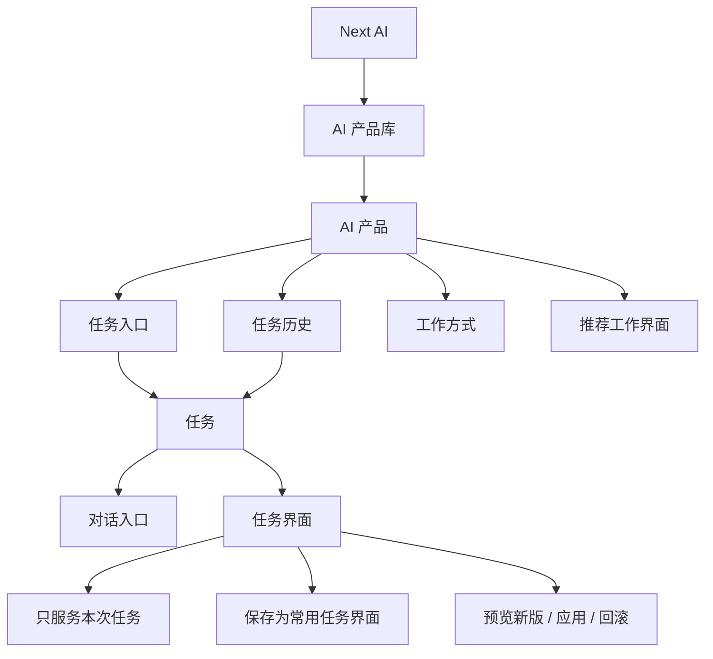

# Next AI UIUX / PRD：AI 产品 + 任务界面

更新日期：2026-06-03

## 当前结论

第一版用户可见主路径使用：

```text
AI 产品库
AI 产品
任务
对话入口
工作界面 / 任务界面
```

底层仍然可以有 assistant/workbench/runtime 等实现概念，但 UI 表层不再用“助手列表”“默认界面”“左侧 Chat / 右侧界面”解释产品。

一句话：

> 用户选择一个 AI 产品，说一句任务；任务需要时，这个 AI 产品会长出适合当前任务的工作界面，并且好用的界面可以被保存、预览新版和回滚。

## 信息架构



## 用户可见概念

- `AI 产品库`：长期 AI 产品入口。
- `AI 产品`：长期工作对象，例如 PPT 设计师、研究分析师。
- `任务`：这个 AI 产品处理的一次具体工作。
- `对话入口`：自然语言输入、反馈和推进入口。
- `工作界面 / 任务界面`：任务中长出的可操作 UI。
- `常用任务界面`：用户保存后，同类任务可以沿用的界面。

## 用户不可先看到的概念

- 母体
- manifest
- sandbox
- generated space
- 版本目录
- 代码 diff
- 左侧 / 右侧固定布局解释

这些可以在内部实现和高级模式存在，但不要进入第一屏主路径。

## 首屏：AI 产品主页

选中一个 AI 产品后，主区是新任务入口，不是配置页。

```text
┌──────────────────────┬────────────────────────────────────────┐
│ AI 产品库             │                                        │
│                      │               PPT 设计师                │
│ 通用 AI               │    把主题、资料和要求交给我，我会先帮你   │
│ PPT 设计师            │    理清 PPT 的方向、受众和结构。          │
│ 研究分析师            │                                        │
│ 数据分析师            │   ┌────────────────────────────────┐   │
│ + 新建 AI 产品         │   │ 描述你想做的 PPT，或上传资料...    │   │
│                      │   └────────────────────────────────┘   │
│ 这个产品处理过的任务    │                                        │
│ - 产品介绍 PPT         │   推荐任务                             │
│ - 融资路演 PPT         │   [做产品介绍 PPT] [文档转汇报 PPT]      │
└──────────────────────┴────────────────────────────────────────┘
```

原则：

- 首屏不展示复杂关系说明卡。
- 首屏不解释自进化。
- 用户可以直接发第一句话开始任务。
- `新建 AI 产品` 需要预览后再加入 AI 产品库。

## 任务页：对话入口 + 工作界面

用户发起任务后进入任务状态。

```text
┌──────────────────────┬──────────────────────────────┬──────────────────────────────┐
│ AI 产品库             │ 产品介绍 PPT                  │ PPT 工作界面                  │
│                      │                              │                              │
│ PPT 设计师            │ 用户：帮我做产品介绍 PPT        │ 当前任务                       │
│ 这个产品处理过的任务    │                              │ 主题 / 受众 / 页数 / 状态       │
│ - 当前任务             │ AI：我先确认主题和受众。        │                              │
│ - 融资路演             │                              │ 大纲 / 页面 / 讲稿              │
│                      │ [输入框]                      │                              │
└──────────────────────┴──────────────────────────────┴──────────────────────────────┘
```

工作界面可以在桌面侧边、移动端下方、弹层或独立页出现；但用户理解上都属于当前 AI 产品的当前任务。

## 工作界面状态

工作界面顶部需要表达它和当前任务的关系：

```text
当前工作界面
PPT 工作界面
当前任务

推荐界面
确认后，下次同类任务会沿用「PPT 工作界面」。
```

菜单动作：

```text
下次沿用
不再推荐
生成新版
应用新版
放弃新版
回滚
新窗口
```

保存后的状态：

```text
常用任务界面
「PPT 设计师」以后同类任务会沿用「PPT 工作界面」。
```

避免：

```text
默认界面
默认打开
保存为默认
取消默认
左侧 Chat
右侧界面
```

## 新建 AI 产品

新建流程从一句自然语言开始。

```text
用户：我想创建一个帮我做融资路演 PPT 的 AI 产品。
```

系统展示预览：

```text
新建 AI 产品预览
创建这个 AI 产品？

将加入 AI 产品库
融资路演 PPT 设计师
把资料、想法和目标受众整理成清晰的演示文稿，并在任务需要时打开合适的工作界面。

任务入口
描述这次路演 PPT 的目标、受众或上传资料...

推荐界面
PPT 工作界面

推荐开始任务
做一份路演 PPT
资料转路演大纲
优化结构和讲稿

1 加入 AI 产品库
2 开始第一次任务
3 任务界面：任务里会使用「PPT 工作界面」

[取消] [创建 AI 产品]
```

确认后：

- 新 AI 产品进入 AI 产品库。
- 新 AI 产品被选中。
- 用户发第一句话开始第一次任务。
- 之后可以继续调整它的工作方式。

## AI 产品自进化

用户在 AI 产品主页说长期偏好：

```text
以后你主要帮我做投资人路演 PPT，要更关注融资阶段、投资人问题、核心叙事和讲稿。
```

系统展示：

```text
工作方式预览
应用这次变化？

现在：PPT 设计师个人版
之后：融资路演 PPT 设计师

工作方式
主要帮我做投资人路演 PPT...

任务入口
描述这次路演 PPT 的目标、受众或上传资料...

推荐任务
做一份路演 PPT / 资料转路演大纲 / 优化结构和讲稿

推荐界面
PPT 工作界面

应用后，后续任务会使用新的任务入口和任务界面；取消不会写入任何变化。

[取消] [应用变化]
```

应用后主页显示最近进化：

```text
最近进化
从「PPT 设计师个人版」调整为「融资路演 PPT 设计师」
已应用，可回滚到上一版。
```

回滚弹窗：

```text
回滚「融资路演 PPT 设计师」？
当前：融资路演 PPT 设计师
回到：PPT 设计师个人版

会恢复上一版工作方式、任务入口和任务界面。历史任务不会被删除。

[取消] [回滚]
```

## PPT 设计师 MVP

第一版只做一个足够清楚的 PPT 垂直样例：

```text
PPT 设计师主页
  -> 输入 PPT 任务
  -> 任务页
  -> PPT 工作界面
```

PPT 工作界面至少包含：

- 当前任务关系：任务名、AI 产品、状态。
- 任务简报：主题、受众、风格。
- 页面预览：当前页、页面列表。
- 下一步：大纲和快捷推进按钮。
- 状态：当前任务草稿；满意后可让同类任务沿用。

按钮动作本质是向对话入口提交结构化意图，但用户可见消息不要标“来自某侧/送回 Chat”。应该表现为当前任务自然继续推进。

## 回归检查

每次改 UI 后至少检查：

- AI 产品主页是否清爽，首屏没有复杂架构解释。
- 新建 AI 产品预览是否说明“会得到什么产品”。
- 发第一句话后是否进入任务状态。
- PPT 工作界面是否属于当前任务，而不是独立 App。
- 保存/沿用/不再推荐/回滚文案是否自然。
- 移动端 390px 是否无横向溢出。
- 用户可见文案不出现 `默认界面`、`默认打开`、`Chat 主线`、`左侧 Chat`、`右侧界面`。
