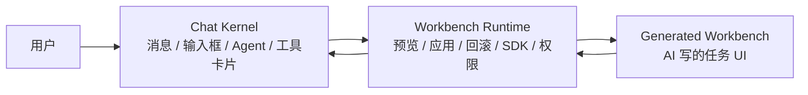

# Next AI Generated Workbench 落地方案

更新日期：2026-06-01

## 一句话判断

当前项目已经有“工作台”的壳，但还不是我们的产品核心。现在的实现更像“Chat 旁边多了一个工作台管理页”；真正要落地的是：

> 稳定的 Chat Kernel 始终在场，AI 在任务需要时生成一个可预览、可应用、可回滚的专属工作台 UI。这个 UI 可以是 AI 写的 React/HTML/CSS/JS，但必须通过 Workbench Runtime 和母体应用通信。

这比纯 block 系统更符合我们的产品直觉：核心 Chat 不乱动，任务页面让 AI 自己长。

## 当前代码事实

### 已经存在的能力

- 后端已有工作台 registry：`vendor/hermes-webui/api/workbenches.py`
- 已有 generated 目录约定：`spaces/generated/<workbench-id>/versions/<version>/`
- 已有 manifest：`spaces/generated/ppt-studio/manifest.json`
- 已有静态预览接口：`/api/workbenches/{id}/preview`
- 已有工作台列表接口：`GET /api/workbenches`
- 已有 propose/create/apply/rollback 接口：
  - `POST /api/workbenches/propose`
  - `POST /api/workbenches/create`
  - `POST /api/workbenches/apply`
  - `POST /api/workbenches/rollback`
- 前端已有工作台侧栏和详情渲染：
  - `vendor/hermes-webui/static/panels.js`
  - `loadWorkbenchesPanel`
  - `renderWorkbenchesPanel`
  - `openWorkbenchDetail`
  - `_workbenchPreviewHtml`
- Chat 消息里已有“建议生成工作台”的触发卡片：
  - `vendor/hermes-webui/static/messages.js`
  - `_workbenchTriggerFromText`
  - `_maybeAppendWorkbenchProposal`
  - `vendor/hermes-webui/static/ui.js`
  - `_workbenchProposalHtml`

### 现在的问题

- 工作台只是侧栏/详情页，不是当前任务的主工作界面。
- `apply_workbench()` 只是改状态，没有把工作台绑定到当前 session。
- `rollback_workbench()` 只是把状态改成 archived，没有真正回到旧版本。
- `WORKBENCH_VERSIONS_FILE` 已声明但基本没有被使用。
- generated iframe 没有 sandbox，也没有 host SDK。
- AI 还没有真正生成/修改工作台代码；`create_workbench()` 只是写死生成一个 PPT v1。
- Chat 与 generated UI 之间没有通信协议，所以“在 PPT 工作台里继续让 Agent 改第 3 页”还不成立。
- 现在 CSS 有一个重要线索：切到 workbenches 时仍然显示 `mainChat`。这说明之前已经隐约意识到“工作台不能拿走 Chat”，但还没把任务 surface 放进 Chat。

## 正确的信息结构



### 三层边界

1. **Chat Kernel**
   - 母体应用最稳定的一层。
   - 不让 AI 随便改。
   - 负责聊天、消息、工具调用、文件、模型、权限、session。

2. **Workbench Runtime**
   - 母体提供给 generated UI 的运行时。
   - 负责版本、预览、应用、回滚、iframe sandbox、postMessage SDK。
   - 这是“自进化”的安全边界。

3. **Generated Workbench**
   - AI 根据任务生成的 UI。
   - 可以是 React/HTML/CSS/JS。
   - 不能直接操作母体 DOM，也不能直接随便请求内部 API。
   - 必须通过 SDK 向 Chat/Agent 发消息、读写任务状态、请求生成内容。

## 用户能懂的交互逻辑

### 默认状态：普通 Chat

用户刚进来时只看到一个普通好用的 Agent 聊天产品。

```text
左侧：新对话 / 会话 / 工作台 / 设置
中间：Chat
底部：输入框
```

### 任务出现：Chat 建议长出界面

用户说：“帮我做一个介绍 Codex 的 PPT。”

Agent 先照常回复，并在消息里出现一个轻量建议：

```text
这个任务可能更适合用 PPT 工作台推进。
[预览 PPT 工作台] [应用到当前任务] [先继续聊天]
```

这里不是“创建一个 app”，而是“这个 Chat 可以进入 PPT 工作模式”。

### 应用后：Chat + PPT 任务区

应用后，当前 Chat 变成：

```text
┌────────────────────────────────────────────┐
│ 当前任务：Codex 介绍 PPT     v1 当前版本     │
├───────────────┬────────────────────────────┤
│ Chat / Agent  │ PPT 工作台 UI               │
│               │ - 关键信息                 │
│ 始终在场      │ - 风格选择                 │
│ 可继续对话    │ - 大纲                     │
│ 可看工具调用  │ - 页面预览                 │
│               │ - 讲稿 / 导出              │
└───────────────┴────────────────────────────┘
```

关键是：用户仍然是在和同一个 Agent 对话，只是右侧长出了更适合 PPT 的操作界面。

### 继续进化：改任务内容 vs 改工作台本身

这两个动作必须区分，否则用户会懵。

```text
“把第 3 页改得更像融资路演”
=> 改当前 PPT 内容

“以后每个 PPT 都默认有讲稿区”
=> 改工作台默认流程 / prompt

“把讲稿固定在右侧，以后都这样”
=> 改工作台 UI，生成 v2，预览后应用
```

### 自进化提案

当 AI 要改工作台本身时，不直接生效，而是走：

```text
Agent 提议 -> 生成 v2 -> 用户预览 -> 应用 / 取消 -> 可回滚
```

文案要非常直白：

```text
我可以把当前 PPT 工作台改得更适合你：
- 讲稿固定在右侧
- 页面缩略图放到底部
- 默认生成 10 页结构

[预览新版] [应用为默认] [只这次使用]
```

## 技术落地方案

### Phase 0：承认当前 MVP 边界

当前 MVP 能证明：

- Hermes Agent 能聊天。
- 可以识别 PPT 类任务。
- 可以创建一个静态 PPT workbench 预览。

当前 MVP 不能证明：

- AI 能改当前 Chat 页面。
- 工作台能绑定到当前 session。
- 工作台版本能真正回滚。
- generated UI 能和 Agent 双向协作。

所以不要再把当前状态称为完整 MVP。它只是 Workbench registry prototype。

### Phase 1：把工作台嵌入 Chat，而不是打开独立页

目标：让应用工作台后，`mainChat` 内出现一个 task surface。

文件级改动：

- `vendor/hermes-webui/static/index.html`
  - 在 `mainChat` 里，`messages-shell` 旁边或上方增加：
    - `#activeWorkbenchSurface`
    - `#activeWorkbenchFrame`
    - `#activeWorkbenchToolbar`
- `vendor/hermes-webui/static/style.css`
  - 增加布局状态：
    - 普通 Chat：单栏
    - 工作台 Chat：左 Chat + 右 Workbench
    - 小屏：Workbench 在消息上方或可折叠
- `vendor/hermes-webui/static/panels.js`
  - `applyWorkbench(id)` 不再只 toast。
  - 应用后调用 `activateWorkbenchInChat(id)`。
- 新增 `vendor/hermes-webui/static/workbench-runtime.js`
  - 管理当前激活工作台。
  - 加载 iframe。
  - 切换 preview/current version。
  - 处理 postMessage。

最小效果：

```text
用户点“应用 PPT 工作台”
=> 不跳到复杂工作台页
=> 当前 Chat 右侧出现 PPT UI
```

### Phase 2：iframe sandbox + Workbench SDK

目标：让 AI 写的 UI 可以运行，但不能破坏母体。

iframe 建议：

```html
<iframe
  sandbox="allow-scripts allow-forms"
  src="/api/workbenches/ppt-studio/preview">
</iframe>
```

不加 `allow-same-origin`，避免 generated UI 拿到母体同源能力。

SDK 通过 postMessage：

```js
window.NextAIWorkbench = {
  sendMessage(text, context),
  updateTaskState(patch),
  requestAgentAction(action, payload),
  savePreference(key, value),
  proposeWorkbenchChange(change)
}
```

generated UI 发消息：

```js
parent.postMessage({
  source: "next-ai-workbench",
  type: "agent.send",
  text: "请根据当前大纲生成 10 页 PPT",
  context: { outline, style }
}, "*")
```

Host 接收后转成 Chat 行为：

```text
用户点 generated UI 里的“生成讲稿”
=> Runtime 把它变成一条用户/系统消息
=> Hermes Agent 执行
=> 结果回写到任务状态
```

### Phase 3：真正的版本系统

目标：支持 v1/v2/v3 预览、应用、回滚。

建议 manifest：

```json
{
  "id": "ppt-studio",
  "name": "PPT 工作台",
  "current_version": "v1",
  "preview_version": "v2",
  "versions": [
    {
      "id": "v1",
      "status": "current",
      "created_at": "...",
      "reason": "initial generated workbench"
    },
    {
      "id": "v2",
      "status": "preview",
      "created_at": "...",
      "reason": "move speaker notes to right side"
    }
  ]
}
```

后端新增：

- `POST /api/workbenches/{id}/versions/generate`
- `POST /api/workbenches/{id}/versions/apply`
- `POST /api/workbenches/{id}/versions/rollback`
- `GET /api/workbenches/{id}/versions`

目录继续用：

```text
spaces/generated/ppt-studio/
  manifest.json
  versions/
    v1/
      index.html
      style.css
      app.js
    v2/
      index.html
      style.css
      app.js
```

### Phase 4：生成 UI 的最小闭环

第一版不要上来就做无限自由代码生成。先做一个可控闭环：

1. Agent 判断用户是要改内容还是改工作台。
2. 如果是改工作台，生成一个 `WorkbenchChangeProposal`。
3. 后端根据 proposal 创建一个新 version。
4. 前端展示 v2 预览。
5. 用户应用后，manifest `current_version = v2`。

第一版可以先用模板生成 v2，后面再接真正 LLM 生成完整文件。

### Phase 5：把工作台绑定到 session

需要让每个对话知道自己当前是否有工作台。

建议 session 字段：

```json
{
  "active_workbench_id": "ppt-studio",
  "active_workbench_version": "v1",
  "workbench_state": {
    "topic": "Codex 介绍",
    "outline": [],
    "slides": []
  }
}
```

这样用户刷新后还能回到同一个 Chat + PPT 工作台状态。

### Phase 6：偏好沉淀

偏好不是一开始就复杂做“长期记忆”，先保存在工作台 manifest 或 session profile 里。

例如：

```json
{
  "preferences": {
    "default_slide_count": 10,
    "speaker_notes_position": "right",
    "style": "tech-business"
  }
}
```

用户说：

```text
以后我的 PPT 都要带讲稿
```

对应：

```text
savePreference("include_speaker_notes", true)
```

## 为什么不是纯 block

block 适合母体的稳定协议，不适合决定所有任务 UI。

应该固定的 block：

- Chat message
- Tool call card
- Approval card
- File/artifact card
- Workbench proposal card
- Version preview/apply/rollback card

不应该固定成 block 的：

- PPT 编辑器布局
- 研究资料墙
- 表格分析面板
- 情感陪伴游戏化界面
- 任何任务产品的具体界面

这些应该允许 AI 写 React/HTML，因为它要根据任务和用户持续变化。

## MVP 重新定义

### MVP 1：Chat 里长出一个 PPT 工作台

验收标准：

- 用户从普通 Chat 输入 PPT 任务。
- Chat 出现“预览/应用 PPT 工作台”的建议。
- 点应用后，当前 Chat 右侧出现 generated PPT UI。
- Chat 输入框仍然可用。
- 工具调用/思考过程仍然可见。
- generated UI 里点击按钮可以给 Chat 发送任务。

### MVP 2：工作台可以保存和复用

验收标准：

- 左侧工作台列表出现 PPT 工作台。
- 新对话可以复用这个工作台。
- 工作台有当前版本。
- session 记住当前工作台。

### MVP 3：工作台可以自进化

验收标准：

- 用户说“把讲稿固定在右侧，以后都这样”。
- Agent 判断这是改工作台，不是改 PPT 内容。
- 生成 v2。
- 用户可预览 v2。
- 用户可应用 v2。
- 用户可回滚 v1。

## 最小实现顺序

1. 新增 `workbench-runtime.js`，先只负责加载当前 workbench iframe。
2. 在 `mainChat` 中加 `activeWorkbenchSurface`。
3. 修改 `applyWorkbench()`：应用后不跳页，直接激活当前 Chat 的工作台 surface。
4. 给 iframe 增加 sandbox。
5. 实现 postMessage SDK 的 `agent.send`。
6. generated PPT UI 里的按钮通过 SDK 发消息给 Chat。
7. 后端增加 version helpers，先支持 v1/v2 文件拷贝和 manifest 切换。
8. 把 `rollback_workbench()` 改成真正回退到上一 current version。
9. 再接入 AI 生成 version 文件。

## 最大风险

- 如果 generated UI 直接同源运行且无 sandbox，等于让 AI 写的代码拥有母体权限。
- 如果工作台和 Chat 分离成两个产品，用户会觉得逻辑怪。
- 如果只做 block，产品会变成“表单工作流”，失去“AI 自己长出产品”的味道。
- 如果一开始就让 AI 任意改母体代码，维护会很快失控，也会让 MVP 很难验证。

所以第一版的边界应该很清楚：

```text
AI 可以写 generated workbench。
AI 不直接写 Chat Kernel。
Workbench Runtime 是中间层。
用户可以预览、应用、回滚。
```

## 当前最应该做的下一步

不是继续画更复杂的概念图，也不是继续堆侧栏功能。

下一步应该直接做：

> 让 `ppt-studio` 从“工作台详情页里的 iframe”变成“当前 Chat 右侧/上方的激活任务界面”，并让这个 iframe 能通过 SDK 给 Chat 发一条消息。

只要这一步跑通，我们的产品感觉会立刻从“旁边有个工作台”变成“Chat 正在变成一个 AI PPT 产品”。
