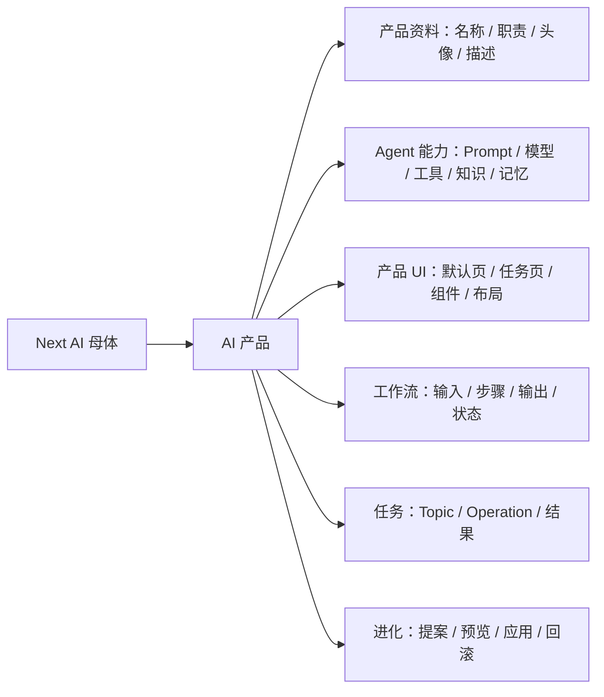
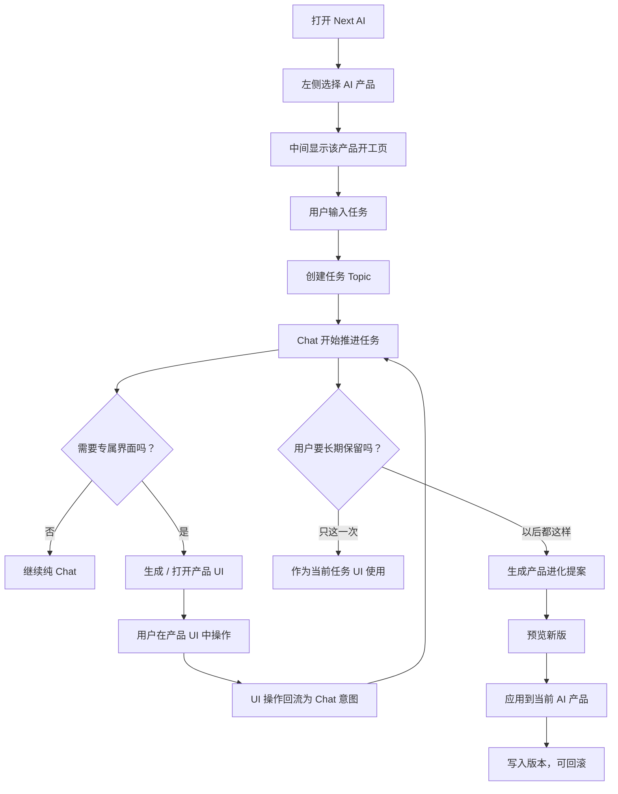

# LobeHub Reference Analysis：从 AI 助手到 AI 产品

更新日期：2026-06-01

参考仓库：`vendor/lobehub`

## 我们为什么看 LobeHub

LobeHub 是很成熟的 **AI 助手操作系统**。它把“助理”这件事拆得很清楚：

```text
助理 = 角色 / Prompt / 模型 / 技能 / 连接器 / 知识库 / 记忆 / 会话 / 话题 / 市场
```

这对 Next AI 很有价值，因为我们不是要凭空发明一套复杂信息结构，而是先承认：如果一个 AI 产品要好用，它首先必须像一个成熟 AI 助手一样好用。

然后我们的升级是：

```text
AI 助手
  -> 配置可进化

AI 产品
  -> 配置可进化
  -> UI 可进化
  -> 工作流可进化
  -> 输入输出结构可进化
  -> 可以被 AI 创建、预览、应用、回滚
```

## LobeHub 的核心信息结构

### 1. Agent 是中心对象

LobeHub 的核心是 `agent`。从代码看，它的主要字段包括：

```text
title
description
avatar
backgroundColor
systemRole
model
provider
params
plugins
knowledgeBases
files
openingMessage
openingQuestions
chatConfig
agencyConfig
tts
tags
pinned
marketIdentifier
```

对应代码：

- `vendor/lobehub/packages/types/src/agent/item.ts`
- `vendor/lobehub/packages/database/src/schemas/agent.ts`

这个结构很强：它把一个助理从“一段 prompt”提升成了一个可管理、可安装、可复用的工作对象。

### 2. Agent 和 Topic 分离

LobeHub 不是只有聊天记录。它有：

```text
Agent：长期存在的工作对象
Session：会话容器
Topic：某次具体任务 / 话题
Thread：话题里的分支或子线程
Operation：Agent 的执行过程记录
```

对应代码：

- `vendor/lobehub/packages/database/src/schemas/session.ts`
- `vendor/lobehub/packages/database/src/schemas/topic.ts`
- `vendor/lobehub/packages/database/src/schemas/agentOperations.ts`

这对我们很重要：**AI 产品不能等于一次聊天**。AI 产品是长期对象，任务是它下面发生的具体工作。

### 3. 首页先选择 Agent，再发起任务

LobeHub 首页有一个 `AgentSelect`，用户先知道当前在和哪个 Agent 工作，再输入任务。

对应代码：

- `vendor/lobehub/src/routes/(main)/home/features/AgentSelect/index.tsx`
- `vendor/lobehub/src/routes/(main)/home/features/InputArea/index.tsx`

这个交互很值得借鉴。我们的首屏也应该是：

```text
当前 AI 产品
输入任务
推荐任务
最近任务
创建 AI 产品
```

而不是先让用户理解“工作台”“空间”“模式”。

### 4. Agent Builder 是“用 AI 创建 AI 助手”

LobeHub 已经有一个内置 Agent Builder。它能通过对话创建或更新 Agent：

```text
createAgent
updateAgent
updatePrompt
installPlugin
searchAgent
callAgent
duplicateAgent
deleteAgent
```

对应代码：

- `vendor/lobehub/packages/builtin-agents/src/agents/agent-builder/index.ts`
- `vendor/lobehub/packages/builtin-tool-agent-management/src/types.ts`

这非常接近我们的“母体创建 AI 产品”，但它的边界仍然是 Agent 配置。

## LobeHub 的上限

LobeHub 的强项是“AI 助手可配置、可管理、可分享”。但从我们的产品定义看，它还没有跨过一个关键门槛：

> Agent 自己没有长期拥有一套专属产品 UI。

它有 Artifacts：

```text
AI 生成 React / HTML / SVG / Mermaid
右侧预览
可迭代
可导出
```

但 Artifacts 更像一次任务产物，不是这个 Agent 的长期产品形态。也就是说：

```text
LobeHub:
  助理不变
  右侧出现一个生成物

Next AI:
  当前 AI 产品本身可以变
  它的默认 UI / 任务 UI / 工作流都可以版本化进化
```

## 我们应该怎么升级它的概念

### LobeHub 的 Agent

```text
Agent = 可以配置的 AI 助手
```

### Next AI 的 AI 产品

```text
AI Product = 可以使用、创建、进化的 AI 产品对象
```

它包含 LobeHub Agent 的全部能力，但额外多出：

```text
productManifest
productUI
uiRuntime
uiVersions
workflowSchema
inputSchema
outputSchema
taskPanels
evolutionProposals
rollbackHistory
```

换句话说：

```text
LobeHub Agent Config
  -> 是 Next AI Product Manifest 的一部分

LobeHub Artifact
  -> 是 Next AI Product UI Runtime 的雏形

LobeHub Agent Builder
  -> 是 Next AI Product Builder 的低阶版本
```

## 最适合我们借鉴的部分

### 可以直接学习

- 左侧长期对象列表：从“助理列表”升级为“AI 产品列表”
- 当前对象选择器：让用户始终知道正在使用哪个 AI 产品
- 开场问题：每个 AI 产品有自己的 opening questions
- Agent Builder：用对话创建一个长期对象
- 社区市场：从“助理市场”升级为“AI 产品市场”
- Topic/Operation：把任务和执行过程从长期对象里拆出来
- Artifacts 预览：作为产品 UI 预览和生成物预览的基础

### 不应该照搬

- 不要把核心叫助理，否则用户会以为只是 ChatGPT/GPTs 类产品
- 不要把专属 UI 做成一次性 Artifact，否则失去“产品可进化”的主张
- 不要一开始塞满插件、知识库、市场、群组，第一版会重新变复杂
- 不要把创建流程做成配置表单，应该先是对话式创建 AI 产品

## Next AI 的推荐信息结构



## PPT AI 产品的落地理解

PPT 设计师不是“一个聊天助手 + 一个 PPT 生成 Artifact”。

它应该是：

```text
AI 产品：PPT 设计师

长期能力：
  Prompt：懂 PPT 结构、受众、讲稿、视觉风格
  技能：读取文件、生成大纲、生成页面、导出
  记忆：用户偏好的风格、常用汇报对象、品牌规范
  UI：PPT 开工页 + 大纲区 + 页面预览 + 讲稿区
  工作流：需求确认 -> 大纲 -> 页面 -> 讲稿 -> 导出

任务实例：
  这一次帮我做“Codex 介绍 PPT”
```

关键关系：

```text
AI 产品是长期对象
Chat 是控制入口
产品 UI 是当前 AI 产品长出来的操作界面
任务是 AI 产品正在处理的一件事
Artifact 是任务中的某个生成结果
```

## 第一版 MVP 应该怎么借鉴 LobeHub

第一版不要做完整 LobeHub，也不要做完整自进化系统。先做最小闭环：

```text
1. 左侧显示 AI 产品列表
2. 选中 PPT 设计师
3. 中间是 PPT 设计师的开工页和 Chat
4. 用户输入 PPT 需求
5. AI 生成一个 PPT 任务
6. 右侧打开 PPT 产品 UI
7. 产品 UI 的按钮能继续驱动 Chat
8. 用户可以说：以后都这样
9. 系统保存为 PPT 设计师的一个 UI / 流程版本
```

这就是我们相对 LobeHub 的第一层升级：

```text
从“选一个助理聊天”
升级为
“选一个 AI 产品，它会用自己的界面帮你完成任务，并能继续进化”
```

## LobeHub 的交互逻辑也值得学习

LobeHub 最值得借鉴的不是某个按钮，而是它的交互分层：

```text
首页
  选择长期对象 Agent
  输入一个任务
  创建 Topic
  跳转到 Agent 任务页

Agent 任务页
  左侧：当前 Agent 下的 Topic / Task
  中间：Chat 主线
  右侧：Portal / WorkingSidebar

Agent Profile
  编辑这个 Agent 的长期能力
  包括名称、头像、模型、工具、Prompt、配置
```

对应代码：

- 首页选择 Agent：`vendor/lobehub/src/routes/(main)/home/features/AgentSelect/index.tsx`
- 首页发送任务：`vendor/lobehub/src/routes/(main)/home/features/InputArea/useSend.ts`
- 创建 Agent 后进入 Profile：`vendor/lobehub/src/routes/(main)/home/_layout/hooks/useCreateMenuItems.tsx`
- Agent 路由状态同步：`vendor/lobehub/src/routes/(main)/agent/_layout/AgentIdSync.tsx`
- Topic 路由状态同步：`vendor/lobehub/src/routes/(main)/agent/features/Conversation/ChatHydration/index.tsx`
- Chat + Portal + WorkingSidebar 布局：`vendor/lobehub/src/routes/(main)/agent/(chat)/_layout/index.tsx`
- 右侧工作面板：`vendor/lobehub/src/routes/(main)/agent/features/Conversation/WorkingSidebar/index.tsx`
- Portal 抽屉：`vendor/lobehub/src/routes/(main)/agent/features/Portal/features/Portal.tsx`
- Agent 配置页：`vendor/lobehub/src/routes/(main)/agent/profile/features/ProfileEditor/index.tsx`

### 交互 1：首页不是纯 Chat，而是任务发起台

LobeHub 首页输入框会绑定当前选择的 Agent。用户发消息时：

```text
读取当前 Agent
确保 Agent 配置已加载
发送消息
创建 Topic
跳到 /agent/:agentId/:topicId
```

这对我们很重要。Next AI 首页也不应该只是“一个空输入框”，而应该是：

```text
当前 AI 产品
产品开工页
输入任务
推荐任务
最近任务
```

用户不需要先理解“自进化”，只要知道：

> 我现在正在用哪个 AI 产品，它能帮我开始什么。

### 交互 2：长期对象和任务实例必须分开

LobeHub 的 Agent 和 Topic 分离非常清楚：

```text
Agent 是长期对象
Topic 是一次任务或话题
Message 是任务里的对话
Operation 是 Agent 的执行过程
```

Next AI 应该对应成：

```text
AI 产品是长期对象
任务是一次具体工作
Chat 是任务控制线
产品 UI 是任务执行中长出的操作界面
版本是 AI 产品被改造后的长期结果
```

如果不分开，就会混乱成：

```text
我是在改这次任务？
还是在改这个 AI 产品？
还是在改整个 App？
```

所以我们的交互里必须显式区分：

```text
这次任务
当前 AI 产品
应用到以后
只改这一次
```

### 交互 3：右侧面板是“辅助空间”，不是主对象

LobeHub 里右侧有两种东西：

```text
WorkingSidebar：资源、文件、参数、进度
Portal：工具 UI、Artifact、线程
```

这给我们的启发是：

```text
Chat 不应该消失
AI 产品 UI 可以在右侧或主区域展开
但它必须始终和 Chat 互相驱动
```

PPT 产品里可以这样：

```text
左侧：AI 产品列表
中间：PPT 设计师 Chat
右侧：PPT 产品 UI
  需求卡
  大纲
  页面预览
  讲稿
```

右侧按钮不是普通前端按钮，而是继续给 Chat 发意图：

```text
“重新生成大纲”
“把这一页改得更商务”
“以后默认都先问受众和场景”
```

### 交互 4：Profile 是长期能力配置，不能和任务页混在一起

LobeHub 的 Agent Profile 是长期配置页：

```text
头像
名称
描述
模型
工具
Prompt 编辑器
高级设置
```

Next AI 也需要类似东西，但应该叫：

```text
AI 产品设置
AI 产品设计
产品能力
产品 UI 版本
产品工作流
```

区别是：LobeHub Profile 主要改助手配置，我们的 Product Profile 还要改：

```text
默认 UI
任务 UI
工作流
输入表单
输出结构
版本历史
```

### 交互 5：创建入口值得学，但要升级

LobeHub 的创建逻辑是：

```text
创建 Agent
进入 Agent Profile
配置 Agent
开始聊天
```

Next AI 应该是：

```text
创建 AI 产品
通过对话描述需求
AI 生成产品草案
预览产品首页 / 专属 UI
创建并使用
后续继续进化
```

第一版可以极简：

```text
用户：我想做一个帮我写融资 BP 的 AI 产品
系统生成：
  名称
  职责
  Prompt
  开工页
  默认流程
  初始 UI
用户选择：
  预览
  创建并使用
  继续修改
```

## 翻译成 Next AI 的推荐交互



这套交互比 Lovable 式 App Builder 更贴近我们：

```text
不是“我让 AI 帮我做一个外部 App”
而是“我正在用的 AI 产品越来越像它该成为的产品”
```

## 从用户视角体验 LobeHub 后的改造点

这一步很重要：不是先讨论“叫什么”，而是看一个用户在 LobeHub 里到底怎么完成一件事。

### LobeHub 用户路径

```text
1. 用户打开首页
2. 左侧看到自己的助理列表
3. 点击创建助理
4. 弹出创建窗口
5. 用户可以：
   - 直接描述想要什么助理
   - 点示例 prompt
   - 创建空白助理
6. 如果描述创建，Agent Builder 帮他生成助理
7. 如果创建空白，进入 Agent Profile
8. 在 Profile 里配置：
   - 名字
   - 头像
   - 模型
   - 工具
   - Prompt
9. 回到这个助理，输入任务
10. 系统创建 Topic
11. 用户在这个 Topic 里继续 Chat
12. 右侧面板按需打开资源、参数、文件、Artifact 等
```

这个路径很顺，因为它没有要求用户理解太多抽象概念。用户只是在做：

```text
创建一个帮手
配置这个帮手
让这个帮手处理一个话题
```

### 我们不应该破坏这条路径

Next AI 第一版也应该保留这个自然路径：

```text
1. 用户打开首页
2. 左侧看到自己的 AI 对象列表
3. 点击创建
4. 描述自己想要什么 AI 对象
5. 系统生成这个对象的基础能力
6. 用户开始使用它
7. 发起一个任务
8. Chat 继续推进
```

真正多出来的，只应该是一层很自然的“界面盖帘”：

```text
当这个 AI 对象需要更好完成任务时，
它可以在 Chat 旁边打开自己的专属界面。
```

不要一开始讲：

```text
自进化
工作台
产品母体
版本化 UI
```

这些都是系统能力，不是用户第一眼要理解的东西。

### “界面盖帘”的正确心智

它不是一个外部 App Builder。

它也不是一次性的 Artifact。

它更像：

```text
这个 AI 对象为了更好处理任务，拉开了一层自己的操作界面。
```

例如 PPT 设计师：

```text
用户：帮我做一个 Codex 介绍 PPT

默认状态：
  Chat 先问主题、受众、页数、风格

信息足够后：
  右侧打开 PPT 界面盖帘
    主题
    受众
    大纲
    页面预览
    讲稿
    导出

用户继续说：
  把这个流程以后都默认放出来

系统才出现：
  是否保存为 PPT 设计师的新默认界面？
  [只这一次] [保存默认] [预览新版]
```

这样用户理解的是：

```text
这个助手越来越好用
```

而不是：

```text
我正在操作一个复杂的自进化平台
```

### 和 LobeHub 的一一对应

```text
LobeHub 助理列表
  -> 我们的 AI 对象列表

LobeHub 创建助理弹窗
  -> 我们的创建 AI 对象弹窗

LobeHub Agent Profile
  -> 我们的 AI 对象设置

LobeHub Topic
  -> 我们的一次任务

LobeHub Chat
  -> 我们仍然保留 Chat 主线

LobeHub Portal / WorkingSidebar
  -> 我们升级成可被 AI 改造和保存的界面盖帘
```

### 最小产品判断

如果按这个思路，MVP 不是做一个“自进化产品平台”。

MVP 是：

```text
一个像 LobeHub 一样清楚的 AI 助手产品，
但每个助手可以在任务中打开一层自己的专属界面，
并且这层界面可以被保存为它以后的默认工作方式。
```

这句话比“AI 产品母体”更适合指导第一版实现。

## 一句结论

LobeHub 证明了“长期 AI 助手对象”是合理的；Next AI 要做的是把这个对象继续升级成“长期 AI 产品对象”。

我们不是反对 AI 助手，而是把 AI 助手作为 AI 产品的内核，再给它加上可生成、可预览、可应用、可回滚的产品 UI 和工作流。
